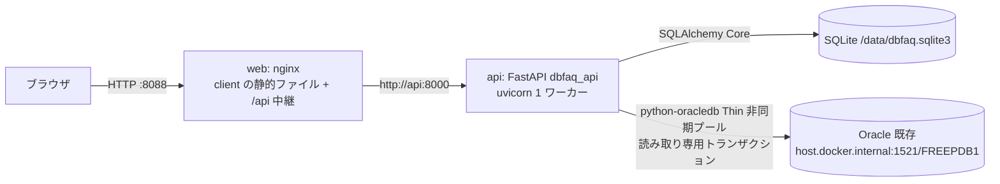

# ArchitectureHandbook.md

後続の Agent(Executor・Reviewer Loop・Refactor)が P001〜P009 を毎回読み直さずに技術的な要点を把握するための要約。詳細は原本(`docs/P00N-*.md`)を正とする。

## 1. アプリケーション概要

* アプリケーション名: DbFAQ
* 一言で言うと: Oracle のスキーマを backend(FastAPI)が直接読み取って SQLite に保存し(CR-002 で MCP を廃止)、ブラウザで ER 図(拡大縮小・ミニマップ・クリックで詳細へ)とテーブル詳細(スキーマ情報/データのタブ)を見せる運用者向けツール。第 1 リリース。FAQ(保存クエリ)の実行は将来 CR で追加する。
* 参照元: `docs/P001-requirement.md`

## 2. 全体構成図

* 開発時: Vite(5173)の proxy → uvicorn(8000)。Oracle は `localhost:1521`。

## 3. 技術スタック

| レイヤ | 技術 | バージョン | 選定理由の参照先 |
| --- | --- | --- | --- |
| フロントエンド | React + TypeScript + Vite、Mantine、TanStack Query、React Router | React 19.x、Mantine 9.x | ADR-009 |
| ER 図 | @xyflow/react(React Flow)+ elkjs | 12.x / 0.12.x | ADR-010 |
| バックエンド | FastAPI(Python 3.12、uv) | 導入時の最新 | ADR-007 |
| Oracle アクセス | python-oracledb Thin(非同期プール、backend のプロセス内)、読み取り専用トランザクション | 導入時の最新 | ADR-014、ADR-011、ADR-005、ADR-006 |
| データベース(アプリ) | SQLite(WAL)+ SQLAlchemy Core、独自の差分マイグレーション | Python 同梱の sqlite3 / SQLAlchemy 2.x | ADR-008、ADR-002、ADR-003 |
| 設定 | YAML(`config.yaml`)+ 環境変数上書き、pydantic | - | ADR-013 |
| 認証 | なし(社内ネットワーク前提) | - | P001 §2 |
| インフラ/デプロイ | Docker Compose(web: nginx、api)、Oracle は外部 | - | ADR-012、ADR-004 |

## 4. ディレクトリ構成の方針

* `server/` — Python の uv プロジェクト 1 つ(`src/dbfaq_api` の 1 パッケージ。Oracle アクセスは `src/dbfaq_api/oracle`、設定は `config.py`、ログは `log.py`。CR-003 で `dbfaq_common` を統合、`tests/unit`、`tests/integration`、`scripts/`)。ビルド: `uv`。
* `client/` — フロントエンド(`src/api`、`src/er`、`src/pages`、`src/components`)。ビルド: `npm`。
* `deploy/` — `api.Dockerfile`、`web.Dockerfile`、`nginx.conf`。`compose.yaml` はルート。
* `e2e/` — Playwright の受入テストとスクリプト(`scripts/reset-and-up.sh` ほか)。
* 目次: `server/INDEX.md`、`client/INDEX.md`(ソースツリーごと)、`./INDEX.md`(全体。P301)。
* `config.yaml`(ルート、Git 管理外)に開発用 Oracle の接続情報。ひな型は `config.example.yaml`。

## 5. データモデルの要点

* SQLite: `snapshots`(owner ごとに最新 1 件)→ `db_tables` → `db_columns` / `db_constraints`(P・U・R)→ `db_constraint_columns` / `db_indexes` → `db_index_columns`。すべて ON DELETE CASCADE。管理用に `schema_migrations`。定義は `docs/P002-frontend-spec.md` §4。
* refresh は 1 トランザクションで旧スナップショット削除 + 挿入(失敗時は前回が残る)。テーブルデータ(rows)は保存しない。
* 状態のスコープ: スナップショット=SQLite(永続)、refresh のロック・Oracle 接続プール=api プロセスのメモリ。`docs/P003-backend-spec.md` §4.2。

## 6. API/画面構成の要点

* 画面: SC-01 ER 図(`/`)、SC-02 テーブル詳細(`/tables/:owner/:table?tab=schema|data&page=N`)。`docs/P002-frontend-spec.md` §2。
* API: `GET /api/schema`、`POST /api/schema/refresh`、`GET /api/schema/tables/{owner}/{table}`、`GET /api/schema/tables/{owner}/{table}/rows?offset&limit`、`GET /api/health`。外部仕様は P002 §3、内部処理は P003 §4.3。
* Oracle アクセスの入口: `OracleClient.get_schema_snapshot`・`get_table_rows`・`ping`(P003 §3.5・§3.6・§3.8・§3.9)。単体テストでは `create_app(oracle=FakeOracle)` で差し替える。
* エラー形式 `{"error":{"code","message","ora_code?"}}`。コード一覧は P002 §3.1、`OracleFailure`→API の対応は P003 §4.1。`GET /api/health` は `backend`・`oracle`・`config`(`mcp` は CR-002 で削除)。

## 7. 実装・テストの単位

* スプリント: U001 foundation → U002 mcp-server → U003 backend-api → U004 frontend-er → U005 frontend-detail → U006 deploy → U007 oracle-in-backend(CR-002。U002 と U003 の MCP ゲートウェイを廃止)(`docs/P005-impl-plan.md`)。
* 単体: pytest(`server/tests/unit`、偽の Oracle アクセス `FakeOracle`・偽のプール・一時 SQLite)、Vitest(`client`)。
* 結合(P008 T01〜T12。T05 は CR-002 で廃止): 実 Oracle HR(pytest マーカー `oracle`)、T09 はテスト内の TCP 中継で Oracle との通信断と回復を作る、Vite proxy、compose。
* 受入(P009 A01〜A08): compose の web(8088)に Playwright。スイート開始前に `docker compose down -v`。HR は読み取りのみで、前後のチェックサムが一致すること。
* HR の期待値: 7 表、35 列、PK 7、UK 1、FK 10(自己参照 EMP_MANAGER_FK を含む)、インデックス 19、EMPLOYEES 107 行、COUNTRIES は IOT。

## 8. 横断的関心事

* 認証・認可: なし。公開は web のポートのみ(ADR-012)。
* 読み取りのみの保証: Oracle アクセスの全処理が `SET TRANSACTION READ ONLY` → 実行 → 必ず ROLLBACK。任意 SQL を実行する機能は無い。識別子は検証 + 実在確認 + クォート(ADR-011)。
* エラーハンドリング: Oracle アクセスは `OracleFailure`(code/message/ora_code)を送出し、`SchemaService` が API エラーに変換。想定外の例外は 500。Oracle が戻れば再起動なしで回復(プールが壊れた接続を作り直す)。
* ログ: 1 行 1 JSON を stdout へ。パスワード・テーブルデータは出さない。
* 設定: `DBFAQ_CONFIG`(既定 `./config.yaml`)、上書き `DBFAQ_ORACLE_HOST`・`DBFAQ_ORACLE_PORT`・`DBFAQ_ORACLE_PASSWORD`・`DBFAQ_SQLITE_PATH`。パスワードは SecretStr。

## 9. 既知の制約・技術的負債

* ★ACCEPTED★ LOB 全体をメモリに読み込む(ADR-005)。検討: SQL 側での切り詰め/不採用理由: SELECT * の組み直しが複雑/残存リスク: 巨大 LOB でメモリを使う(limit を下げて回避)。
* ★ACCEPTED★ OFFSET 方式のページ送り(ADR-006)。検討: キーセット方式/不採用理由: 主キー無し・複合主キーで複雑、ページ直接移動ができない/残存リスク: 深いページが遅い(offset 上限 100,000)、同時更新で行がずれて見える。
* uvicorn は 1 ワーカー前提(refresh のロックと Oracle 接続プールがプロセス内のため。ADR-014)。
* ★ACCEPTED★(2026-09-27 人間承認) health の疎通確認は問い合わせの上限 5 秒だが、Oracle のホストが応答しないときは接続の確立(`connect_timeout_sec`、既定 10 秒)まで待つ。検討: `asyncio.wait_for` で打ち切る/不採用理由: 通信途中の接続がプールに戻りうる/残存リスク: 応答の無いホストでは health が 5 秒を超える(P003 §3.8、ADR-014)。
* `LAST_ANALYZED` は DB のタイムゾーンを UTC とみなしている ★ACCEPTED★(2026-09-24 人間承認)(P003 §3.5)。検討: DB のタイムゾーンを問い合わせて変換する/承認理由: 統計の取得日は目安で足りる/残存リスク: DB が UTC 以外だと日時がずれる。
* 大規模スキーマ(300 表)の性能は偽データでのみ確認する(P006 §2.2)。
* 開発・テスト用の接続ユーザー hr は書き込み権限を持つ(読み取り専用トランザクションで防いでいる)。実運用は読み取り専用ユーザーを推奨。
* 実機で判明した python-oracledb 26.0.0 の挙動(2026-09-27、CR-002 の P103 で確認): 非同期プールの `close(force=True)` は、リスナーに届かない(接続拒否)間は長く戻らない(実測 124 秒)。最小再現: `oracledb.create_pool_async(dsn="localhost:1/FREEPDB1", min=1, getmode=POOL_GETMODE_TIMEDWAIT, wait_timeout=3000, tcp_connect_timeout=3)` を作り、acquire の有無にかかわらず `await pool.close(force=True)` が 40 秒以内に終わらない(`min=0` でも同じ)。Oracle に届くときは一瞬で終わる。backend の lifespan の終了(api の停止・再起動)に影響するため、close の待ち時間を `connect_timeout_sec` で打ち切る(P202 F008、P003 §3.1)。
* 実機で判明した python-oracledb 26.0.0 の挙動(2026-09-27): ホスト名を解決できないとき、`oracledb.Error` ではなく `socket.gaierror`(`OSError`)をそのまま送出する。`run_readonly` で `OSError` も `OracleFailure` に変換する(P202 F007、P003 §3.2)。
* 実機で判明した python-oracledb の挙動: `call_timeout` 超過時、`DPY-4024` だけでなく `DPY-4011`(`timed out` を含む)になることがある(2026-09-23 確認。最小再現: 非同期プールの接続で `call_timeout=1000` にして `DBMS_SESSION.SLEEP(3)`)。

## 10. 関連ドキュメントへのリンク

* `docs/P001-requirement.md` 〜 `docs/P009-acceptance-direction.md`
* `docs/ADR.md`
* `server/INDEX.md`、`client/INDEX.md`、`./INDEX.md`
