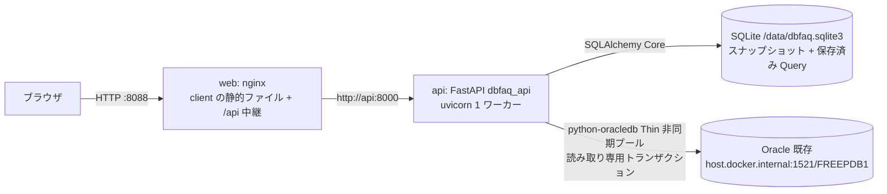

# ArchitectureHandbook.md

後続の Agent(Executor・Reviewer Loop・Refactor)が P001〜P009 を毎回読み直さずに技術的な要点を把握するための要約。詳細は原本(`docs/P00N-*.md`)を正とする。

## 1. アプリケーション概要

* アプリケーション名: DbFAQ
* 一言で言うと: Oracle のスキーマを backend(FastAPI)が直接読み取って SQLite に保存し(CR-002 で MCP を廃止)、ブラウザで ER 図(拡大縮小・ミニマップ・クリックで詳細へ)とテーブル詳細(スキーマ情報/データ/Query のタブ)を見せる運用者向けツール。CR-004 で Query タブ(利用者の SELECT を実行、画面は 500 行まで、CSV で全行)を追加。CR-005 で Query の SQL を名前・説明付きでテーブルごと・PDB に保存・復元する機能(保存済み Query)と、SC-01 のドラム缶のアイコンから開く SC-03 PDB 画面(PDB 情報・Query・運用 Query のひな型)を追加。CR-006 で推奨の接続ユーザーを読み取り専用ユーザー `dbfaq_ro` にし、PDB 情報とひな型を対象スキーマ基準にした。
* 参照元: `docs/P001-requirement.md`

## 2. 全体構成図

* 開発時: Vite(5173)の proxy → uvicorn(8000)。Oracle は `localhost:1521`。

## 3. 技術スタック

| レイヤ | 技術 | バージョン | 選定理由の参照先 |
| --- | --- | --- | --- |
| フロントエンド | React + TypeScript + Vite、Mantine、TanStack Query、React Router | React 19.x、Mantine 9.x | ADR-009 |
| ER 図 | @xyflow/react(React Flow)+ elkjs | 12.x / 0.12.x | ADR-010 |
| バックエンド | FastAPI(Python 3.12、uv) | 導入時の最新 | ADR-007 |
| Oracle アクセス | python-oracledb Thin(非同期プール、backend のプロセス内)、読み取り専用トランザクション | 導入時の最新 | ADR-014、ADR-011、ADR-005、ADR-006 |
| データベース(アプリ) | SQLite(WAL)+ SQLAlchemy Core、独自の差分マイグレーション | Python 同梱の sqlite3 / SQLAlchemy 2.x | ADR-008、ADR-002、ADR-003 |
| 設定 | YAML(`config.yaml`)+ 環境変数上書き、pydantic | - | ADR-013 |
| 認証 | なし(社内ネットワーク前提) | - | P001 §2 |
| インフラ/デプロイ | Docker Compose(web: nginx、api)、Oracle は外部 | - | ADR-012、ADR-004 |

## 4. ディレクトリ構成の方針

* `server/` — Python の uv プロジェクト 1 つ(`src/dbfaq_api` の 1 パッケージ。Oracle アクセスは `src/dbfaq_api/oracle`、設定は `config.py`、ログは `log.py`。CR-003 で `dbfaq_common` を統合、`tests/unit`、`tests/integration`、`scripts/`)。ビルド: `uv`。
* `client/` — フロントエンド(`src/api`、`src/er`、`src/pages`、`src/components`)。ビルド: `npm`。
* `deploy/` — `api.Dockerfile`、`web.Dockerfile`、`nginx.conf`。`compose.yaml` はルート。
* `e2e/` — Playwright の受入テストとスクリプト(`scripts/reset-and-up.sh` ほか)。
* 目次: `server/INDEX.md`、`client/INDEX.md`(ソースツリーごと)、`./INDEX.md`(全体。P301)。
* `config.yaml`(ルート、Git 管理外)に開発用 Oracle の接続情報。ひな型は `config.example.yaml`。

## 5. データモデルの要点

* SQLite: `snapshots`(owner ごとに最新 1 件)→ `db_tables` → `db_columns` / `db_constraints`(P・U・R)→ `db_constraint_columns` / `db_indexes` → `db_index_columns`。すべて ON DELETE CASCADE。管理用に `schema_migrations`。定義は `docs/P002-frontend-spec.md` §4。
* 保存済み Query(CR-005、0002): `saved_queries`(`scope` table/pdb、`owner`・`table_name` の文字列、`name` は保存先ごとに一意、`template_key`)と `query_template_seeds`。**スナップショットのテーブルとは外部キーで結ばない**(ADR-016)。refresh でテーブルが消えても行は残り、同名のテーブルが戻れば同じ行が一覧に出る。PDB は `owner`・`table_name` が空文字列。PDB のひな型(`pdb_templates.py`、17 件)は起動時にキー単位で 1 回だけ登録する。
* refresh は 1 トランザクションで旧スナップショット削除 + 挿入(失敗時は前回が残る)。テーブルデータ(rows)は保存しない。
* 状態のスコープ: スナップショット・保存済み Query=SQLite(永続。保存済み Query は作り直せない利用者のデータ)、refresh のロック・Oracle 接続プール=api プロセスのメモリ。`docs/P003-backend-spec.md` §4.2。

## 6. API/画面構成の要点

* 画面: SC-01 ER 図(`/`。キャンバスの左上にドラム缶のアイコン `PdbIcon`。CR-005)、SC-02 テーブル詳細(`/tables/:owner/:table?tab=schema|data|query&page=N`。`query` は CR-004)、SC-03 PDB(`/pdb?tab=info|query`。CR-005)。`QueryTab` はテーブル・PDB で共用し、保存済み Query の部品 `SavedQueries` を組み込む(CR-005)。Query タブのひな形は画面側の純粋関数(`client/src/query/template.ts`)で、詳細と `GET /api/schema` から作る。`docs/P002-frontend-spec.md` §2。
* API: `GET /api/schema`、`POST /api/schema/refresh`、`GET /api/schema/tables/{owner}/{table}`、`GET /api/schema/tables/{owner}/{table}/rows?offset&limit`、`GET /api/health`、`POST /api/query`・`POST /api/query/csv`(CR-004)、`GET/POST /api/saved-queries`・`PUT/DELETE /api/saved-queries/{id}`・`GET /api/pdb`(CR-005)。外部仕様は P002 §3、内部処理は P003 §4.3。
* Oracle アクセスの入口: `OracleClient.get_schema_snapshot`・`get_table_rows`・`ping`(P003 §3.5・§3.6・§3.8・§3.9)、`run_query`・`export_csv`(P003 §3.11。CR-004)、`get_pdb_info`(P003 §3.12。セクションごとのエラーを許す。CR-005)。単体テストでは `create_app(oracle=FakeOracle)` で差し替える。
* エラー形式 `{"error":{"code","message","ora_code?","position?"}}`(`position` は Query の `ORACLE_ERROR` のみ。`SQL_REJECTED` は 422。CR-004。`SAVED_QUERY_NOT_FOUND` 404・`QUERY_NAME_CONFLICT` 409 は CR-005)。コード一覧は P002 §3.1、`OracleFailure`→API の対応は P003 §4.1。`GET /api/health` は `backend`・`oracle`・`config`(`mcp` は CR-002 で削除)。

## 7. 実装・テストの単位

* スプリント: U001 foundation → U002 mcp-server → U003 backend-api → U004 frontend-er → U005 frontend-detail → U006 deploy → U007 oracle-in-backend(CR-002。U002 と U003 の MCP ゲートウェイを廃止)→ U008 merge-common(CR-003)→ U009 query-tab(CR-004)→ U010 saved-queries-pdb(CR-005)→ U011 readonly-user(CR-006)(`docs/P005-impl-plan.md`)。
* 単体: pytest(`server/tests/unit`、偽の Oracle アクセス `FakeOracle`・偽のプール・一時 SQLite)、Vitest(`client`)。
* 結合(P008 T01〜T15。T05 は CR-002 で廃止、T13 は CR-004 の Query、T14(PDB 情報・ひな型、実 Oracle)・T15(保存済み Query と refresh、偽の Oracle + 実ファイルの SQLite)は CR-005): 実 Oracle HR(pytest マーカー `oracle`)、T09 はテスト内の TCP 中継で Oracle との通信断と回復を作る、Vite proxy、compose。
* 受入(P009 A01〜A10。A09 は CR-004 の Query タブ、A10 は CR-005 の保存済み Query と PDB 画面。A10 は `A10-` の名前で作り、前後で消す): compose の web(8088)に Playwright。スイート開始前に `docker compose down -v`。HR は読み取りのみで、前後のチェックサムが一致すること。
* HR の期待値: 8 表、38 列、PK 8、UK 1、FK 11(自己参照 EMP_MANAGER_FK を含む)、インデックス 20、EMPLOYEES 107 行、EMPLOYEE_FIGURE(BLOB。行数は前提にしない)、COUNTRIES は IOT。前提の DB は ① Oracle 配布の HR サンプル + ② `server/scripts/sql/hr_employee_figure.sql`(P006 §3.1)(※P202 F010(CR-004)により 7 表から変更。人間の指示 2026-10-04)。

## 8. 横断的関心事

* 認証・認可: なし。公開は web のポートのみ(ADR-012)。
* 読み取りのみの保証: Oracle アクセスの全処理が `SET TRANSACTION READ ONLY` → 実行 → 必ず ROLLBACK。接続ユーザーは読み取り専用ユーザー `dbfaq_ro`(CR-006、ADR-017。権限でも DML が ORA-41900 で止まる)。接続を借りるたびに `current_schema` を対象スキーマ(`oracle.schema`)にする(PDB 情報・ひな型は `SYS_CONTEXT('USERENV','CURRENT_SCHEMA')` で対象スキーマを指す)。backend が組み立てる SQL の識別子は検証 + 実在確認 + クォート(ADR-011)。利用者の SQL(Query タブ、CR-004)は `oracle/sql_guard.py` の字句検査で SELECT・WITH の 1 文だけを通し、同じ読み取り専用トランザクションで包まずに実行する(ADR-015)。保存済み Query は保存時に検査せず、実行時に同じ検査を通す。PDB 情報は固定の SELECT(CR-005)。
* エラーハンドリング: Oracle アクセスは `OracleFailure`(code/message/ora_code)を送出し、`SchemaService` が API エラーに変換。想定外の例外は 500。Oracle が戻れば再起動なしで回復(プールが壊れた接続を作り直す)。
* ログ: 1 行 1 JSON を stdout へ。パスワード・テーブルデータ・Query の SQL の本文・保存済み Query の名前と SQL は出さない。
* 設定: `DBFAQ_CONFIG`(既定 `./config.yaml`)、上書き `DBFAQ_ORACLE_HOST`・`DBFAQ_ORACLE_PORT`・`DBFAQ_ORACLE_PASSWORD`・`DBFAQ_SQLITE_PATH`。パスワードは SecretStr。

## 9. 既知の制約・技術的負債

* ★ACCEPTED★ LOB 全体をメモリに読み込む(ADR-005)。検討: SQL 側での切り詰め/不採用理由: SELECT * の組み直しが複雑/残存リスク: 巨大 LOB でメモリを使う(limit を下げて回避)。
* ★ACCEPTED★ OFFSET 方式のページ送り(ADR-006)。検討: キーセット方式/不採用理由: 主キー無し・複合主キーで複雑、ページ直接移動ができない/残存リスク: 深いページが遅い(offset 上限 100,000)、同時更新で行がずれて見える。
* uvicorn は 1 ワーカー前提(refresh のロックと Oracle 接続プールがプロセス内のため。ADR-014)。
* ★ACCEPTED★(2026-09-27 人間承認) health の疎通確認は問い合わせの上限 5 秒だが、Oracle のホストが応答しないときは接続の確立(`connect_timeout_sec`、既定 10 秒)まで待つ。検討: `asyncio.wait_for` で打ち切る/不採用理由: 通信途中の接続がプールに戻りうる/残存リスク: 応答の無いホストでは health が 5 秒を超える(P003 §3.8、ADR-014)。
* `LAST_ANALYZED` は DB のタイムゾーンを UTC とみなしている ★ACCEPTED★(2026-09-24 人間承認)(P003 §3.5)。検討: DB のタイムゾーンを問い合わせて変換する/承認理由: 統計の取得日は目安で足りる/残存リスク: DB が UTC 以外だと日時がずれる。
* 大規模スキーマ(300 表)の性能は偽データでのみ確認する(P006 §2.2)。
* Query タブ(CR-004、ADR-015)の制約: 列名・別名に `UPDATE` などの語を引用符なしで使った SELECT も拒否する(誤検知)。副作用のある既存のストアドファンクション(自律型トランザクション)の呼び出しは防げない(読み取り専用ユーザーで運用する)。CSV は全行を api コンテナの一時ファイルに書いてから返すため、行数・時間の上限が無く、取得中は接続プールの接続を 1 つ占有する。nginx は `/api/query/csv` だけ待ち時間 600 秒・バッファなし。★ACCEPTED★(2026-10-09 人間承認)検討: 上限を設けるか/承認理由: 依頼者の指示「全てのデータ」/残存リスク: 上記のディスク・時間・接続の消費。
* 実行環境(2026-10-04、CR-004 の P103 で確認): `server/.venv/bin/pytest` などのスクリプトのシバン行が `/home/atsushi/projects/DbFAQ/...`(小文字の projects)を指し、`uv run pytest` が `Failed to spawn: pytest`(No such file or directory)で起動しない。最小再現: `head -1 server/.venv/bin/pytest`。仮想環境を大文字小文字の違うパスで作ったことによる環境側の問題で、アプリケーションの欠陥ではない。回避策: `uv run python -m pytest ...`(または `.venv` を作り直す)。
* 開発用 Oracle の HR の変化(2026-10-04、CR-004 の P103 で確認): 2026-09-29 に表 `EMPLOYEE_FIGURE`(BLOB 列、外部キー `FK_EMPLOYEE_FIGURE_EMP` → EMPLOYEES)が追加され、HR は 8 表・外部キー 11 本になっている。人間の指示(2026-10-04)で、これを新しいテストのベースラインにした(P202 F010、P006 §3.2)。
* 実機で判明した挙動(2026-10-09、CR-006): `dbfaq_ro`(対象の表への `READ` だけ)で DML を実行すると、読み取り専用トランザクションの ORA-01456 より先に `ORA-41900: missing DELETE privilege on "HR"."REGIONS"`(23ai)になる。`DBMS_XMLGEN.GETXML` の中の問い合わせはロール(`SELECT_CATALOG_ROLE`)とスキーマ権限で実行できる。読めない表を含むと `ORA-19202: error in XML processing` になる。
* 実機で判明した python-oracledb の挙動(2026-10-04): `oracledb.Error` の `offset` は実行した SQL の **UTF-8 のバイト位置**(0 始まり)。最小再現: `-- 日本語コメント\nSELECT ほげ FROM EMPLOYEES` の ORA-00904 で 32(文字位置は 18)。位置を持たないエラー(ORA-00900 など)でも 0 を返す。
* ~~開発・テスト用の接続ユーザー hr は書き込み権限を持つ~~ ※CR-006により、開発・テストの接続ユーザーは `dbfaq_ro`(2026-10-09 に依頼者が作成。`CREATE SESSION`、`SELECT_CATALOG_ROLE`(実際には `HS_ADMIN_SELECT_ROLE` も付く)、`READ ANY TABLE ON SCHEMA hr`)。テスト用 DB の準備は `hr` や管理ユーザーで行う。開発用 Oracle には HR 以外に Oracle が管理しないスキーマ(APPOWNER・APPBULK・APPREADER・APPREADER_MIN・PDBADMIN)があり、`dbfaq_ro` は APPOWNER の表を読めない(全スキーマのひな型 04 は ALL_LOBS で読める表だけにする)。
* 保存済み Query・PDB(CR-005、ADR-016)の制約: テーブルを改名すると保存済み Query は旧名に残る。無くなったテーブルの保存済み Query を一覧・付け替えする画面は無い。保存済み Query は作り直せないが、アプリはバックアップ機能を持たない(SQLite のバックアップ手順は P302)。登録済みのひな型は後の版で SQL を直しても反映されない。
* ※CR-006により、接続ユーザーを `dbfaq_ro` にしたため、下記の DBA_* ・V$ は読めるようになった(2026-10-09 確認)。以下は CR-005 時点の記録。開発用 Oracle の hr の権限(2026-10-07、CR-005 の設計時に確認): DBA_DATA_FILES・DBA_FREE_SPACE・DBA_LOBS・DBA_TAB_COLUMNS・DBA_TEMP_FREE_SPACE・DBA_TS_QUOTAS・V$SESSION・V$INSTANCE・V$DATABASE・V$PDBS・V$CONTAINERS は ORA-00942。V$VERSION・V$SESSION_LONGOPS・PRODUCT_COMPONENT_VERSION・NLS_DATABASE_PARAMETERS・USER_* は読める。権限の要るひな型(01・04〜07・14・15・17)と PDB 情報の「表領域の使用状況」は、この環境では結果の正しさを確かめられない ★ACCEPTED★(2026-10-09 人間承認)検討: DBA 権限のあるユーザーでの確認/承認理由: 構文は確認済み/残存リスク: 実行結果の正しさは未確認。※CR-006により解消(2026-10-09、`dbfaq_ro` で全件確認)
* LOB の実データの合計(ひな型 03・04)は `DBMS_XMLGEN.GETXMLTYPE` で列ごとの `SUM(DBMS_LOB.GETLENGTH)` を動的に問い合わせる(動的 SQL の `EXECUTE IMMEDIATE`・`DBMS_SQL` は Query の検査で拒否されるため)。全行の LOB の長さを読むため、大きな表では時間がかかり、`query_timeout_sec` を超えうる。
* 実機で判明した python-oracledb 26.0.0 の挙動(2026-09-27、CR-002 の P103 で確認): 非同期プールの `close(force=True)` は、リスナーに届かない(接続拒否)間は長く戻らない(実測 124 秒)。最小再現: `oracledb.create_pool_async(dsn="localhost:1/FREEPDB1", min=1, getmode=POOL_GETMODE_TIMEDWAIT, wait_timeout=3000, tcp_connect_timeout=3)` を作り、acquire の有無にかかわらず `await pool.close(force=True)` が 40 秒以内に終わらない(`min=0` でも同じ)。Oracle に届くときは一瞬で終わる。backend の lifespan の終了(api の停止・再起動)に影響するため、close の待ち時間を `connect_timeout_sec` で打ち切る(P202 F008、P003 §3.1)。
* 実機で判明した python-oracledb 26.0.0 の挙動(2026-09-27): ホスト名を解決できないとき、`oracledb.Error` ではなく `socket.gaierror`(`OSError`)をそのまま送出する。`run_readonly` で `OSError` も `OracleFailure` に変換する(P202 F007、P003 §3.2)。
* 実機で判明した python-oracledb の挙動: `call_timeout` 超過時、`DPY-4024` だけでなく `DPY-4011`(`timed out` を含む)になることがある(2026-09-23 確認。最小再現: 非同期プールの接続で `call_timeout=1000` にして `DBMS_SESSION.SLEEP(3)`)。

## 10. 関連ドキュメントへのリンク

* `docs/P001-requirement.md` 〜 `docs/P009-acceptance-direction.md`
* `docs/ADR.md`
* `server/INDEX.md`、`client/INDEX.md`、`./INDEX.md`
