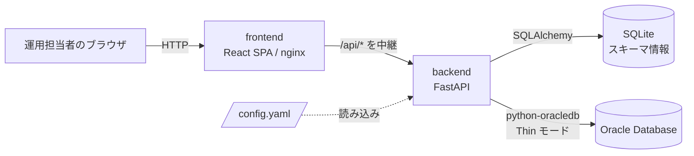
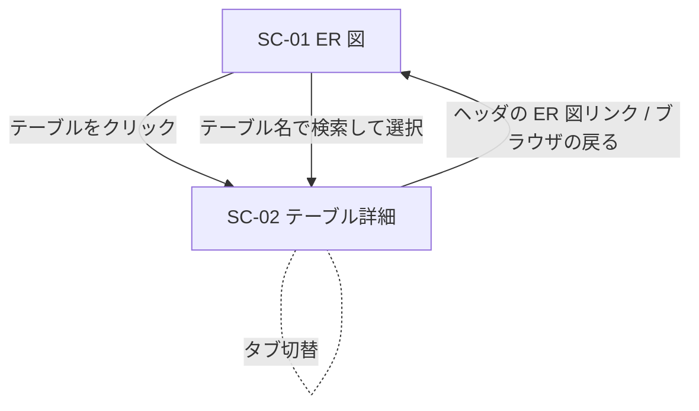

> **この文書は無効です。** CR-004 対応前の原本(2026-10-04時点)です。
> 現在有効なシステム要件定義は `docs/P001-requirement.md` です。

# P001 システム要件定義書 — DbFAQ

## 0. 本書の範囲(第1リリース)

DbFAQ の最終目標は「運用で使う SQL を FAQ(Frequently Asked Queries)として保存し、何度でも実行できるようにする」ことである。
人間の指示により、**第1リリースではその土台となる「Oracle のスキーマを読み取り、ER 図として表示し、テーブルの詳細(スキーマ情報・データ)を参照する機能」を作る。**
FAQ の保存・実行は第2リリース以降に変更要求(CR)として追加する(§10 将来スコープ)。

## 1. アプリケーションの概要

| 項目 | 内容 |
| --- | --- |
| 名称 | DbFAQ |
| 目的(第1リリース) | Oracle のスキーマ(テーブル・列・制約・リレーション)を読み取って SQLite に保存し、ブラウザで ER 図として見られるようにする。テーブルを選ぶと、スキーマ情報とテーブルの実データをタブで切り替えて参照できる |
| 利用者 | Oracle データベースの運用担当者 |
| 解決する課題 | 運用中にクエリを組み立てるとき、テーブル間の関係や列の定義を確認する手段が SQL*Plus などでのデータディクショナリ検索しかなく、手間がかかる。ER 図とテーブル詳細を画面で確認できるようにし、将来の FAQ(クエリ)作成の足場にする ★ACCEPTED★(2026-09-24 人間承認)課題の記述はAgentの想定。検討: 人間の原文に課題の記述が無く補った/承認理由: 趣旨に合う/残存リスク: 実際の課題とずれていれば、将来の FAQ 機能の優先度付けがずれる |
| 対象DB | Oracle Database。接続先は1つで、設定ファイルで指定する ★ACCEPTED★(2026-09-24 人間承認)接続先を1つに限定したのはAgentの想定。検討: 複数接続先の切替/承認理由: 第1リリースは1接続先で足りる/残存リスク: 複数 DB を見るには別インスタンスを立てるか CR が要る |
| DB への操作 | 読み取りのみ(データディクショナリの参照と、テーブルデータの SELECT) |

## 2. システムの前提

| 項目 | 内容 |
| --- | --- |
| 想定ユーザー数 | 同時利用者 1〜10名程度 ★ACCEPTED★(2026-09-24 人間承認)検討: 利用者数の指定が無く補った/承認理由: 社内の運用者向けで妥当/残存リスク: 10 名同時の負荷は未テスト(P302 10.1)→ CR-001 で確認する(§8.4) |
| 想定スキーマ規模 | 1スキーマあたりテーブル 〜300、列 〜5,000 まで ER 図を実用的な速さで表示できること ★ACCEPTED★(2026-09-24 人間承認)検討: 規模の指定が無く補った/承認理由: 想定する業務スキーマに足りる/残存リスク: 300 表を超えると表示が遅くなりうる |
| デプロイ先 | 実運用環境(社内ネットワーク内のサーバ)。Docker Compose で起動する |
| 認証・権限管理 | なし(人間の指示)。社内ネットワーク内の限られた端末からだけアクセスされる前提とする ★ACCEPTED★(2026-09-24 人間承認)ネットワーク側でアクセス元を制限する前提はAgentの想定。検討: アプリ側の認証/承認理由: 認証なしは人間の指示で、公開範囲はネットワークで絞る/残存リスク: 8088 番に届く人は誰でもスキーマとデータを読める |
| 永続化 | 読み取ったスキーマ情報は SQLite に保存する。SQLite ファイルは Docker ボリュームに置き、再起動・コンテナ再作成後も保持する |
| Oracle 接続設定 | 接続パラメータ(ホスト、ポート、サービス名、ユーザー、パスワード、対象スキーマ、タイムアウトなど)は設定ファイル `config.yaml` に保存する。`config.yaml` はリポジトリに含めず(`.gitignore` 対象)、ひな型の `config.example.yaml` だけを含める。コンテナへはホストからマウントする |
| 開発・テスト用 Oracle | 人間が指定した既存の Oracle(`localhost:1521`、サービス名 `FREEPDB1`、ユーザー `hr`)の HR サンプルスキーマで実証・テストする。パスワードは `config.yaml` にだけ書き、文書やリポジトリには書かない。HR には 7 テーブル(REGIONS, COUNTRIES, LOCATIONS, DEPARTMENTS, JOBS, EMPLOYEES, JOB_HISTORY)と外部キー 10 本、ビュー 1 本(EMP_DETAILS_VIEW)があることを確認済み(2026-09-23、Oracle 23.26) |
| コンテナから Oracle への接続 | Oracle がホスト上で動いている場合、コンテナからは `localhost` で届かないため、compose 用の設定ファイルでは `host.docker.internal`(`extra_hosts: host-gateway`)を指定する ★ACCEPTED★(2026-09-24 人間承認)検討: Oracle の配置が不明で補った/承認理由: 開発環境の構成に合う/残存リスク: Oracle が別ホストなら config.yaml の host を変える |

## 3. 技術選定

### 3.1 全体アーキテクチャ

* Oracle へは **backend(FastAPI)が python-oracledb で直接接続する**。MCP サーバは使わない(人間の指示。※CR-002により変更。以前は「すべて MCP サーバ(FastMCP、stdio、backend の子プロセス)経由」としていた)。
* backend の Oracle アクセス処理の設計は、既存の `../OracleSearchMCP`(TypeScript 実装)を参考にする。特に、データディクショナリの問い合わせ(ALL_TAB_COLUMNS / ALL_CONSTRAINTS / ALL_CONS_COLUMNS)、複合外部キーの扱い、読み取り専用トランザクション(`SET TRANSACTION READ ONLY` と、終了時の必ず `ROLLBACK`)、識別子の検証とクォートを踏襲する。

### 3.2 フロントエンド(人間の指示: おまかせ)

| 技術 | 選定理由 |
| --- | --- |
| React 19 + TypeScript | 人間の指示(React)。2026-09 時点の最新安定版(19.x) |
| Vite | React の標準的なビルドツールで、開発サーバの起動とビルドが速い |
| React Flow(`@xyflow/react`) | ER 図の描画に使う。拡大・縮小・パン(`Controls`)と全体の略図(`MiniMap`)が標準部品として揃っており、ノードのクリックも扱える。要求(拡大縮小・略図・クリックで遷移)をそのまま満たす |
| elkjs | ER 図の自動レイアウト(テーブルの配置と、リレーション線が重なりにくい配置)★ACCEPTED★(2026-09-24 人間承認)検討: フロントエンドはおまかせの指示/承認理由: ER 図の自動配置に向く/残存リスク: 特になし |
| React Router | ER 図画面とテーブル詳細画面を URL で表す(`/`、`/tables/:owner/:table`) |
| TanStack Query | API の取得・キャッシュ・再取得の管理 |
| Mantine | タブ、表、ボタン、通知などの UI 部品 ★ACCEPTED★(2026-09-24 人間承認)検討: 同上/承認理由: 必要な UI 部品がそろう/残存リスク: 特になし |
| npm | フロントエンドの依存管理 ★ACCEPTED★(2026-09-24 人間承認)検討: 同上/承認理由: 標準的な依存管理/残存リスク: 特になし |
| nginx(本番配信) | ビルド済み静的ファイルの配信と `/api` のリバースプロキシ |

### 3.3 バックエンド(※CR-002により見出しから MCP サーバを削除)

| 技術 | 選定理由 |
| --- | --- |
| Python 3.12 | CLAUDE.md の方針 ★ACCEPTED★(2026-09-24 人間承認)バージョンはAgentの想定。検討: 指定なし/承認理由: 依存ライブラリがすべて対応/残存リスク: 特になし |
| uv | Python のパッケージ管理(人間の指示)。backend を1つの uv プロジェクト(`server/`)の 1 パッケージ(`dbfaq_api`)で管理する(※CR-002により MCP サーバを削除。※CR-003により共通部品パッケージ `dbfaq_common` を `dbfaq_api` に統合) ★ACCEPTED★(2026-09-24 人間承認)プロジェクト構成はAgentの想定(P003 §1.2)。検討: 別プロジェクトに分ける/承認理由: 1 つのプロジェクトで依存・ロックファイルをまとめられる(※CR-003により「共通部品を共有しやすい」から変更。共有する相手が無くなったため)/残存リスク: 特になし |
| FastAPI | 人間の指示 |
| python-oracledb(Thin モード) | Oracle 公式ドライバ。Thin モードは Oracle Instant Client が不要で、コンテナイメージを小さくできる。HR への接続を実機で確認済み |
| SQLAlchemy 2.x + SQLite | 人間の指示(SQLite)。ORM でテーブル定義とテストを簡単にする ★ACCEPTED★(2026-09-24 人間承認)検討: ORM か Core か/承認理由: 設計(P003 §1.2、ADR-008)で SQLAlchemy Core にしたことも含めて承認。本行の「ORM」は Core と読み替える/残存リスク: 特になし |
| pydantic-settings + PyYAML | `config.yaml` の読み込みと型チェック ★ACCEPTED★(2026-09-24 人間承認)検討: 設定の読み込み方法/承認理由: 型チェックできる/残存リスク: 特になし |
| pytest | Python のテスト |

## 4. 画面一覧

| 画面ID | 画面名 | URL | 概要 |
| --- | --- | --- | --- |
| SC-01 | ER 図 | `/` | SQLite に保存したスキーマ情報から ER 図を描く。拡大・縮小・パン・全体の略図(ミニマップ)を持つ。テーブルをクリックすると SC-02 へ遷移する。「Oracle から再読み込み」でスキーマ情報を取り込み直す。トップ画面 |
| SC-02 | テーブル詳細 | `/tables/:owner/:table` | タブで「スキーマ情報」と「データ」を切り替える |

全画面に共通ヘッダ(アプリ名、対象スキーマ名、スキーマ情報の取得日時、ER 図へ戻るリンク)を置く。

## 5. 画面遷移図

## 6. 各画面の入出力項目と紐づく API

### SC-01 ER 図

| 区分 | 項目 | 備考 |
| --- | --- | --- |
| 出力 | テーブルのノード | 対象はテーブルのみ(ビューは ER 図に含めない)★ACCEPTED★(2026-09-24 人間承認)ビューを除外したのはAgentの想定。検討: ビューもノードにする/承認理由: ビューは外部キーを持たず線が引けない/残存リスク: ビューの定義はこの画面では見られない。テーブル名、テーブルのコメント、列の一覧(列名・データ型・主キー/外部キーの印・NOT NULL の印)|
| 出力 | リレーションの線 | 外部キー 1 本(複合外部キーも 1 本)につき 1 本。子テーブルから親テーブルへ向かう。線の近くに制約名を表示する ★ACCEPTED★(2026-09-24 人間承認)検討: 列単位で線を引く/承認理由: 制約単位の方が読みやすい/残存リスク: 特になし |
| 出力 | ミニマップ | 画面右下に全体の略図を表示し、今見えている範囲を枠で示す。略図をドラッグすると表示範囲が移る |
| 出力 | 取得日時 | スキーマ情報を Oracle から読み取った日時 |
| 操作 | 拡大・縮小 | マウスホイール、ピンチ、画面上のボタン(+ / − / 全体表示)。倍率は 10%〜200% ★ACCEPTED★(2026-09-24 人間承認)検討: 倍率の範囲/承認理由: 300 表の全体表示と細部の確認の両方に足りる/残存リスク: 特になし |
| 操作 | パン | 背景をドラッグ |
| 操作 | ノードのドラッグ | テーブルの位置を手で動かせる。位置は保存しない(再表示すると自動レイアウトに戻る)★ACCEPTED★(2026-09-24 人間承認)検討: 位置の保存/承認理由: 第1リリースでは不要/残存リスク: 再表示で手動の配置が失われる。ドラッグ操作は CR-001 で受入テスト(A01)を追加して確認する |
| 操作 | テーブル名検索 | 入力したテーブル名のノードへ表示を移し、強調する ★ACCEPTED★(2026-09-24 人間承認)検討: 検索の挙動/承認理由: 大きな ER 図で目的の表を探せる/残存リスク: 特になし |
| 操作 | テーブルをクリック | SC-02 へ遷移する |
| 操作 | Oracle から再読み込み | Oracle からスキーマ情報を読み取り(※CR-002により「MCP 経由で」を削除)、SQLite に保存し直して ER 図を描き直す |

| 操作 | API |
| --- | --- |
| 表示 | `GET /api/schema` |
| 再読み込み | `POST /api/schema/refresh` |

前提を満たさないとき:
* SQLite にスキーマ情報がまだ無い(初回起動時)場合は、ER 図の代わりに「スキーマ情報がありません」と「Oracle から読み込む」ボタンを表示する。
* 再読み込みに失敗した(Oracle に接続できない、タイムアウト、権限不足など)場合は、SQLite の前回の情報を残したまま ER 図を表示し続け、エラー通知(ORA エラーコードとメッセージ)を表示する。
* 読み込み中はボタンを押せなくし、処理中であることを表示する。
* 対象スキーマにテーブルが 0 件の場合は「テーブルがありません」と表示する。

### SC-02 テーブル詳細

共通(タブの外):

| 区分 | 項目 | 備考 |
| --- | --- | --- |
| 出力 | スキーマ名.テーブル名、テーブルのコメント | |
| 操作 | タブ切替 | 「スキーマ情報」「データ」。選択中のタブは URL のクエリ(`?tab=data`)に持ち、再読み込みしても保たれる ★ACCEPTED★(2026-09-24 人間承認)検討: タブ状態を URL に持つか/承認理由: 再読み込み・共有で状態が保たれる/残存リスク: 特になし |

#### スキーマ情報タブ(SQLite から表示)

| 区分 | 項目 | 備考 |
| --- | --- | --- |
| 出力 | 列一覧 | 順番、列名、データ型(長さ・精度・スケールを含む表記。例 `VARCHAR2(20)`、`NUMBER(8,2)`)、NULL 可否、デフォルト値、主キーの印、コメント |
| 出力 | 主キー | 制約名と列 |
| 出力 | 一意制約 | 制約名と列 ★ACCEPTED★(2026-09-24 人間承認)検討: 表示項目/承認理由: 必要十分/残存リスク: 特になし |
| 出力 | 外部キー(参照先) | 制約名、自テーブルの列 → 参照先テーブル.列。参照先テーブル名をクリックするとそのテーブルの SC-02 へ遷移する |
| 出力 | 外部キー(参照元) | このテーブルを参照している外部キー。参照元テーブル名をクリックするとそのテーブルの SC-02 へ遷移する |
| 出力 | インデックス | インデックス名、一意かどうか、列 ★ACCEPTED★(2026-09-24 人間承認)検討: 表示項目/承認理由: 必要十分/残存リスク: 特になし |
| 出力 | 行数の目安 | 統計情報の NUM_ROWS と統計の取得日(統計が無ければ「統計なし」)★ACCEPTED★(2026-09-24 人間承認)検討: COUNT(*) で正確に数える/承認理由: 大きな表で遅くなるため統計値にした/残存リスク: 統計が古いと実際の行数とずれる |

#### データタブ(Oracle から直接表示。SQLite には保存しない。※CR-002により「MCP 経由で」を変更)

| 区分 | 項目 | 備考 |
| --- | --- | --- |
| 出力 | データの表 | 列名を見出しにした表。1 ページ 50 行 ★ACCEPTED★(2026-09-24 人間承認)検討: 1 ページの行数/承認理由: 画面で見やすい/残存リスク: 多くの行を一度に見たいときはページ送りが要る |
| 出力 | 並び順 | 主キーの昇順(主キーが無いテーブルは ROWID 順)。ページをまたいで行の順番が変わらないようにするため ★ACCEPTED★(2026-09-24 人間承認)検討: 並び順を指定しない/承認理由: ページ間で順番を保つため/残存リスク: 特になし |
| 出力 | 値の表示 | NULL は「(null)」と区別して表示する。日付は `YYYY-MM-DD HH:MM:SS`。LOB と長い文字列は先頭 1,000 文字で切って省略記号を付ける ★ACCEPTED★(2026-09-24 人間承認)検討: 値の表示形式/承認理由: 参照用途に足りる/残存リスク: 1,000 文字を超える値の全体は見られない。日付の小数秒・タイムゾーンは表示しない |
| 操作 | ページ送り | 前へ / 次へ。次のページがあるかどうかで「次へ」を押せるかを決める(全件数は数えない。大きなテーブルで COUNT(*) を避けるため)★ACCEPTED★(2026-09-24 人間承認)検討: 全件数の表示/承認理由: 大きな表での COUNT(*) を避ける/残存リスク: 総ページ数は分からない |
| 操作 | 再読み込み | 同じページを取り直す |
| 出力 | 取得時間 | Oracle からの取得にかかった時間 |

| 操作 | API |
| --- | --- |
| スキーマ情報タブの表示 | `GET /api/schema/tables/{owner}/{table}` |
| データタブの表示・ページ送り | `GET /api/schema/tables/{owner}/{table}/rows?offset=&limit=` |

前提を満たさないとき:
* URL のテーブルが SQLite のスキーマ情報に無い場合は「テーブルが見つかりません」と ER 図へ戻るリンクを表示する。
* データの取得でエラー(Oracle に接続できない、SELECT 権限が無い、タイムアウト、テーブルが Oracle 側で削除済み)になった場合は、データタブにエラー(ORA エラーコードとメッセージ)を表示する。スキーマ情報タブはそのまま使える。
* データが 0 行の場合は「データがありません」と表示する。

## 7. バックエンド API 一覧

| メソッド | パス | 用途 |
| --- | --- | --- |
| GET | `/api/schema` | ER 図用のスキーマ情報(テーブル・列・主キー・外部キー・取得日時)を SQLite から返す。未取得なら空であることを返す |
| POST | `/api/schema/refresh` | Oracle からスキーマ情報を読み取り、SQLite を置き換える(失敗したら前回の情報を残す) |
| GET | `/api/schema/tables/{owner}/{table}` | テーブル詳細(列・制約・インデックス・参照元外部キー・統計)を SQLite から返す |
| GET | `/api/schema/tables/{owner}/{table}/rows` | Oracle からテーブルのデータを 1 ページ分取得する(offset, limit。limit は最大 500)|
| GET | `/api/health` | backend の稼働、Oracle の疎通(DB バージョン)、接続設定(パスワード以外)を返す |

※CR-002により refresh・rows の「MCP 経由で」と、health の「MCP サーバの疎通」を削除。

### 7.1 backend の Oracle アクセス処理(※CR-002により「MCP サーバのツール一覧」から変更)

| 処理 | 用途 |
| --- | --- |
| スキーマの読み取り | 対象スキーマのテーブル・列・主キー・一意制約・外部キー(複合を含む)・インデックス・コメント・統計の行数をまとめて読み取る(対象: owner。省略時は接続ユーザー)。`POST /api/schema/refresh` が使う |
| テーブルデータの取得 | テーブルのデータを主キー順に 1 ページ分読み取る(owner, table, offset, limit)。テーブル名は実在確認のうえクォートして埋め込み、offset/limit はバインド変数で渡す。`GET .../rows` が使う |
| 疎通確認 | Oracle への疎通確認(DB バージョンと接続ユーザー)。`GET /api/health` が使う |

* すべての処理は読み取り専用トランザクション(`SET TRANSACTION READ ONLY`)の中で実行し、最後に必ずロールバックする。
* エラーは ORA エラーコードとメッセージを含む決まった形で返す。

## 8. 非機能要件

### 8.1 性能

| 項目 | 目標 |
| --- | --- |
| ER 図の表示(SQLite から) | HR(7 テーブル)で 1 秒以内。300 テーブルで 3 秒以内 ★ACCEPTED★(2026-09-24 人間承認)検討: 目標値の指定が無く補った/承認理由: A05 で達成を確認済み/残存リスク: 特になし |
| スキーマの再読み込み(Oracle から) | HR で 10 秒以内 ★ACCEPTED★(2026-09-24 人間承認)検討: 同上/承認理由: A05 で達成を確認済み/残存リスク: 大きなスキーマでは時間が延びる |
| データタブの 1 ページ表示 | Oracle の処理時間 + 1 秒以内 ★ACCEPTED★(2026-09-24 人間承認)検討: 同上/承認理由: A05 で達成を確認済み/残存リスク: 特になし |
| Oracle 問い合わせのタイムアウト | 既定 30 秒。`config.yaml` で変更できる ★ACCEPTED★(2026-09-24 人間承認)検討: 既定値/承認理由: 設定で変えられる/残存リスク: 特になし |

### 8.2 可用性

* 単一ホストの Docker Compose で動かす。冗長化はしない ★ACCEPTED★(2026-09-24 人間承認)検討: 冗長化/承認理由: 社内の参照ツールであり、停止しても業務は止まらない/残存リスク: ホスト障害中は使えない
* 各コンテナは `restart: unless-stopped` で自動で再起動する。
* Oracle に接続できなくても backend・frontend は起動し、SQLite に保存済みのスキーマ情報で ER 図とスキーマ情報タブは表示できる(データタブと再読み込みだけがエラーになる)。
* Oracle に接続できない状態から Oracle が戻った場合、backend を再起動しなくても次の呼び出しから使えるようになる(※CR-002により「MCP サーバの子プロセスが異常終了した場合、backend は次の呼び出し時に起動し直す」から変更。子プロセスが無くなるため)

### 8.3 セキュリティ

* 認証なし(人間の指示)。compose でホストに公開するのは frontend のポートだけにする。
* Oracle へのアクセスは読み取りのみ。backend はデータディクショナリの参照と、実在確認済みのテーブルに対する決まった形の SELECT しか発行しない(任意の SQL を受け付ける機能は第1リリースでは作らない)(※CR-002により主語を MCP サーバから backend に変更)。さらに読み取り専用トランザクションで実行する。
* 実運用では、接続ユーザーを読み取り専用ユーザー(`CREATE SESSION` と対象テーブルへの `SELECT` 権限のみ)にすることを導入手順書で推奨する ★ACCEPTED★(2026-09-24 人間承認)検討: 読み取り専用ユーザーを必須にする/承認理由: 読み取り専用トランザクションで書き込みを防いでいるため推奨にとどめる/残存リスク: 書き込み権限のあるユーザーで運用すると多重防御にならない
* パスワードは `config.yaml` にだけ書く。API の応答・ログ・画面に出さない。`config.yaml` はイメージに含めず、Git の管理対象外にする。
* TLS はアプリでは終端しない。必要なら運用環境のリバースプロキシで終端する ★ACCEPTED★(2026-09-24 人間承認)検討: アプリでの TLS 終端/承認理由: 社内ネットワーク前提/残存リスク: リバースプロキシが無いと通信は平文(P302 10.2 の本番検証)

### 8.4 スケーラビリティ・同時利用者数

* 同時利用者 10 名程度を想定する。SQLite は WAL モードで使う。スキーマの再読み込みが同時に要求された場合は 1 つだけ実行し、ほかは実行中であることを返す ★ACCEPTED★(2026-09-24 人間承認)検討: 同時利用の想定/承認理由: 社内の運用者向けで妥当/残存リスク: 10 名同時の負荷は未テスト(P302 10.1)→ CR-001 で A08 を追加して確認する
* 同時利用者 10 名の合格基準: 10 名が同時に ER 図の表示・テーブル詳細・データタブのページ送りを繰り返しても、エラーが 0 件で、各操作が 8.1 の目標内(ER 図・テーブル詳細は 1 秒以内、データ 1 ページは Oracle の処理時間 + 1 秒以内)であること(人間の指示)※CR-001により追加

### 8.5 ログ出力と監視

* backend は JSON 形式のログを標準出力へ出す。`docker compose logs` で確認する(※CR-002により MCP サーバのログ(標準エラー出力)の記述を削除)。
* 外部の監視基盤との連携はしない。`GET /api/health` を外部の監視から使える形にしておく ★ACCEPTED★(2026-09-24 人間承認)検討: 監視基盤との連携/承認理由: health を外部から使えれば足りる/残存リスク: 監視の設定は運用側で行う

## 9. テスト方針

* **単体テスト**: backend は pytest(※CR-002により MCP サーバを削除)。データディクショナリの結果を ER 図の形に組み立てる処理(複合外部キー、主キーの無いテーブル、自己参照の外部キー)、識別子の検証、SQLite への保存と置き換えを重点的に確かめる。frontend は Vitest + Testing Library で、API の結果から ER 図のノードと線を作る処理、タブ切替、ページ送りを確かめる。
* **結合テスト**: backend → Oracle(HR)をつないで(※CR-002により MCP サーバを削除)、スキーマの読み取り、SQLite への保存、データのページ取得、エラー(存在しないテーブル、接続できない設定、タイムアウト)を確かめる。HR の期待値(7 テーブル、外部キー 10 本、EMPLOYEES の自己参照 EMP_MANAGER_FK など)で検証する。
* **受入テスト**: docker compose で全体を起動し、Playwright でブラウザ操作(初回読み込み → ER 図表示 → 拡大縮小・ミニマップ → テーブルをクリック → スキーマ情報タブ → データタブのページ送り → 外部キー先へ移動)を確かめる ★ACCEPTED★(2026-09-24 人間承認)E2E ツールの選定はAgentの想定。検討: ツールの指定なし/承認理由: ブラウザ操作の自動化に向く/残存リスク: 特になし
* テストでは HR のデータを変更しない。テストを続けて2回実行しても同じ結果になることを確かめる。

## 10. 将来スコープ(第2リリース以降に CR で追加する)

* FAQ(保存したクエリ)の登録・編集・削除・検索、カテゴリ・タグ
* FAQ の実行(SELECT のみ。バインド変数によるパラメータ入力)、結果の表示と CSV 出力
* 実行履歴
* 任意の SELECT の実行(SQL の検査と読み取り専用トランザクションによる多層防御。`../OracleSearchMCP` の SQL ガードを参考にする)(※CR-002により「MCP ツール」を削除。「MCP の HTTP トランスポート対応」も MCP の廃止にともない削除)
* ER 図のノード位置の保存、複数スキーマの切り替え
