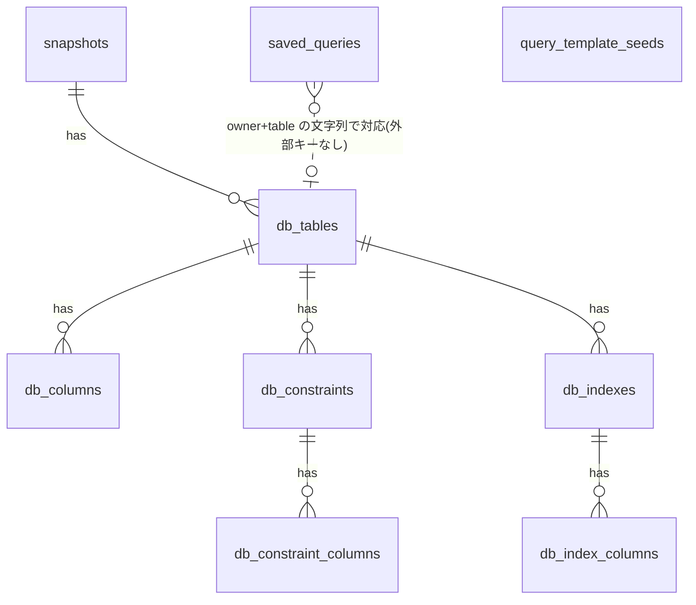
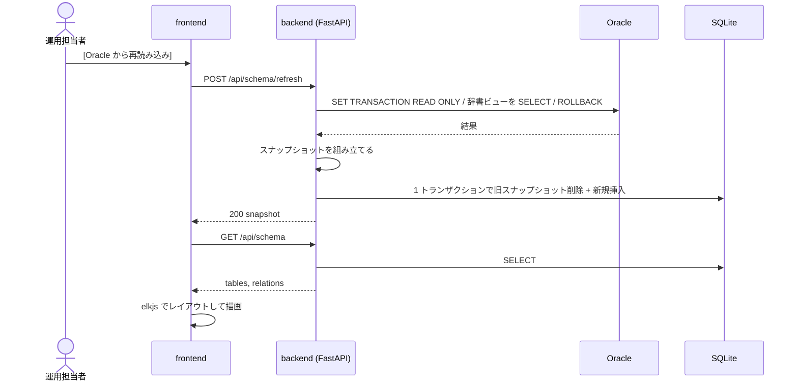
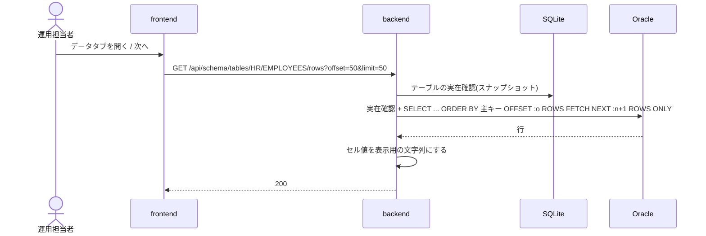
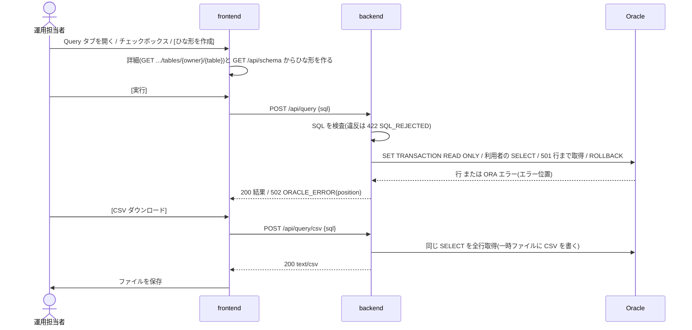
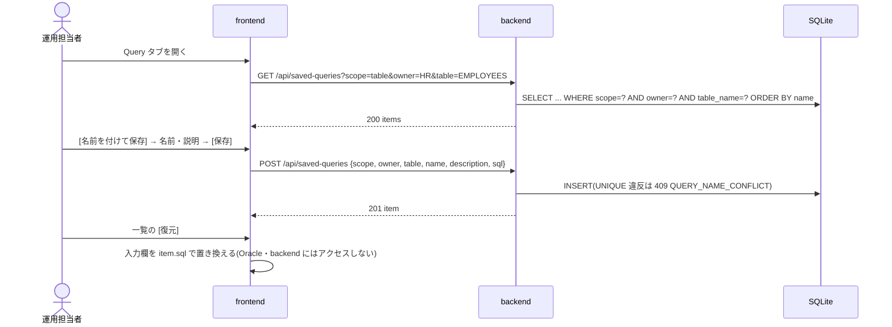
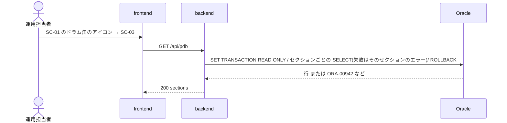

# P002 ユーザインタフェース設計書 — DbFAQ(第1リリース)

入力: `docs/P001-requirement.md`。本書は画面の振る舞い、入力のバリデーション、API の外部仕様(契約)、画面を成り立たせるデータモデルを確定する。
内部の実現方法(Oracle へのアクセス方法、SQL、SQLite への保存手順など。※CR-002により「MCP の呼び出し方」を変更)は `docs/P003-backend-spec.md` で確定する。

## 1. 画面共通

### 1.1 レイアウト

```
+----------------------------------------------------------------------------+
| DbFAQ   スキーマ: HR   取得日時: 2026-09-23 10:15:02   [ER 図]   ●Oracle   |  ← 共通ヘッダ (高さ 48px)
+----------------------------------------------------------------------------+
|                                                                            |
|                       各画面の本体 (ヘッダ以外の全面)                        |
|                                                                            |
+----------------------------------------------------------------------------+
```

| 要素 | 内容 |
| --- | --- |
| アプリ名「DbFAQ」 | クリックで SC-01 へ |
| スキーマ | `GET /api/schema` の `snapshot.owner`。未取得なら「未取得」 |
| 取得日時 | `snapshot.fetched_at` をブラウザのローカル時刻で `YYYY-MM-DD HH:mm:ss` 表示。未取得なら非表示 |
| [ER 図] リンク | SC-01 へ |
| Oracle 状態 | `GET /api/health` の `oracle.status` を色付きの丸で表示(ok=緑、error=赤、確認中=灰)。マウスを乗せると DB バージョン・接続先(host:port/service、user)またはエラーメッセージを表示する。画面を開いたとき 1 回取得し、以降は 60 秒ごとに再取得する ★ACCEPTED★(2026-09-24 人間承認)60 秒間隔はAgentの想定。検討: 要求書に無い表示(P302 10.4)/承認理由: Oracle に届かないことにすぐ気づける/残存リスク: 状態の反映は最大 60 秒遅れる |

### 1.2 ルーティング

| URL | 画面 | 備考 |
| --- | --- | --- |
| `/` | SC-01 ER 図 | |
| `/tables/:owner/:table` | SC-02 テーブル詳細 | `:owner`・`:table` は URL エンコードした Oracle 識別子(大文字小文字を区別する。辞書に格納された値そのまま) |
| `/tables/:owner/:table?tab=schema` | SC-02 スキーマ情報タブ | `tab` 省略時・不正値のときは `schema` |
| `/tables/:owner/:table?tab=query` | SC-02 Query タブ | ※CR-004により追加。SQL は URL に持たない(長く、共有の意図が無いため) |
| `/pdb` | SC-03 PDB(PDB 情報タブ) | ※CR-005により追加。`tab` 省略時・不正値のときは `info` |
| `/pdb?tab=query` | SC-03 PDB の Query タブ | ※CR-005により追加。SQL は URL に持たない |
| `/tables/:owner/:table?tab=data&page=N` | SC-02 データタブ | `page` は 1 始まり。省略時・不正値(整数でない、1 未満)のときは 1 ★ACCEPTED★(2026-09-24 人間承認)ページ番号を URL に持たせるのはAgentの想定。検討: 要求書に無い(P302 10.4)/承認理由: 再読み込みで位置が保たれる/残存リスク: 特になし |
| 上記以外 | 「ページが見つかりません」+ ER 図へのリンク | |

### 1.3 共通のエラー表示

* API が §3.1 のエラー形式を返したら、通知(画面右上、10 秒で消える。手動で閉じられる)に `message` を表示する。`ora_code` があれば `message` の前に `[ORA-xxxxx]` を付ける。
* backend に接続できない(ネットワークエラー)場合は「サーバに接続できません」と表示する。
* 例外: SC-02 データタブのエラーは通知ではなく、タブ内にエラー表示(§2.2.3)する。Query タブのエラーも同じくタブ内に表示する(§2.2.6。※CR-004により追加)。SC-03 の PDB 情報タブのエラーも項目ごとにタブ内に表示する(§2.3.2。※CR-005により追加)。保存済み Query の保存・変更のエラーはダイアログ内に表示する(§2.2.8。※CR-005により追加)。

## 2. 画面仕様

### 2.1 SC-01 ER 図

#### 2.1.1 レイアウト

```
+----------------------------------------------------------------------------+
| 共通ヘッダ                                                                  |
+----------------------------------------------------------------------------+
| [テーブル名で検索 ______ ]  [Oracle から再読み込み]   テーブル 7 / 関連 10   |  ← ツールバー
+----------------------------------------------------------------------------+
|  +--------+                                                                |
|  | (ドラム)|  ← PDB のアイコン(※CR-005により追加。キャンバスの左上に固定)       |
|  |  PDB   |                                                                |
|  |FREEPDB1|                                                                |
|  +--------+                                                                |
|  +-----------+          +-------------+                                    |
|  | REGIONS   |<---------| COUNTRIES   |          ER 図キャンバス             |
|  |-----------|          |-------------|                                    |
|  |🔑REGION_ID|          |🔑COUNTRY_ID |                                    |
|  | REGION_NAME          |🔗REGION_ID  |                    +------------+  |
|  +-----------+          +-------------+                    | ミニマップ  |  |
|  [+][-][□]                                                 +------------+  |
+----------------------------------------------------------------------------+
```

#### 2.1.2 ER 図の描画規則

| 対象 | 規則 |
| --- | --- |
| ノード | 1 テーブル = 1 ノード(ビューは含めない)。見出し行にテーブル名、その下に列を `column_id` 順に 1 行ずつ表示する |
| 列の行 | `[印] 列名  データ型表記`。印は主キー列=🔑、外部キー列=🔗(両方なら両方)。NOT NULL の列は列名を太字にする |
| ノードのツールチップ | テーブルのコメント(無ければ表示しない) |
| 列数の多いテーブル | 列が 30 を超える場合は先頭 30 列を表示し、末尾に「… 他 N 列」と表示する ★ACCEPTED★(2026-09-24 人間承認)検討: 全列を表示する/承認理由: ノードが大きくなりすぎるのを防ぐ/残存リスク: 31 列目以降は SC-02 で見る |
| 線(エッジ) | 外部キー 1 制約 = 1 本(複合外部キーも 1 本)。子テーブル(外部キーを持つ側)から親テーブル(参照先)へ矢印を向ける。線上に制約名をラベル表示する |
| 自己参照 | 同じノードの右辺から出て右辺に戻るループ線で描く(例: `EMP_MANAGER_FK`) |
| 別スキーマへの外部キー | 参照先テーブルがノードに無い(`to_owner` が対象スキーマと異なる)場合、線は描かない。SC-02 の外部キー一覧には表示する ★ACCEPTED★(2026-09-24 人間承認)検討: 別スキーマのノードも描く/承認理由: 対象は 1 スキーマ/残存リスク: 別スキーマへの関係は ER 図では見えない |
| 自動レイアウト | elkjs の `layered` アルゴリズム、方向は左→右(親テーブルが右)。ノードの幅・高さは列数とテーブル名の長さから算出する ★ACCEPTED★(2026-09-24 人間承認)検討: レイアウト方式/承認理由: 親子関係が読みやすい/残存リスク: 特になし |
| 初期表示 | レイアウト完了後に全体表示(fit view)する |
| PDB のアイコン(※CR-005により追加) | テーブルのノードとは別に、キャンバス領域の左上にドラム缶(記憶装置。円柱)のアイコンを固定で置く(拡大縮小・パンで動かない。ER 図のレイアウトには含めない)。アイコンの下に「PDB」と、`GET /api/health` の `config.service_name` を英大文字にした名前(取得前・取得失敗時は名前を出さない)を表示する。スキーマ情報の取得中・未取得・テーブル 0 件・エラーのときも表示する。マウスを乗せると「PDB の情報と Query」と表示する ★ACCEPTED★(2026-10-09 人間承認)検討: アイコンを ER 図のノードにするか、キャンバス左上に固定するか/承認理由: ノードにすると自動レイアウト・ミニマップ・テーブル数の表示に混ざる/残存リスク: 拡大縮小・パンで動かず、ノードと重なって見えることがある |

#### 2.1.3 操作

| 操作 | 振る舞い |
| --- | --- |
| マウスホイール / ピンチ | 拡大・縮小。倍率 10%〜200% |
| コントロール(左下) | [+] 拡大、[−] 縮小、[□] 全体表示 |
| 背景ドラッグ | パン |
| ノードのドラッグ | ノードを移動。位置は保存しない(画面を開き直すと自動レイアウトに戻る) |
| ミニマップ(右下) | 全ノードの略図と、現在の表示範囲の枠を表示する。ミニマップ上をクリック・ドラッグすると表示範囲が移る。ミニマップ上のホイールで拡大縮小する |
| ノードのクリック | SC-02(`/tables/{owner}/{table}`)へ遷移する。ドラッグ(移動量 5px 以上)の後に離した場合は遷移しない |
| PDB のアイコンのクリック(Enter・Space でも可) | SC-03(`/pdb`)へ遷移する(※CR-005により追加) |
| テーブル名検索 | 入力中に候補(テーブル名の部分一致、大文字小文字を区別しない、最大 20 件)を表示する。候補を選ぶと、そのノードを画面中央に移動・拡大(倍率 100%)し、2 秒間強調表示する。Enter で先頭候補を選ぶ。候補の行の右端にある「開く」ボタンを押すと、そのテーブルの SC-02 へ遷移する ★ACCEPTED★(2026-09-24 人間承認)検索の挙動はAgentの想定。検討: 検索の挙動/承認理由: 使いやすい/残存リスク: 特になし |
| [Oracle から再読み込み] | `POST /api/schema/refresh` を呼ぶ。実行中はボタンを無効化してスピナーと「読み込み中…」を表示する。成功したら `GET /api/schema` を取り直して描き直し、通知「スキーマ情報を更新しました(テーブル N / 関連 M)」を表示する。失敗したら前回の ER 図を残し、エラー通知を表示する |

#### 2.1.4 入力のバリデーション

| 項目 | ルール |
| --- | --- |
| テーブル名検索 | 任意。最大 128 文字(Oracle の識別子の最大長)。前後の空白は取り除く。空なら候補を出さない。サーバには送らない(クライアント内で絞り込む) |

#### 2.1.5 状態ごとの表示

| 状態 | 表示 |
| --- | --- |
| `GET /api/schema` 取得中 | キャンバス中央にスピナー |
| `loaded=false`(未取得) | キャンバスの代わりに「スキーマ情報がありません」と [Oracle から読み込む] ボタン(再読み込みと同じ動作) |
| `loaded=true` かつ テーブル 0 件 | 「テーブルがありません(スキーマ: HR)」と [Oracle から再読み込み] ボタン |
| レイアウト計算中 | キャンバス中央にスピナー |
| 再読み込み失敗 | 前回の ER 図を表示し続け、エラー通知 |

* いずれの状態でも PDB のアイコンは表示する(※CR-005により追加)。

### 2.2 SC-02 テーブル詳細

#### 2.2.1 レイアウト

```
+----------------------------------------------------------------------------+
| 共通ヘッダ                                                                  |
+----------------------------------------------------------------------------+
| ← ER 図へ    HR.EMPLOYEES                                                  |
|              employees table. References with departments, jobs, ...       |
| [ スキーマ情報 ] [ データ ] [ Query ]                                        |
+----------------------------------------------------------------------------+
|  タブの中身                                                                 |
+----------------------------------------------------------------------------+
```

* 「← ER 図へ」は SC-01 へ遷移する(ブラウザの戻るでも可)。
* タブを切り替えると URL の `tab` を書き換える(履歴を積まない `replace`)。データタブのページ送りも `page` を `replace` で書き換える。
* ※CR-004により Query タブを追加。Query タブの入力欄の内容・チェックボックスの状態・最後の実行結果(※CR-005により、復元・保存した保存済み Query の情報を含む)は、同じテーブルの SC-02 を表示している間はタブを切り替えても保つ。別のテーブルへ移ったり画面を再読み込みしたりすると初期状態(ひな形)に戻る ★ACCEPTED★(2026-10-09 人間承認)検討: 入力・結果をブラウザに保存するか/承認理由: CR-005 で SQL は保存済み Query として残せる/残存リスク: 保存していない入力は再読み込みで消える

#### 2.2.2 スキーマ情報タブ

`GET /api/schema/tables/{owner}/{table}` の結果を表示する。

| セクション | 表示項目 |
| --- | --- |
| 概要 | テーブル名、コメント、行数の目安(`num_rows`。null なら「統計なし」)、統計取得日(`last_analyzed`、`YYYY-MM-DD HH:mm:ss`) |
| 列 | #(`column_id`)、列名、データ型(`data_type_display`)、NULL(「可」/「不可」)、デフォルト(`data_default`、null なら空欄)、主キー(🔑 と主キー内の位置)、コメント |
| 主キー | 制約名、列(カンマ区切り、位置順)。無ければ「主キーなし」 |
| 一意制約 | 制約名、列。無ければ「なし」 |
| 外部キー(このテーブル → 参照先) | 制約名、列 → `参照先スキーマ.参照先テーブル(列)`、削除時の動作(`delete_rule`)。参照先テーブル名はリンク(SC-02 へ)。参照先がスナップショットに無い別スキーマのテーブルの場合はリンクにしない |
| 外部キー(参照元 → このテーブル) | 制約名、`参照元テーブル(列)` → 列。参照元テーブル名はリンク(SC-02 へ) |
| インデックス | インデックス名、一意(「一意」/空欄)、種類(`index_type`)、列(位置順、降順の列は ` DESC` を付ける) |

#### 2.2.3 データタブ

初めてデータタブを開いたときに `GET /api/schema/tables/{owner}/{table}/rows?offset={(page-1)*50}&limit=50` を呼ぶ。スキーマ情報タブだけを見ている間は呼ばない。

```
| 並び順: EMPLOYEE_ID(主キー)    取得 38 ms    [再読み込み]   [< 前へ] 1 ページ目 (1〜50 行) [次へ >] |
+-------------+------------+-----------+----------------------+-----------------------+
| EMPLOYEE_ID | FIRST_NAME | LAST_NAME | EMAIL                | HIRE_DATE             |
+-------------+------------+-----------+----------------------+-----------------------+
| 100         | Steven     | King      | SKING                | 2013-06-17 00:00:00   |
```

| 要素 | 振る舞い |
| --- | --- |
| 表 | 見出しは列名(マウスを乗せるとデータ型)。横に長い場合は表の中で横スクロール。見出し行は縦スクロールしても固定 |
| セルの値 | API の値をそのまま表示する。`null` は灰色斜体で `(null)` と表示し、文字列 `"(null)"` と見分けられるようにする。`truncated` の列インデックスに含まれるセルは末尾に `…` が付いた状態で届くので、マウスを乗せると「先頭 1,000 文字のみ表示」と表示する |
| 並び順の表示 | `order_basis=PRIMARY_KEY` なら「並び順: 列名(主キー)」、`ROWID` なら「並び順: ROWID(主キーなし)」 |
| 取得時間 | `elapsed_ms` を「取得 N ms」で表示 |
| [前へ] | `page>1` のとき押せる。`page-1` を取得 |
| [次へ] | `has_next=true` のとき押せる。`page+1` を取得 |
| 行範囲の表示 | 「N ページ目 (a〜b 行)」。0 行のときは「データがありません」 |
| [再読み込み] | 同じ `offset`・`limit` で取り直す(キャッシュを使わない) |
| 取得中 | 表の上にスピナーを重ね、ボタンを無効化 |
| エラー | 表の代わりにエラー表示(赤枠): `[ORA-xxxxx] メッセージ` またはメッセージと [再試行] ボタン |

#### 2.2.4 入力のバリデーション

| 項目 | ルール | 不正時 |
| --- | --- | --- |
| URL の `:owner`・`:table` | 1〜128 文字。スナップショットに存在すること | API が 404 `TABLE_NOT_FOUND` を返したら「テーブルが見つかりません: HR.XXX」と [ER 図へ] を表示 |
| URL の `tab` | `schema`、`data`、`query`(※CR-004により `query` を追加) | `schema` として扱う |
| 保存済み Query の名前・説明(※CR-005により追加) | 名前: 前後の空白を除いて 1〜100 文字。説明: 1,000 文字以下(空でよい) | ダイアログの入力欄の下にエラーを表示し、[保存] を押せない。同じ名前は backend が 409 で返す(§2.2.8) |
| Query タブの SELECT 文 | 空白以外の文字を含むこと。100,000 文字以下(※CR-004により追加) | 空白だけのときは [実行]・[CSV ダウンロード] を押せない。100,000 文字を超えたら入力欄の下に「100,000 文字以内で入力してください」と表示し、両ボタンを押せない。SELECT・WITH 以外の文などの検査は backend が行う(§3.8)|
| URL の `page` | 1 以上の整数。`(page-1)*50` が 100,000 以下 | 1 として扱う。上限超えは 1 として扱う ★ACCEPTED★(2026-09-24 人間承認)検討: 上限超えの扱い/承認理由: offset 上限(3.5)に合わせる/残存リスク: 5,001 ページ目以降は見られない |

#### 2.2.5 状態ごとの表示

| 状態 | 表示 |
| --- | --- |
| スキーマ未取得(`SCHEMA_NOT_LOADED`) | 「スキーマ情報がありません」と [ER 図へ](SC-01 で読み込める) |
| テーブルが無い(`TABLE_NOT_FOUND`) | 「テーブルが見つかりません: {owner}.{table}」と [ER 図へ] |
| Oracle に接続できない | スキーマ情報タブは表示できる。データタブにエラー表示。Query タブはひな形を作れるが、実行・CSV ダウンロードはタブ内にエラー表示(※CR-004により追加)。保存済み Query の一覧・保存・復元は使える(SQLite だけで行う。※CR-005により追加) |

#### 2.2.6 Query タブ(※CR-004により追加)

利用者が SELECT 文を書いて Oracle で実行し、結果を表で見る。ひな形はスキーマ情報(SQLite のスナップショット)から画面側で作る(Oracle にはアクセスしない)。結果は保存しない。SQL は名前と説明を付けてテーブルごとに保存・復元できる(※CR-005により追加。§2.2.8)。

```
| JOIN するテーブル(外部キー):                                                     |
|  [ ] → DEPARTMENTS  EMP_DEPT_FK (DEPARTMENT_ID)                                   |
|  [ ] → JOBS         EMP_JOB_FK (JOB_ID)                                           |
|  [ ] → EMPLOYEES    EMP_MANAGER_FK (MANAGER_ID)                                   |
|  [ ] ← DEPARTMENTS  DEPT_MGR_FK (MANAGER_ID → EMPLOYEE_ID)                        |
|  [ ] ← EMPLOYEES    EMP_MANAGER_FK (MANAGER_ID → EMPLOYEE_ID)                     |
|  [ ] ← JOB_HISTORY  JHIST_EMP_FK (EMPLOYEE_ID → EMPLOYEE_ID)                      |
| [ひな形を作成]                                                                     |
| 保存済み Query (2) [名前を付けて保存] [上書き保存] 復元中: 部署50 ← ※CR-005(§2.2.8) |
|  ● 部署50の社員   部署 50 の社員を姓の順に        2026-10-07 21:03  [復元][編集][削除] |
|    給与の高い順   ...                             2026-10-07 21:10  [復元][編集][削除] |
| +-------------------------------------------------------------------------------+ |
| | SELECT                                                                        | |
| |   t0.EMPLOYEE_ID,                                                             | |
| |   ...                                                                         | |
| | FROM HR.EMPLOYEES t0                                                          | |
| | ORDER BY t0.EMPLOYEE_ID                                                       | |
| +-------------------------------------------------------------------------------+ |
| [実行 (Ctrl+Enter)]  [CSV ダウンロード]      107 行   取得 41 ms                   |
| +-------------+------------+-----------+                                          |
| | EMPLOYEE_ID | FIRST_NAME | ...       |   ← 結果の表(先頭 500 行まで)             |
```

| 要素 | 振る舞い |
| --- | --- |
| JOIN するテーブルの一覧 | `GET /api/schema/tables/{owner}/{table}` の `foreign_keys`(→ このテーブルが参照するテーブル)と `referenced_by`(← このテーブルを参照するテーブル)を、この順に、それぞれ制約名の昇順で 1 制約 = 1 行のチェックボックスで並べる。表示は `→ 参照先テーブル  制約名 (列)` / `← 参照元テーブル  制約名 (参照元の列 → このテーブルの列)`。相手のテーブルの列が `GET /api/schema` に無い(別スキーマ、`ref_in_snapshot=false`、列名が不明)制約は、チェックボックスを押せなくし「列情報なし」と添える。外部キーが 1 本も無ければ「外部キーでつながるテーブルはありません」と表示する ★ACCEPTED★(2026-10-09 人間承認)検討・承認理由・残存リスクは P001 §6 Query タブと同じ |
| チェックボックス | 切り替えると、入力欄がひな形のまま(利用者が編集していない)なら、選択に合わせたひな形に自動で置き換える。利用者が編集していたら置き換えず、「SQL が編集されているため自動では置き換えません」と表示する(内容を失わないため)。[ひな形を作成] で置き換えられる ★ACCEPTED★(2026-10-09 人間承認)検討: 編集済みでもチェックボックスでひな形に置き換えるか/承認理由: 利用者の入力を失わない/残存リスク: [ひな形を作成] を押す手間がかかる |
| [ひな形を作成] | 現在のチェックボックスの選択で §2.2.7 のひな形を作り、入力欄を置き換える |
| 入力欄 | 等幅フォントの複数行入力。初期値は外部キーを選んでいないひな形。高さは内容に合わせて 8〜20 行。Ctrl+Enter(macOS は ⌘+Enter)で [実行] と同じ |
| [実行] | `POST /api/query` に入力欄の内容をそのまま送る。実行中はボタンを無効にしてスピナーを出す |
| 結果の表 | データタブの表と同じ見た目・値の表示(見出しは列名、マウスを乗せるとデータ型、`(null)`、切り詰めたセルのツールチップ、見出しの固定、横スクロール)。同じ名前の列が複数あってもそのまま並べる |
| 行数・取得時間 | 「N 行」「取得 N ms」(`elapsed_ms`)。`has_more=true` のときは「先頭 500 行を表示しています(500 行で打ち切り)。全行は CSV でダウンロードできます」と表示する |
| 0 行 | 列の見出しだけの表と「結果は 0 行です」 |
| [CSV ダウンロード] | `POST /api/query/csv` に入力欄の内容を送り、応答をファイルとして保存させる。ファイル名は `{テーブル名}_query_{YYYYMMDD-HHmmss}.csv`(ブラウザのローカル時刻)。作成中はボタンを無効にしてスピナーを出す。画面の結果の表は変えない(実行していなくても押せる) |
| エラー | 結果の表の代わりに赤枠のエラー表示: 見出し「SQL を実行できませんでした」(CSV のときは「CSV を作成できませんでした」)、`[ORA-xxxxx] メッセージ`(`ora_code` が無ければメッセージだけ)。`position` があれば「エラー位置: N 行目 M 文字目」と、その行の内容と位置を示す `^` を等幅で表示し、[エラー位置へ移動] で入力欄のその文字を選択状態にする。`SQL_REJECTED` は「実行できない SQL です: 理由」と表示する |

#### 2.2.7 ひな形の組み立て規則(※CR-004により追加)

画面側の純粋関数で作る。入力は `GET /api/schema/tables/{owner}/{table}`(このテーブルの列・主キー・外部キー)と `GET /api/schema`(相手のテーブルの列)、選んだ制約の一覧。

| 項目 | 規則 |
| --- | --- |
| 別名 | このテーブルは `t0`、選んだ制約の相手のテーブルは一覧の順に `t1`、`t2`、… 同じテーブルを複数回 JOIN しても(自己参照を含む)別名で区別する |
| 識別子の書き方 | 英大文字で始まり英大文字・数字・`_`・`$`・`#` だけからなり、Oracle の予約語でない名前はそのまま書く。それ以外(小文字・空白・日本語・予約語)は `"` で囲む |
| SELECT 句 | 1 列 1 行。`t0` の全列を `column_id` 順、続いて JOIN したテーブルの全列を `column_id` 順に並べる。それより前に出た列と同じ名前の列には `AS T1_列名` のように別名を付ける(別名が 128 文字を超える場合は付けない) |
| FROM 句 | `FROM {owner}.{table} t0` |
| JOIN | 1 制約 = 1 つの `LEFT JOIN {相手のowner}.{相手のテーブル} tN ON ...`。外部キーの列を位置順に `AND` でつなぐ。→(参照先)は `tN.参照先列 = t0.自テーブルの列`、←(参照元)は `tN.参照元の列 = t0.このテーブルの列` ★ACCEPTED★(2026-10-09 人間承認)検討: INNER JOIN か LEFT JOIN か/承認理由: このテーブルの行が JOIN で消えない/残存リスク: 参照元(←)を JOIN すると行が増えうる |
| ORDER BY | 主キーがあれば `ORDER BY t0.主キー列, ...`(位置順)。無ければ付けない |
| 改行・字下げ | キーワードごとに改行し、列・条件は 2 文字の空白で字下げする。末尾にセミコロンは付けない |

例(EMPLOYEES で EMP_DEPT_FK を選んだとき):

```sql
SELECT
  t0.EMPLOYEE_ID,
  t0.FIRST_NAME,
  ...
  t0.DEPARTMENT_ID,
  t1.DEPARTMENT_ID AS T1_DEPARTMENT_ID,
  t1.DEPARTMENT_NAME,
  t1.MANAGER_ID AS T1_MANAGER_ID,
  t1.LOCATION_ID
FROM HR.EMPLOYEES t0
  LEFT JOIN HR.DEPARTMENTS t1 ON t1.DEPARTMENT_ID = t0.DEPARTMENT_ID
ORDER BY t0.EMPLOYEE_ID
```

#### 2.2.8 保存済み Query(※CR-005により追加)

Query タブ(SC-02)と SC-03 の Query タブに共通の部品(`SavedQueries`)。保存先(以下「保存先」)は、SC-02 では表示中のテーブル(`scope=table`、`owner`、`table`)、SC-03 では PDB(`scope=pdb`)。

| 要素 | 振る舞い |
| --- | --- |
| 一覧 | 見出し「保存済み Query (件数)」。`GET /api/saved-queries` の `items` を、その順(名前の昇順)に 1 件 1 行で並べる。各行に名前(太字)、説明(1 行に収まらない分は省略記号。マウスを乗せると全文)、更新日時(ローカル時刻 `YYYY-MM-DD HH:mm`)、[復元]・[編集]・[削除]。ひな型(`is_template=true`)は名前の後ろに「ひな型」の印を付ける。復元中(下記)の行は先頭に ● を付ける。件数が 10 件を超える場合は一覧の高さを 10 行分に抑えて縦スクロールする。0 件なら「保存済みの Query はありません」 |
| [復元] | その Query の SQL で入力欄を置き換え、「復元中: 名前」を表示する。入力欄が空白だけでなく、かつ最後のひな形・復元・保存の後に編集されている場合は、置き換える前に確認ダイアログ「入力欄の SQL を「名前」で置き換えますか? 編集中の内容は失われます」([置き換える] / [キャンセル])を出す。結果の表・エラー表示は変えない。SC-02 ではチェックボックスの選択は変えない(入力欄はひな形と異なるため、チェックボックスを切り替えても自動では置き換わらない。§2.2.6) |
| [名前を付けて保存] | 入力欄が空白だけでない、かつ 100,000 文字以下のとき押せる。ダイアログ「Query を保存」(名前・説明の入力欄、保存先の表示「保存先: HR.EMPLOYEES」/「保存先: PDB」、[保存] / [キャンセル])を出し、[保存] で `POST /api/saved-queries` に入力欄の SQL をそのまま送る。復元中なら名前・説明の初期値はその Query の名前の末尾に「 のコピー」を付けたものと説明、そうでなければ空。成功したらダイアログを閉じ、一覧を取り直し、保存した Query を復元中にし、通知「保存しました: 名前」を出す |
| [上書き保存] | 復元中の Query があり、入力欄が空白だけでない、かつ 100,000 文字以下のとき押せる。確認なしで `PUT /api/saved-queries/{id}` に、その Query の名前・説明と入力欄の SQL を送る。成功したら一覧を取り直し、通知「上書き保存しました: 名前」を出す ★ACCEPTED★(2026-10-09 人間承認)検討: 上書き保存の前に確認するか/承認理由: 復元中の Query を明示しており操作が軽い/残存リスク: 誤操作で上書きすると元の SQL に戻せない |
| [編集] | ダイアログ「Query の名前と説明を変更」(名前・説明。SQL は変えない)を出し、[保存] で `PUT /api/saved-queries/{id}` に新しい名前・説明と元の SQL を送る。成功したら一覧を取り直す。復元中の Query なら「復元中: 名前」も新しい名前にする |
| [削除] | 確認ダイアログ「「名前」を削除しますか? 元に戻せません」([削除] / [キャンセル])を出し、[削除] で `DELETE /api/saved-queries/{id}`。成功したら一覧を取り直し、通知「削除しました: 名前」。復元中の Query なら復元中を解除する(入力欄はそのまま) |
| 保存・変更のエラー | ダイアログを開いたまま、ダイアログ内に赤字で表示する。409 `QUERY_NAME_CONFLICT` は「同じ名前の Query が既にあります」、422 は `message`、それ以外は §1.3 の形(`[ORA-xxxxx]` は付かない) |
| 一覧の取得のエラー・削除のエラー・上書き保存のエラー | 通知(§1.3)。404 `SAVED_QUERY_NOT_FOUND`(別の画面で削除済み)のときは一覧を取り直す |
| 復元中の状態 | Query タブの状態(§2.2.1)の一部として保つ(タブを切り替えても保つ。別のテーブル・再読み込みで消える)。復元中の Query が一覧から消えたら(削除・取り直しで見つからない)解除する |

* [名前を付けて保存]・[上書き保存]・「復元中: 名前」は一覧の見出しの行に置く(P102 で決定。保存の操作を一覧の部品にまとめるため)。
* 一覧は Query タブ(SC-02)・Query タブ(SC-03)を開いたときに取得する(TanStack Query のキー `['saved-queries', scope, owner, table]`。保存・変更・削除の成功時にそのキーを無効化する)。
* テーブルがスナップショットから無くなったテーブルの保存済み Query は、そのテーブルの SC-02 を開けない(`TABLE_NOT_FOUND`)ため画面からは見えないが、SQLite には残る。同じスキーマ名・テーブル名のテーブルがスナップショットに戻れば、そのテーブルの Query タブに再び出る(保存先の照合はスキーマ名とテーブル名の文字列の完全一致。大文字小文字を区別する) ★ACCEPTED★(2026-10-09 人間承認)検討: 無くなったテーブルの保存済み Query の一覧・付け替え機能/承認理由: 要求は「残す」「同名で復活したら使える」まで(P001 §10 の将来スコープ)/残存リスク: テーブルを改名すると旧名の Query は画面から見えない

### 2.3 SC-03 PDB(※CR-005により追加)

#### 2.3.1 レイアウト

```
+----------------------------------------------------------------------------+
| 共通ヘッダ                                                                  |
+----------------------------------------------------------------------------+
| ← ER 図へ    (ドラム) PDB: FREEPDB1                                        |
| [ PDB 情報 ] [ Query ]                                                      |
+----------------------------------------------------------------------------+
|  タブの中身                                                                 |
+----------------------------------------------------------------------------+
```

* 見出しの PDB 名は `GET /api/health` の `config.service_name` を英大文字にしたもの(取得前は「PDB」だけ)。
* タブを切り替えると URL の `tab` を書き換える(`replace`)。`info`(既定)・`query`。
* Query タブの状態(入力欄・結果・復元中の Query)は、SC-03 を表示している間はタブを切り替えても保つ。画面を離れる・再読み込みすると初期状態(入力欄は空)に戻る。

#### 2.3.2 PDB 情報タブ

初めて PDB 情報タブを開いたときに `GET /api/pdb` を呼ぶ(Query タブだけを見ている間は呼ばない)。

```
| 取得 2026-10-07 21:15:02   取得 85 ms   [再読み込み]                          |
| 概要                                                                         |
|  コンテナ名(PDB)   FREEPDB1                                                   |
|  DB 名             FREEPDB1                                                   |
|  ...                                                                         |
| 表領域の割り当て(接続ユーザー)                                                 |
|  TABLESPACE_NAME | USED_MB | MAX_MB                                           |
|  USERS           | 154     | UNLIMITED                                        |
| セグメントの使用量(接続ユーザー)                                               |
|  ...                                                                         |
| 表領域の使用状況                                                               |
|  [!] 権限が無いため取得できません [ORA-00942] ...                              |
```

| 要素 | 振る舞い |
| --- | --- |
| セクション | `sections` の順に、見出し(`title`)と内容を縦に並べる。内容は `rows` を §2.2.3 と同じ結果の表(`ResultTable`)で表示する。ただし `key=overview` は 2 列(項目・値)の表で見出し行を出さない |
| セクションのエラー | `error` があるセクションは、表の代わりに黄色枠の表示。`ora_code` が `ORA-00942`・`ORA-01031` なら「権限が無いため取得できません」の下に `[ORA-xxxxx] メッセージ`、それ以外は「取得できませんでした」の下に `[ORA-xxxxx] メッセージ` |
| 0 行のセクション | 「該当する行はありません」 |
| 取得日時・取得時間 | `fetched_at` をローカル時刻 `YYYY-MM-DD HH:mm:ss`、`elapsed_ms` を「取得 N ms」 |
| [再読み込み] | `GET /api/pdb` を取り直す(キャッシュを使わない)。取得中はボタンを無効化してスピナー |
| 全体のエラー | API が 502・504・500 を返したら(Oracle に接続できないなど)、セクションの代わりに赤枠のエラー表示と [再試行] |

#### 2.3.3 Query タブ(PDB)

§2.2.6 の Query タブと同じ部品(`QueryTab`)を使う。違いは次のとおり。

| 要素 | SC-03 での振る舞い |
| --- | --- |
| JOIN するテーブル・[ひな形を作成] | 表示しない |
| 入力欄の初期値 | 空(プレースホルダ「SELECT 文を入力するか、保存済み Query(ひな型)を復元してください」) |
| 保存済み Query | 保存先は PDB(`scope=pdb`)。最初からひな型(P003 §4.7)が登録されている |
| CSV のファイル名 | `PDB_query_{YYYYMMDD-HHmmss}.csv` |
| 実行・CSV・エラー位置・500 行の打ち切り | §2.2.6 と同じ |

## 3. API 外部仕様

* ベースパス `/api`。リクエスト・レスポンスとも `application/json; charset=utf-8`。ただし `POST /api/query/csv` の成功時の応答は `text/csv`(§3.9。※CR-004により追加)。
* 日時は ISO 8601(UTC、`Z` 付き。例 `2026-09-23T01:15:02Z`)で返す。画面側でローカル時刻に変換する。ただしテーブルデータ(rows)のセル値は §3.6 の表示用文字列で返す。
* 認証なし。CORS ヘッダは返さない(同一オリジンで使う。P003 §7)。

### 3.1 エラー形式(全 API 共通)

```json
{ "error": { "code": "ORACLE_ERROR", "message": "ORA-00942: table or view does not exist", "ora_code": "ORA-00942" } }
```

| code | HTTP | 意味 |
| --- | --- | --- |
| `VALIDATION_ERROR` | 422 | パラメータが不正。`message` に項目名と理由 |
| `SCHEMA_NOT_LOADED` | 404 | スキーマ情報がまだ一度も取得されていない |
| `TABLE_NOT_FOUND` | 404 | 指定のテーブルがスキーマ情報(スナップショット)に無い |
| `REFRESH_IN_PROGRESS` | 409 | 別のスキーマ再読み込みが実行中 |
| `SQL_REJECTED` | 422 | Query の SQL が検査(§3.8)で拒否された。`message` に理由。※CR-004により追加 |
| `SAVED_QUERY_NOT_FOUND` | 404 | 指定の保存済み Query が無い(削除済みなど)。※CR-005により追加 |
| `QUERY_NAME_CONFLICT` | 409 | 同じ保存先に同じ名前の保存済み Query がある。※CR-005により追加 |
| `ORACLE_ERROR` | 502 | Oracle がエラーを返した(接続拒否・認証失敗・ORA-00942 など)。`ora_code` 付き(取れた場合)。Query の実行では `position` 付き(取れた場合)|
| `ORACLE_TIMEOUT` | 504 | Oracle の処理がタイムアウトした |
| `INTERNAL_ERROR` | 500 | 上記以外の想定外のエラー。`message` は「内部エラーが発生しました」固定(詳細はログのみ) |

`ora_code` は `ORACLE_ERROR` のときのみ(取得できれば)含める。パスワードは `message` に決して含めない。

※CR-004により追加: `POST /api/query`・`POST /api/query/csv` の `ORACLE_ERROR` は、Oracle がエラー位置を返した場合に `position` を含める。

```json
{ "error": { "code": "ORACLE_ERROR", "message": "ORA-00904: \"BAR\": invalid identifier", "ora_code": "ORA-00904",
             "position": { "offset": 30, "line": 3, "column": 7 } } }
```

| 項目 | 内容 |
| --- | --- |
| `offset` | 送られた SQL の先頭からの文字数(0 始まり。Unicode のコードポイント単位)|
| `line` | 行番号(1 始まり。改行 `\n` で数える)|
| `column` | その行の中の文字の位置(1 始まり。コードポイント単位。タブも 1 文字)|

* Oracle がエラー位置を返さない場合(位置 0 を含む。例: 接続の失敗、ORA-00900 のように文の先頭のエラー)は `position` を含めない ★ACCEPTED★ 検討: 位置 0 も「1 行目 1 文字目」として返す/不採用理由: python-oracledb は位置を持たないエラーでも 0 を返すため、本当に先頭のエラーと区別できず、誤った位置を示しうる/残存リスク: 文の先頭のエラーでは位置が表示されない(メッセージは表示される)

※CR-002により `MCP_UNAVAILABLE`(503、MCP サーバを起動できない/応答しない)を削除。MCP サーバが無くなり発生しなくなったため。Oracle に届かない場合は従来どおり `ORACLE_ERROR`(502)または `ORACLE_TIMEOUT`(504)になる。

### 3.2 `GET /api/schema`

ER 図用のスキーマ情報を返す(SQLite から。Oracle にはアクセスしない)。

* パラメータ: なし
* 200(未取得):

```json
{ "loaded": false, "snapshot": null, "tables": [], "relations": [] }
```

* 200(取得済み):

```json
{
  "loaded": true,
  "snapshot": { "owner": "HR", "fetched_at": "2026-09-23T01:15:02Z", "oracle_version": "23.26.3.0.0", "table_count": 7, "relation_count": 10 },
  "tables": [
    {
      "owner": "HR", "name": "EMPLOYEES", "comment": "employees table. ...", "num_rows": 107,
      "columns": [
        { "name": "EMPLOYEE_ID", "column_id": 1, "data_type_display": "NUMBER(6)", "nullable": false, "is_pk": true, "is_fk": false }
      ]
    }
  ],
  "relations": [
    { "name": "EMP_MANAGER_FK", "from_owner": "HR", "from_table": "EMPLOYEES", "from_columns": ["MANAGER_ID"],
      "to_owner": "HR", "to_table": "EMPLOYEES", "to_columns": ["EMPLOYEE_ID"] }
  ]
}
```

* `tables` はテーブル名の昇順、`columns` は `column_id` 昇順、`relations` は制約名の昇順。
* エラー: 500 `INTERNAL_ERROR` のみ。

### 3.3 `POST /api/schema/refresh`

Oracle からスキーマ情報を読み取り、SQLite のスナップショットを置き換える(※CR-002により「MCP 経由で」を削除)。

* リクエストボディ: なし(空、または `{}`)。対象スキーマは設定ファイルで決まる。
* 200:

```json
{ "snapshot": { "owner": "HR", "fetched_at": "2026-09-23T01:15:02Z", "oracle_version": "23.26.3.0.0", "table_count": 7, "relation_count": 10 } }
```

* エラー: 409 `REFRESH_IN_PROGRESS` / 502 `ORACLE_ERROR` / 504 `ORACLE_TIMEOUT` / 500 `INTERNAL_ERROR`(※CR-002により 503 `MCP_UNAVAILABLE` を削除)。いずれのエラーでも既存のスナップショットは変わらない。
* 処理時間は数秒〜数十秒かかりうる。画面側のタイムアウトは設けない(backend 側のタイムアウトで終わる)。

### 3.4 `GET /api/schema/tables/{owner}/{table}`

テーブル詳細を返す(SQLite から)。

* パスパラメータ: `owner`、`table`(1〜128 文字。大文字小文字を区別)
* 200:

```json
{
  "snapshot": { "owner": "HR", "fetched_at": "2026-09-23T01:15:02Z" },
  "table": { "owner": "HR", "name": "EMPLOYEES", "comment": "...", "num_rows": 107, "last_analyzed": "2026-09-22T08:12:32Z", "iot": false },
  "columns": [
    { "column_id": 1, "name": "EMPLOYEE_ID", "data_type": "NUMBER", "data_type_display": "NUMBER(6)", "data_length": 22,
      "data_precision": 6, "data_scale": 0, "nullable": false, "data_default": null, "comment": "Primary key of employees table.",
      "pk_position": 1, "is_fk": false }
  ],
  "primary_key": { "name": "EMP_EMP_ID_PK", "columns": ["EMPLOYEE_ID"] },
  "unique_keys": [ { "name": "EMP_EMAIL_UK", "columns": ["EMAIL"] } ],
  "foreign_keys": [
    { "name": "EMP_DEPT_FK", "columns": ["DEPARTMENT_ID"], "ref_owner": "HR", "ref_table": "DEPARTMENTS", "ref_columns": ["DEPARTMENT_ID"],
      "delete_rule": "NO ACTION", "ref_in_snapshot": true }
  ],
  "referenced_by": [
    { "name": "DEPT_MGR_FK", "from_owner": "HR", "from_table": "DEPARTMENTS", "from_columns": ["MANAGER_ID"], "columns": ["EMPLOYEE_ID"] }
  ],
  "indexes": [
    { "name": "EMP_NAME_IX", "unique": false, "index_type": "NORMAL", "columns": [ { "name": "LAST_NAME", "descending": false } ] }
  ]
}
```

* `primary_key` は無ければ `null`。`unique_keys`・`foreign_keys`・`referenced_by`・`indexes` は無ければ空配列。各配列は名前の昇順。
* `last_analyzed`・`num_rows` は統計が無ければ `null`。
* エラー: 404 `SCHEMA_NOT_LOADED` / 404 `TABLE_NOT_FOUND` / 422 `VALIDATION_ERROR`(長さ超過)/ 500。

### 3.5 `GET /api/schema/tables/{owner}/{table}/rows`

テーブルのデータを 1 ページ分、Oracle から取得する(SQLite には保存しない。※CR-002により「MCP 経由で」を削除)。

* クエリパラメータ:

| 名前 | 型 | 既定 | 制約 |
| --- | --- | --- | --- |
| `offset` | 整数 | 0 | 0 以上 100,000 以下 ★ACCEPTED★(2026-09-24 人間承認)上限はAgentの想定(大きな OFFSET は Oracle 側で遅くなるため)。検討: 上限なし/承認理由: 遅い問い合わせを防ぐ/残存リスク: 100,000 行より後は見られない |
| `limit` | 整数 | 50 | 1 以上 500 以下 |

* 200:

```json
{
  "owner": "HR", "table": "EMPLOYEES",
  "columns": [ { "name": "EMPLOYEE_ID", "data_type": "NUMBER" }, { "name": "HIRE_DATE", "data_type": "DATE" } ],
  "rows": [ ["100", "2013-06-17 00:00:00"] ],
  "truncated": [ [] ],
  "offset": 0, "limit": 50, "has_next": true,
  "order_basis": "PRIMARY_KEY", "order_by": ["EMPLOYEE_ID"],
  "elapsed_ms": 38
}
```

* `rows` の各セルは表示用の文字列または `null`(§3.6)。`truncated[i]` は `rows[i]` のうち切り詰めたセルの列インデックスの配列。
* `order_basis` は `PRIMARY_KEY`(主キーの昇順)または `ROWID`(主キーが無い)。
* エラー: 404 `SCHEMA_NOT_LOADED` / 404 `TABLE_NOT_FOUND`(スナップショットに無い)/ 422 `VALIDATION_ERROR` / 502 `ORACLE_ERROR`(Oracle 側で削除済み=ORA-00942、権限不足など)/ 504 `ORACLE_TIMEOUT` / 500(※CR-002により 503 `MCP_UNAVAILABLE` を削除)。

### 3.6 セル値の表示用文字列(rows、query。※CR-004により query にも適用)

| Oracle の型 | 表示 |
| --- | --- |
| NULL | JSON の `null` |
| VARCHAR2 / NVARCHAR2 / CHAR / NCHAR | そのまま(CHAR の末尾空白も残す) |
| NUMBER / FLOAT / BINARY_FLOAT / BINARY_DOUBLE | 10 進の文字列(指数表記にしない。例 `24000`、`0.15`)|
| DATE | `YYYY-MM-DD HH:MM:SS` |
| TIMESTAMP(n) | `YYYY-MM-DD HH:MM:SS.ffffff`(小数部は 6 桁)|
| TIMESTAMP WITH (LOCAL) TIME ZONE | 上記 + ` +HH:MM` |
| INTERVAL | Python の表現を文字列化(例 `3 days, 4:00:00`)★ACCEPTED★(2026-09-24 人間承認)検討: ISO 8601 形式/承認理由: 読みやすい/残存リスク: 特になし |
| CLOB / NCLOB / LONG | 先頭 1,000 文字。超えたら切って `…` を付け、`truncated` に記録 |
| RAW / BLOB / LONG RAW | 先頭 32 バイトを 16 進(`0x` 始まり)で。超えたら `…` を付け `truncated` に記録 |
| 上記以外(XMLTYPE、JSON、VECTOR、オブジェクト型など) | 文字列化して先頭 1,000 文字 ★ACCEPTED★(2026-09-24 人間承認)検討: 型ごとの表示/承認理由: 参照用途に足りる/残存リスク: 型によっては読みにくい表示になる |

VARCHAR2 などの文字列も 1,000 文字を超えたら切り詰める。

### 3.7 `GET /api/health`

* 200(常に 200。個々の状態は本文で返す):

```json
{
  "status": "ok",
  "backend": { "status": "ok", "version": "0.1.0" },
  "oracle": { "status": "ok", "version": "23.26.3.0.0", "user": "HR", "message": null },
  "config": { "host": "localhost", "port": 1521, "service_name": "FREEPDB1", "user": "hr", "schema": "HR", "query_timeout_sec": 30 },
  "checked_at": "2026-09-23T01:20:00Z"
}
```

* `status` は `oracle.status` が `ok` なら `ok`、それ以外は `degraded`。`oracle.status` は `ok` / `error`。`error` のとき `message` にエラー内容(`ORA-xxxxx: ...` など)。
* ※CR-002により `mcp`(MCP サーバの状態)を削除し、`status` を `oracle` だけで決めるように変更。
* `config` にパスワードは含めない。

### 3.8 `POST /api/query`(※CR-004により追加)

利用者が書いた SELECT 文を Oracle で実行し、先頭 500 行を返す(SQL も結果も保存しない)。

* リクエスト(`application/json`):

```json
{ "sql": "SELECT EMPLOYEE_ID, LAST_NAME FROM HR.EMPLOYEES WHERE DEPARTMENT_ID = 50" }
```

| 名前 | 型 | 制約 |
| --- | --- | --- |
| `sql` | 文字列 | 必須。1〜100,000 文字で、空白以外の文字を含む。違反は 422 `VALIDATION_ERROR` |

* 検査(Oracle に送る前。違反は 422 `SQL_REJECTED`。規則の詳細は P003 §3.10):
  * コメント・文字列リテラルを除いた先頭の語が `SELECT` または `WITH` であること
  * 文が 1 つであること(末尾のセミコロン 1 個は許し、取り除いて実行する)
  * PL/SQL ブロック(`BEGIN`・`DECLARE`)、動的 SQL(`EXECUTE IMMEDIATE`・`DBMS_SQL`)、`FOR UPDATE`、`LOCK TABLE`、DML・DDL・トランザクション制御のキーワード(`INSERT`・`UPDATE`・`DELETE`・`MERGE`・`DROP`・`TRUNCATE`・`ALTER`・`CREATE`・`GRANT`・`REVOKE`・`COMMIT`・`ROLLBACK`・`SAVEPOINT`)を含まないこと(引用符で囲んだ識別子の中と文字列リテラルの中は数えない) ★ACCEPTED★(2026-10-09 人間承認)検討: 検査の方式(`../OracleSearchMCP` の SQL ガードを踏襲)/承認理由: 読み取り専用トランザクションとの二重の防御(ADR-015)/残存リスク: 列名などに同じ語を引用符なしで使った正当な SELECT も拒否される
* 200:

```json
{
  "columns": [ { "name": "EMPLOYEE_ID", "data_type": "NUMBER" }, { "name": "LAST_NAME", "data_type": "VARCHAR" } ],
  "rows": [ ["120", "Weiss"] ],
  "truncated": [ [] ],
  "row_count": 45,
  "has_more": false,
  "max_rows": 500,
  "elapsed_ms": 12
}
```

* `rows` の各セルは §3.6 の表示用の文字列または `null`。`truncated` は §3.5 と同じ。
* `row_count` は `rows` の行数(500 以下)。`has_more` は 501 行目があったか(全件数は数えない)。`max_rows` は 500 固定(人間の指示)。
* `elapsed_ms` は Oracle での実行と行の取得にかかった時間。
* エラー: 422 `VALIDATION_ERROR` / 422 `SQL_REJECTED` / 502 `ORACLE_ERROR`(構文の誤り・権限不足・読み取り専用トランザクションでの拒否など。`position` 付きのことがある)/ 504 `ORACLE_TIMEOUT`(1 回の問い合わせが `query_timeout_sec` を超えた)/ 500。

### 3.9 `POST /api/query/csv`(※CR-004により追加)

§3.8 と同じ SELECT 文を実行し、結果の**全行**を CSV で返す(人間の指示。500 行の打ち切りは無い)。

* リクエスト・検査: §3.8 と同じ。
* 200: `Content-Type: text/csv; charset=utf-8`、`Content-Disposition: attachment; filename="query.csv"`、`X-Row-Count: 全行数`。
* 本文の形式:

| 項目 | 規則 |
| --- | --- |
| 文字コード | UTF-8(先頭に BOM を付ける。Excel で開いたときの文字化けを防ぐため)★ACCEPTED★(2026-10-09 人間承認)検討: BOM の有無・文字コード/承認理由: Excel で開いたときの文字化けを防ぐ/残存リスク: BOM を扱えないツールでは先頭の列名に BOM が付いて見える |
| 改行 | CRLF(RFC 4180) |
| 1 行目 | 列名 |
| 区切り・囲み | カンマ区切り。カンマ・`"`・改行を含む値は `"` で囲み、`"` は `""` にする |
| 値 | §3.6 の表示用文字列と同じ形式だが**切り詰めない**(CLOB・長い文字列は全文、RAW・BLOB は全バイトを `0x` 始まりの 16 進)。NULL は空の値 |

* エラー: §3.8 と同じ JSON のエラー(全行を取得し終えてから応答を始めるため、取得の途中で失敗してもエラーを JSON で返せる)。
* 時間: 行数に比例する。`query_timeout_sec` は Oracle との 1 回の往復ごとの上限であり、全体の上限は設けない ★ACCEPTED★(2026-10-09 人間承認)検討: 全行の上限(行数・時間・サイズ)を設けるか/承認理由: 人間の指示「全てのデータ」/残存リスク: 巨大な結果は backend の一時ファイルとして一度ディスクに書くため、ディスク容量と時間を消費する

### 3.10 `GET /api/saved-queries`(※CR-005により追加)

保存先の保存済み Query の一覧を返す(SQLite から。Oracle にはアクセスしない)。スナップショットにテーブルがあるかどうかは見ない(テーブルが無くなっても、同じ名前で戻っても、同じ保存先として扱う)。

* クエリパラメータ:

| 名前 | 型 | 制約 |
| --- | --- | --- |
| `scope` | 文字列 | 必須。`table` または `pdb` |
| `owner` | 文字列 | `scope=table` のとき必須。1〜128 文字。`scope=pdb` のときは指定しない |
| `table` | 文字列 | `scope=table` のとき必須。1〜128 文字。`scope=pdb` のときは指定しない |

違反は 422 `VALIDATION_ERROR`。

* 200:

```json
{
  "items": [
    { "id": 12, "scope": "table", "owner": "HR", "table": "EMPLOYEES", "name": "部署50の社員",
      "description": "部署 50 の社員を姓の順に", "sql": "SELECT ...", "is_template": false,
      "created_at": "2026-10-07T12:03:00Z", "updated_at": "2026-10-07T12:03:00Z" }
  ]
}
```

* `items` は名前の昇順(文字コード順)、同じ名前は無い。`scope=pdb` の項目は `owner`・`table` が `null`。`is_template` はひな型として登録された項目(変更・削除してもひな型の印は残る)。
* エラー: 422 / 500。

### 3.11 `POST /api/saved-queries`(※CR-005により追加)

Query を保存する。SQL は検査しない(実行するときに §3.8 の検査を通す)。

* リクエスト(`application/json`):

```json
{ "scope": "table", "owner": "HR", "table": "EMPLOYEES", "name": "部署50の社員", "description": "部署 50 の社員を姓の順に", "sql": "SELECT ..." }
```

| 名前 | 型 | 制約 |
| --- | --- | --- |
| `scope` | 文字列 | 必須。`table` または `pdb` |
| `owner`・`table` | 文字列 | §3.10 と同じ |
| `name` | 文字列 | 必須。前後の空白を除いて 1〜100 文字(除いた値を保存する) |
| `description` | 文字列 | 任意(省略時は空文字列)。1,000 文字以下。前後の空白を除いて保存する |
| `sql` | 文字列 | 必須。1〜100,000 文字で、空白以外の文字を含む(§3.8 と同じ)。そのまま保存する |

* 201: §3.10 の項目 1 件。
* エラー: 422 `VALIDATION_ERROR` / 409 `QUERY_NAME_CONFLICT`(同じ保存先に同じ名前)/ 500。

### 3.12 `PUT /api/saved-queries/{id}`(※CR-005により追加)

保存済み Query の名前・説明・SQL を置き換える(保存先は変えられない)。

* リクエスト: `{ "name": "...", "description": "...", "sql": "..." }`(制約は §3.11 と同じ。3 つとも必須。`description` は空文字列可)
* 200: 更新後の項目 1 件(`updated_at` が新しくなる)。
* エラー: 404 `SAVED_QUERY_NOT_FOUND` / 422 / 409 `QUERY_NAME_CONFLICT`(同じ保存先の別の項目と同じ名前)/ 500。

### 3.13 `DELETE /api/saved-queries/{id}`(※CR-005により追加)

* 204(本文なし)。
* エラー: 404 `SAVED_QUERY_NOT_FOUND` / 500。

### 3.14 `GET /api/pdb`(※CR-005により追加)

接続先の PDB の情報を Oracle から読み取って返す(保存しない)。項目(セクション)ごとに独立して問い合わせ、権限不足などで失敗したセクションはそのセクションの `error` に入れる(全体は 200)。

* 200:

```json
{
  "sections": [
    { "key": "overview", "title": "概要",
      "columns": [ { "name": "ITEM", "data_type": "VARCHAR" }, { "name": "VALUE", "data_type": "VARCHAR" } ],
      "rows": [ ["コンテナ名(PDB)", "FREEPDB1"], ["バージョン", "23.26.3.0.0"] ], "truncated": [ [], [] ], "error": null },
    { "key": "tablespaces", "title": "表領域の使用状況", "columns": [], "rows": [], "truncated": [],
      "error": { "code": "ORACLE_ERROR", "message": "ORA-00942: table or view \"SYS\".\"DBA_DATA_FILES\" does not exist", "ora_code": "ORA-00942" } }
  ],
  "fetched_at": "2026-10-07T12:15:02Z",
  "elapsed_ms": 85
}
```

| `key` | `title` | 内容 |
| --- | --- | --- |
| `overview` | 概要 | 2 列(`ITEM`・`VALUE`)。行: コンテナ名(PDB)、DB 名、サービス名、バージョン、文字セット、各国語文字セット、接続ユーザー、カレントスキーマ、既定の表領域、一時表領域(この順) |
| `ts_quotas` | 表領域の割り当て(接続ユーザー) | `TABLESPACE_NAME`、`USED_MB`、`MAX_MB`(上限なしは `UNLIMITED`) |
| `segments` | セグメントの使用量(接続ユーザー) | `SEGMENT_TYPE`、`SEGMENTS`、`SIZE_MB`(大きい順) |
| `tablespaces` | 表領域の使用状況 | `TABLESPACE_NAME`、`TOTAL_MB`、`USED_MB`、`FREE_MB`、`USED_PCT`、`MAX_MB`(使用率の高い順。DBA_* を読む権限が要る) |

* セルの値は §3.6 の表示用文字列。`truncated` は §3.5 と同じ。`error` の形は §3.1 の `error` と同じ(`code` は `ORACLE_ERROR`)。
* エラー(全体): 502 `ORACLE_ERROR`(接続できないなど)/ 504 `ORACLE_TIMEOUT`(いずれかのセクションがタイムアウトしたら全体を 504 にする)/ 500。

## 4. データモデル(SQLite)

スキーマ情報のスナップショットを保存する。対象スキーマ(owner)ごとに最新の 1 件だけを持つ(第1リリースは対象スキーマが 1 つなので、実質 1 件)。
ER 図・テーブル詳細はすべてこのデータから作る。テーブルのデータ(rows)は保存しない。
※CR-005により、保存済み Query(`saved_queries`)とひな型の登録記録(`query_template_seeds`)を追加。これらはスナップショットのテーブルと外部キーで結ばない(スナップショットを置き換えても消えないようにするため)。

### 4.1 ER 図



### 4.2 テーブル定義

**snapshots** — スナップショット(取得 1 回分)

| 列 | 型 | 制約 | 内容 |
| --- | --- | --- | --- |
| id | INTEGER | PK, AUTOINCREMENT | |
| owner | TEXT | NOT NULL, UNIQUE | 対象スキーマ名(例 `HR`) |
| fetched_at | TEXT | NOT NULL | 取得完了日時(ISO 8601 UTC) |
| oracle_version | TEXT | NOT NULL | Oracle のバージョン |
| table_count | INTEGER | NOT NULL | |
| relation_count | INTEGER | NOT NULL | 外部キー制約の数 |

**db_tables** — テーブル

| 列 | 型 | 制約 | 内容 |
| --- | --- | --- | --- |
| id | INTEGER | PK | |
| snapshot_id | INTEGER | NOT NULL, FK → snapshots.id ON DELETE CASCADE | |
| name | TEXT | NOT NULL | テーブル名 |
| comment | TEXT | NULL | ALL_TAB_COMMENTS.COMMENTS |
| num_rows | INTEGER | NULL | ALL_TABLES.NUM_ROWS |
| last_analyzed | TEXT | NULL | ISO 8601 UTC |
| iot | INTEGER | NOT NULL | 索引構成表なら 1 |
| | | UNIQUE(snapshot_id, name) | |

**db_columns** — 列

| 列 | 型 | 制約 | 内容 |
| --- | --- | --- | --- |
| id | INTEGER | PK | |
| table_id | INTEGER | NOT NULL, FK → db_tables.id ON DELETE CASCADE | |
| column_id | INTEGER | NOT NULL | ALL_TAB_COLUMNS.COLUMN_ID |
| name | TEXT | NOT NULL | |
| data_type | TEXT | NOT NULL | 例 `NUMBER`、`VARCHAR2`、`TIMESTAMP(6)` |
| data_type_display | TEXT | NOT NULL | 例 `NUMBER(8,2)`、`VARCHAR2(20)`、`VARCHAR2(20 CHAR)`。組み立て規則は P003 §3.4 |
| data_length | INTEGER | NULL | |
| data_precision | INTEGER | NULL | |
| data_scale | INTEGER | NULL | |
| char_length | INTEGER | NULL | |
| char_used | TEXT | NULL | `B` / `C` |
| nullable | INTEGER | NOT NULL | NULL 可なら 1 |
| data_default | TEXT | NULL | 前後の空白を除いた文字列 |
| comment | TEXT | NULL | ALL_COL_COMMENTS.COMMENTS |
| | | UNIQUE(table_id, name) | |

**db_constraints** — 主キー・一意制約・外部キー

| 列 | 型 | 制約 | 内容 |
| --- | --- | --- | --- |
| id | INTEGER | PK | |
| table_id | INTEGER | NOT NULL, FK → db_tables.id ON DELETE CASCADE | 制約を持つテーブル |
| name | TEXT | NOT NULL | 制約名 |
| type | TEXT | NOT NULL, CHECK IN ('P','U','R') | P=主キー、U=一意、R=外部キー |
| ref_owner | TEXT | NULL | 外部キーの参照先スキーマ |
| ref_table | TEXT | NULL | 外部キーの参照先テーブル |
| delete_rule | TEXT | NULL | `NO ACTION` / `CASCADE` / `SET NULL` |
| | | UNIQUE(table_id, name) | |

**db_constraint_columns** — 制約の列(位置順)

| 列 | 型 | 制約 | 内容 |
| --- | --- | --- | --- |
| constraint_id | INTEGER | NOT NULL, FK → db_constraints.id ON DELETE CASCADE | |
| position | INTEGER | NOT NULL | 1 始まり |
| column_name | TEXT | NOT NULL | 自テーブルの列 |
| ref_column_name | TEXT | NULL | 外部キーの参照先の列(同じ位置) |
| | | PK(constraint_id, position) | |

**db_indexes** — インデックス

| 列 | 型 | 制約 | 内容 |
| --- | --- | --- | --- |
| id | INTEGER | PK | |
| table_id | INTEGER | NOT NULL, FK → db_tables.id ON DELETE CASCADE | |
| name | TEXT | NOT NULL | |
| is_unique | INTEGER | NOT NULL | |
| index_type | TEXT | NOT NULL | 例 `NORMAL`、`IOT - TOP`、`FUNCTION-BASED NORMAL` |
| | | UNIQUE(table_id, name) | |

**db_index_columns** — インデックスの列

| 列 | 型 | 制約 | 内容 |
| --- | --- | --- | --- |
| index_id | INTEGER | NOT NULL, FK → db_indexes.id ON DELETE CASCADE | |
| position | INTEGER | NOT NULL | |
| column_name | TEXT | NOT NULL | 関数索引は式の文字列(ALL_IND_EXPRESSIONS)★ACCEPTED★(2026-09-24 人間承認)検討: 要求書に無い(P302 10.4)/承認理由: 関数索引の内容が分かる/残存リスク: 特になし |
| descending | INTEGER | NOT NULL | |
| | | PK(index_id, position) | |

**saved_queries** — 保存済み Query(※CR-005により追加。`0002_saved_queries.sql`)

| 列 | 型 | 制約 | 内容 |
| --- | --- | --- | --- |
| id | INTEGER | PK, AUTOINCREMENT | 削除した id は再利用しない |
| scope | TEXT | NOT NULL, CHECK IN ('table','pdb') | 保存先の種類 |
| owner | TEXT | NOT NULL | `scope=table` はスキーマ名、`scope=pdb` は空文字列 |
| table_name | TEXT | NOT NULL | `scope=table` はテーブル名、`scope=pdb` は空文字列 |
| name | TEXT | NOT NULL | 名前(前後の空白を除いた 1〜100 文字) |
| description | TEXT | NOT NULL, DEFAULT '' | 説明 |
| sql | TEXT | NOT NULL | SQL(入力どおり) |
| template_key | TEXT | NULL, UNIQUE | ひな型として登録した項目のキー(P003 §4.7)。利用者が保存した項目は NULL |
| created_at | TEXT | NOT NULL | ISO 8601 UTC |
| updated_at | TEXT | NOT NULL | ISO 8601 UTC |
| | | UNIQUE(scope, owner, table_name, name) | 同じ保存先に同じ名前を置かない。pdb の owner・table_name を NULL でなく空文字列にするのは、NULL だと UNIQUE が効かないため |

* `db_tables` とは外部キーで結ばない。保存先のテーブルは `owner`・`table_name` の文字列で照合する ★ACCEPTED★ 検討: `db_tables.id` への外部キー/不採用理由: スナップショットの置き換え(ADR-003)は `db_tables` を削除して入れ直すため、外部キーにすると id が変わり、ON DELETE CASCADE なら保存済み Query も消える。テーブルが無くなっても残し、同じ名前で戻ったら使えるという要求(CR-005)を満たせない/残存リスク: テーブルの名前を変えると、保存済み Query は旧名に残る(新しい名前のテーブルには出ない)

**query_template_seeds** — ひな型の登録記録(※CR-005により追加)

| 列 | 型 | 制約 | 内容 |
| --- | --- | --- | --- |
| template_key | TEXT | PK | 登録したひな型のキー |
| seeded_at | TEXT | NOT NULL | 登録した日時(ISO 8601 UTC) |

* ひな型を一度登録したら記録を残し、利用者がそのひな型を削除・改名しても、次の起動で登録し直さない。

マイグレーション方式・内部用のテーブル(`schema_migrations`)は `docs/P003-backend-spec.md` §5 で定める。

## 5. 処理フロー(シーケンス図)

### 5.1 スキーマの再読み込み(SC-01)



### 5.2 データタブ(SC-02)



### 5.3 Query タブ(SC-02。※CR-004により追加)



### 5.4 保存済み Query の保存・復元(SC-02・SC-03。※CR-005により追加)



### 5.5 PDB 情報タブ(SC-03。※CR-005により追加)



※CR-002により §5.1・§5.2 のシーケンス図から MCP サーバを削除(backend が Oracle に直接問い合わせる)。

## 6. フロントエンドの構成

| 項目 | 内容 |
| --- | --- |
| 配置 | `client/`(Vite + React + TypeScript) |
| 主要な部品 | `AppShell`(共通ヘッダ)、`ErDiagramPage`(SC-01)、`TableNode`(ER 図のノード)、`TableSearch`、`TableDetailPage`(SC-02)、`SchemaTab`、`DataTab`、`QueryTab`(※CR-004により追加。※CR-005によりテーブル・PDB の両方で使えるようにする)、`PdbIcon`(ドラム缶のアイコン)・`PdbPage`(SC-03)・`PdbInfoTab`・`SavedQueries`(保存済み Query の一覧とダイアログ)(※CR-005により追加) |
| ひな形の組み立て | `src/query/template.ts`(§2.2.7 の純粋関数。※CR-004により追加)。単体テストできるようにする |
| API クライアント | `src/api/`。§3 の型を TypeScript の型として定義する。`fetch` を使い、エラー形式を `ApiError` クラスに変換する |
| ER 図の組み立て | `src/er/buildGraph.ts`(API の結果 → React Flow のノード・エッジ)と `src/er/layout.ts`(elkjs でのレイアウト)を純粋関数・非同期関数として分け、単体テストできるようにする |
| 開発時の API | Vite 開発サーバの proxy で `/api` を backend(`http://localhost:8000`)へ中継する(P003 §7) |
