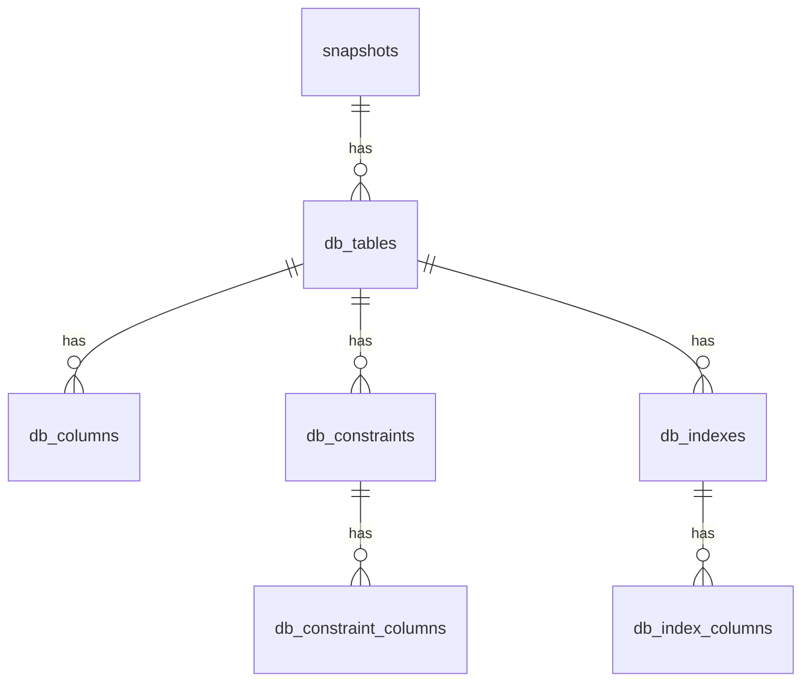
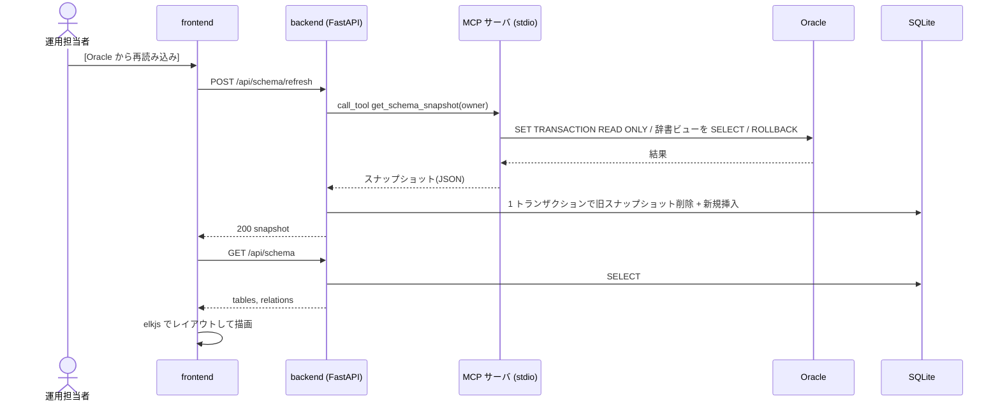
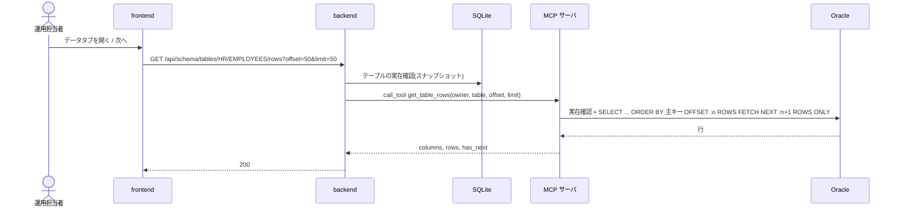

# P002 ユーザインタフェース設計書 — DbFAQ(第1リリース)

入力: `docs/P001-requirement.md`。本書は画面の振る舞い、入力のバリデーション、API の外部仕様(契約)、画面を成り立たせるデータモデルを確定する。
内部の実現方法(MCP の呼び出し方、SQL、SQLite への保存手順など)は `docs/P003-backend-spec.md` で確定する。

## 1. 画面共通

### 1.1 レイアウト

```
+----------------------------------------------------------------------------+
| DbFAQ   スキーマ: HR   取得日時: 2026-09-23 10:15:02   [ER 図]   ●Oracle   |  ← 共通ヘッダ (高さ 48px)
+----------------------------------------------------------------------------+
|                                                                            |
|                       各画面の本体 (ヘッダ以外の全面)                        |
|                                                                            |
+----------------------------------------------------------------------------+
```

| 要素 | 内容 |
| --- | --- |
| アプリ名「DbFAQ」 | クリックで SC-01 へ |
| スキーマ | `GET /api/schema` の `snapshot.owner`。未取得なら「未取得」 |
| 取得日時 | `snapshot.fetched_at` をブラウザのローカル時刻で `YYYY-MM-DD HH:mm:ss` 表示。未取得なら非表示 |
| [ER 図] リンク | SC-01 へ |
| Oracle 状態 | `GET /api/health` の `oracle.status` を色付きの丸で表示(ok=緑、error=赤、確認中=灰)。マウスを乗せると DB バージョン・接続先(host:port/service、user)またはエラーメッセージを表示する。画面を開いたとき 1 回取得し、以降は 60 秒ごとに再取得する ★FIXME★ 60 秒間隔はAgentの想定 |

### 1.2 ルーティング

| URL | 画面 | 備考 |
| --- | --- | --- |
| `/` | SC-01 ER 図 | |
| `/tables/:owner/:table` | SC-02 テーブル詳細 | `:owner`・`:table` は URL エンコードした Oracle 識別子(大文字小文字を区別する。辞書に格納された値そのまま) |
| `/tables/:owner/:table?tab=schema` | SC-02 スキーマ情報タブ | `tab` 省略時・不正値のときは `schema` |
| `/tables/:owner/:table?tab=data&page=N` | SC-02 データタブ | `page` は 1 始まり。省略時・不正値(整数でない、1 未満)のときは 1 ★FIXME★ ページ番号を URL に持たせるのはAgentの想定 |
| 上記以外 | 「ページが見つかりません」+ ER 図へのリンク | |

### 1.3 共通のエラー表示

* API が §3.1 のエラー形式を返したら、通知(画面右上、10 秒で消える。手動で閉じられる)に `message` を表示する。`ora_code` があれば `message` の前に `[ORA-xxxxx]` を付ける。
* backend に接続できない(ネットワークエラー)場合は「サーバに接続できません」と表示する。
* 例外: SC-02 データタブのエラーは通知ではなく、タブ内にエラー表示(§2.2.3)する。

## 2. 画面仕様

### 2.1 SC-01 ER 図

#### 2.1.1 レイアウト

```
+----------------------------------------------------------------------------+
| 共通ヘッダ                                                                  |
+----------------------------------------------------------------------------+
| [テーブル名で検索 ______ ]  [Oracle から再読み込み]   テーブル 7 / 関連 10   |  ← ツールバー
+----------------------------------------------------------------------------+
|  +-----------+          +-------------+                                    |
|  | REGIONS   |<---------| COUNTRIES   |          ER 図キャンバス             |
|  |-----------|          |-------------|                                    |
|  |🔑REGION_ID|          |🔑COUNTRY_ID |                                    |
|  | REGION_NAME          |🔗REGION_ID  |                    +------------+  |
|  +-----------+          +-------------+                    | ミニマップ  |  |
|  [+][-][□]                                                 +------------+  |
+----------------------------------------------------------------------------+
```

#### 2.1.2 ER 図の描画規則

| 対象 | 規則 |
| --- | --- |
| ノード | 1 テーブル = 1 ノード(ビューは含めない)。見出し行にテーブル名、その下に列を `column_id` 順に 1 行ずつ表示する |
| 列の行 | `[印] 列名  データ型表記`。印は主キー列=🔑、外部キー列=🔗(両方なら両方)。NOT NULL の列は列名を太字にする |
| ノードのツールチップ | テーブルのコメント(無ければ表示しない) |
| 列数の多いテーブル | 列が 30 を超える場合は先頭 30 列を表示し、末尾に「… 他 N 列」と表示する ★FIXME★ |
| 線(エッジ) | 外部キー 1 制約 = 1 本(複合外部キーも 1 本)。子テーブル(外部キーを持つ側)から親テーブル(参照先)へ矢印を向ける。線上に制約名をラベル表示する |
| 自己参照 | 同じノードの右辺から出て右辺に戻るループ線で描く(例: `EMP_MANAGER_FK`) |
| 別スキーマへの外部キー | 参照先テーブルがノードに無い(`to_owner` が対象スキーマと異なる)場合、線は描かない。SC-02 の外部キー一覧には表示する ★FIXME★ |
| 自動レイアウト | elkjs の `layered` アルゴリズム、方向は左→右(親テーブルが右)。ノードの幅・高さは列数とテーブル名の長さから算出する ★FIXME★ |
| 初期表示 | レイアウト完了後に全体表示(fit view)する |

#### 2.1.3 操作

| 操作 | 振る舞い |
| --- | --- |
| マウスホイール / ピンチ | 拡大・縮小。倍率 10%〜200% |
| コントロール(左下) | [+] 拡大、[−] 縮小、[□] 全体表示 |
| 背景ドラッグ | パン |
| ノードのドラッグ | ノードを移動。位置は保存しない(画面を開き直すと自動レイアウトに戻る) |
| ミニマップ(右下) | 全ノードの略図と、現在の表示範囲の枠を表示する。ミニマップ上をクリック・ドラッグすると表示範囲が移る。ミニマップ上のホイールで拡大縮小する |
| ノードのクリック | SC-02(`/tables/{owner}/{table}`)へ遷移する。ドラッグ(移動量 5px 以上)の後に離した場合は遷移しない |
| テーブル名検索 | 入力中に候補(テーブル名の部分一致、大文字小文字を区別しない、最大 20 件)を表示する。候補を選ぶと、そのノードを画面中央に移動・拡大(倍率 100%)し、2 秒間強調表示する。Enter で先頭候補を選ぶ。候補の行の右端にある「開く」ボタンを押すと、そのテーブルの SC-02 へ遷移する ★FIXME★ 検索の挙動はAgentの想定 |
| [Oracle から再読み込み] | `POST /api/schema/refresh` を呼ぶ。実行中はボタンを無効化してスピナーと「読み込み中…」を表示する。成功したら `GET /api/schema` を取り直して描き直し、通知「スキーマ情報を更新しました(テーブル N / 関連 M)」を表示する。失敗したら前回の ER 図を残し、エラー通知を表示する |

#### 2.1.4 入力のバリデーション

| 項目 | ルール |
| --- | --- |
| テーブル名検索 | 任意。最大 128 文字(Oracle の識別子の最大長)。前後の空白は取り除く。空なら候補を出さない。サーバには送らない(クライアント内で絞り込む) |

#### 2.1.5 状態ごとの表示

| 状態 | 表示 |
| --- | --- |
| `GET /api/schema` 取得中 | キャンバス中央にスピナー |
| `loaded=false`(未取得) | キャンバスの代わりに「スキーマ情報がありません」と [Oracle から読み込む] ボタン(再読み込みと同じ動作) |
| `loaded=true` かつ テーブル 0 件 | 「テーブルがありません(スキーマ: HR)」と [Oracle から再読み込み] ボタン |
| レイアウト計算中 | キャンバス中央にスピナー |
| 再読み込み失敗 | 前回の ER 図を表示し続け、エラー通知 |

### 2.2 SC-02 テーブル詳細

#### 2.2.1 レイアウト

```
+----------------------------------------------------------------------------+
| 共通ヘッダ                                                                  |
+----------------------------------------------------------------------------+
| ← ER 図へ    HR.EMPLOYEES                                                  |
|              employees table. References with departments, jobs, ...       |
| [ スキーマ情報 ] [ データ ]                                                  |
+----------------------------------------------------------------------------+
|  タブの中身                                                                 |
+----------------------------------------------------------------------------+
```

* 「← ER 図へ」は SC-01 へ遷移する(ブラウザの戻るでも可)。
* タブを切り替えると URL の `tab` を書き換える(履歴を積まない `replace`)。データタブのページ送りも `page` を `replace` で書き換える。

#### 2.2.2 スキーマ情報タブ

`GET /api/schema/tables/{owner}/{table}` の結果を表示する。

| セクション | 表示項目 |
| --- | --- |
| 概要 | テーブル名、コメント、行数の目安(`num_rows`。null なら「統計なし」)、統計取得日(`last_analyzed`、`YYYY-MM-DD HH:mm:ss`) |
| 列 | #(`column_id`)、列名、データ型(`data_type_display`)、NULL(「可」/「不可」)、デフォルト(`data_default`、null なら空欄)、主キー(🔑 と主キー内の位置)、コメント |
| 主キー | 制約名、列(カンマ区切り、位置順)。無ければ「主キーなし」 |
| 一意制約 | 制約名、列。無ければ「なし」 |
| 外部キー(このテーブル → 参照先) | 制約名、列 → `参照先スキーマ.参照先テーブル(列)`、削除時の動作(`delete_rule`)。参照先テーブル名はリンク(SC-02 へ)。参照先がスナップショットに無い別スキーマのテーブルの場合はリンクにしない |
| 外部キー(参照元 → このテーブル) | 制約名、`参照元テーブル(列)` → 列。参照元テーブル名はリンク(SC-02 へ) |
| インデックス | インデックス名、一意(「一意」/空欄)、種類(`index_type`)、列(位置順、降順の列は ` DESC` を付ける) |

#### 2.2.3 データタブ

初めてデータタブを開いたときに `GET /api/schema/tables/{owner}/{table}/rows?offset={(page-1)*50}&limit=50` を呼ぶ。スキーマ情報タブだけを見ている間は呼ばない。

```
| 並び順: EMPLOYEE_ID(主キー)    取得 38 ms    [再読み込み]   [< 前へ] 1 ページ目 (1〜50 行) [次へ >] |
+-------------+------------+-----------+----------------------+-----------------------+
| EMPLOYEE_ID | FIRST_NAME | LAST_NAME | EMAIL                | HIRE_DATE             |
+-------------+------------+-----------+----------------------+-----------------------+
| 100         | Steven     | King      | SKING                | 2013-06-17 00:00:00   |
```

| 要素 | 振る舞い |
| --- | --- |
| 表 | 見出しは列名(マウスを乗せるとデータ型)。横に長い場合は表の中で横スクロール。見出し行は縦スクロールしても固定 |
| セルの値 | API の値をそのまま表示する。`null` は灰色斜体で `(null)` と表示し、文字列 `"(null)"` と見分けられるようにする。`truncated` の列インデックスに含まれるセルは末尾に `…` が付いた状態で届くので、マウスを乗せると「先頭 1,000 文字のみ表示」と表示する |
| 並び順の表示 | `order_basis=PRIMARY_KEY` なら「並び順: 列名(主キー)」、`ROWID` なら「並び順: ROWID(主キーなし)」 |
| 取得時間 | `elapsed_ms` を「取得 N ms」で表示 |
| [前へ] | `page>1` のとき押せる。`page-1` を取得 |
| [次へ] | `has_next=true` のとき押せる。`page+1` を取得 |
| 行範囲の表示 | 「N ページ目 (a〜b 行)」。0 行のときは「データがありません」 |
| [再読み込み] | 同じ `offset`・`limit` で取り直す(キャッシュを使わない) |
| 取得中 | 表の上にスピナーを重ね、ボタンを無効化 |
| エラー | 表の代わりにエラー表示(赤枠): `[ORA-xxxxx] メッセージ` またはメッセージと [再試行] ボタン |

#### 2.2.4 入力のバリデーション

| 項目 | ルール | 不正時 |
| --- | --- | --- |
| URL の `:owner`・`:table` | 1〜128 文字。スナップショットに存在すること | API が 404 `TABLE_NOT_FOUND` を返したら「テーブルが見つかりません: HR.XXX」と [ER 図へ] を表示 |
| URL の `tab` | `schema` または `data` | `schema` として扱う |
| URL の `page` | 1 以上の整数。`(page-1)*50` が 100,000 以下 | 1 として扱う。上限超えは 1 として扱う ★FIXME★ |

#### 2.2.5 状態ごとの表示

| 状態 | 表示 |
| --- | --- |
| スキーマ未取得(`SCHEMA_NOT_LOADED`) | 「スキーマ情報がありません」と [ER 図へ](SC-01 で読み込める) |
| テーブルが無い(`TABLE_NOT_FOUND`) | 「テーブルが見つかりません: {owner}.{table}」と [ER 図へ] |
| Oracle に接続できない | スキーマ情報タブは表示できる。データタブにエラー表示 |

## 3. API 外部仕様

* ベースパス `/api`。リクエスト・レスポンスとも `application/json; charset=utf-8`。
* 日時は ISO 8601(UTC、`Z` 付き。例 `2026-09-23T01:15:02Z`)で返す。画面側でローカル時刻に変換する。ただしテーブルデータ(rows)のセル値は §3.6 の表示用文字列で返す。
* 認証なし。CORS ヘッダは返さない(同一オリジンで使う。P003 §7)。

### 3.1 エラー形式(全 API 共通)

```json
{ "error": { "code": "ORACLE_ERROR", "message": "ORA-00942: table or view does not exist", "ora_code": "ORA-00942" } }
```

| code | HTTP | 意味 |
| --- | --- | --- |
| `VALIDATION_ERROR` | 422 | パラメータが不正。`message` に項目名と理由 |
| `SCHEMA_NOT_LOADED` | 404 | スキーマ情報がまだ一度も取得されていない |
| `TABLE_NOT_FOUND` | 404 | 指定のテーブルがスキーマ情報(スナップショット)に無い |
| `REFRESH_IN_PROGRESS` | 409 | 別のスキーマ再読み込みが実行中 |
| `ORACLE_ERROR` | 502 | Oracle がエラーを返した(接続拒否・認証失敗・ORA-00942 など)。`ora_code` 付き(取れた場合) |
| `ORACLE_TIMEOUT` | 504 | Oracle の処理がタイムアウトした |
| `MCP_UNAVAILABLE` | 503 | MCP サーバを起動できない、または応答しない |
| `INTERNAL_ERROR` | 500 | 上記以外の想定外のエラー。`message` は「内部エラーが発生しました」固定(詳細はログのみ) |

`ora_code` は `ORACLE_ERROR` のときのみ(取得できれば)含める。パスワードは `message` に決して含めない。

### 3.2 `GET /api/schema`

ER 図用のスキーマ情報を返す(SQLite から。Oracle にはアクセスしない)。

* パラメータ: なし
* 200(未取得):

```json
{ "loaded": false, "snapshot": null, "tables": [], "relations": [] }
```

* 200(取得済み):

```json
{
  "loaded": true,
  "snapshot": { "owner": "HR", "fetched_at": "2026-09-23T01:15:02Z", "oracle_version": "23.26.3.0.0", "table_count": 7, "relation_count": 10 },
  "tables": [
    {
      "owner": "HR", "name": "EMPLOYEES", "comment": "employees table. ...", "num_rows": 107,
      "columns": [
        { "name": "EMPLOYEE_ID", "column_id": 1, "data_type_display": "NUMBER(6)", "nullable": false, "is_pk": true, "is_fk": false }
      ]
    }
  ],
  "relations": [
    { "name": "EMP_MANAGER_FK", "from_owner": "HR", "from_table": "EMPLOYEES", "from_columns": ["MANAGER_ID"],
      "to_owner": "HR", "to_table": "EMPLOYEES", "to_columns": ["EMPLOYEE_ID"] }
  ]
}
```

* `tables` はテーブル名の昇順、`columns` は `column_id` 昇順、`relations` は制約名の昇順。
* エラー: 500 `INTERNAL_ERROR` のみ。

### 3.3 `POST /api/schema/refresh`

MCP 経由で Oracle からスキーマ情報を読み取り、SQLite のスナップショットを置き換える。

* リクエストボディ: なし(空、または `{}`)。対象スキーマは設定ファイルで決まる。
* 200:

```json
{ "snapshot": { "owner": "HR", "fetched_at": "2026-09-23T01:15:02Z", "oracle_version": "23.26.3.0.0", "table_count": 7, "relation_count": 10 } }
```

* エラー: 409 `REFRESH_IN_PROGRESS` / 502 `ORACLE_ERROR` / 504 `ORACLE_TIMEOUT` / 503 `MCP_UNAVAILABLE` / 500 `INTERNAL_ERROR`。いずれのエラーでも既存のスナップショットは変わらない。
* 処理時間は数秒〜数十秒かかりうる。画面側のタイムアウトは設けない(backend 側のタイムアウトで終わる)。

### 3.4 `GET /api/schema/tables/{owner}/{table}`

テーブル詳細を返す(SQLite から)。

* パスパラメータ: `owner`、`table`(1〜128 文字。大文字小文字を区別)
* 200:

```json
{
  "snapshot": { "owner": "HR", "fetched_at": "2026-09-23T01:15:02Z" },
  "table": { "owner": "HR", "name": "EMPLOYEES", "comment": "...", "num_rows": 107, "last_analyzed": "2026-09-22T08:12:32Z", "iot": false },
  "columns": [
    { "column_id": 1, "name": "EMPLOYEE_ID", "data_type": "NUMBER", "data_type_display": "NUMBER(6)", "data_length": 22,
      "data_precision": 6, "data_scale": 0, "nullable": false, "data_default": null, "comment": "Primary key of employees table.",
      "pk_position": 1, "is_fk": false }
  ],
  "primary_key": { "name": "EMP_EMP_ID_PK", "columns": ["EMPLOYEE_ID"] },
  "unique_keys": [ { "name": "EMP_EMAIL_UK", "columns": ["EMAIL"] } ],
  "foreign_keys": [
    { "name": "EMP_DEPT_FK", "columns": ["DEPARTMENT_ID"], "ref_owner": "HR", "ref_table": "DEPARTMENTS", "ref_columns": ["DEPARTMENT_ID"],
      "delete_rule": "NO ACTION", "ref_in_snapshot": true }
  ],
  "referenced_by": [
    { "name": "DEPT_MGR_FK", "from_owner": "HR", "from_table": "DEPARTMENTS", "from_columns": ["MANAGER_ID"], "columns": ["EMPLOYEE_ID"] }
  ],
  "indexes": [
    { "name": "EMP_NAME_IX", "unique": false, "index_type": "NORMAL", "columns": [ { "name": "LAST_NAME", "descending": false } ] }
  ]
}
```

* `primary_key` は無ければ `null`。`unique_keys`・`foreign_keys`・`referenced_by`・`indexes` は無ければ空配列。各配列は名前の昇順。
* `last_analyzed`・`num_rows` は統計が無ければ `null`。
* エラー: 404 `SCHEMA_NOT_LOADED` / 404 `TABLE_NOT_FOUND` / 422 `VALIDATION_ERROR`(長さ超過)/ 500。

### 3.5 `GET /api/schema/tables/{owner}/{table}/rows`

テーブルのデータを 1 ページ分、MCP 経由で Oracle から取得する(SQLite には保存しない)。

* クエリパラメータ:

| 名前 | 型 | 既定 | 制約 |
| --- | --- | --- | --- |
| `offset` | 整数 | 0 | 0 以上 100,000 以下 ★FIXME★ 上限はAgentの想定(大きな OFFSET は Oracle 側で遅くなるため) |
| `limit` | 整数 | 50 | 1 以上 500 以下 |

* 200:

```json
{
  "owner": "HR", "table": "EMPLOYEES",
  "columns": [ { "name": "EMPLOYEE_ID", "data_type": "NUMBER" }, { "name": "HIRE_DATE", "data_type": "DATE" } ],
  "rows": [ ["100", "2013-06-17 00:00:00"] ],
  "truncated": [ [] ],
  "offset": 0, "limit": 50, "has_next": true,
  "order_basis": "PRIMARY_KEY", "order_by": ["EMPLOYEE_ID"],
  "elapsed_ms": 38
}
```

* `rows` の各セルは表示用の文字列または `null`(§3.6)。`truncated[i]` は `rows[i]` のうち切り詰めたセルの列インデックスの配列。
* `order_basis` は `PRIMARY_KEY`(主キーの昇順)または `ROWID`(主キーが無い)。
* エラー: 404 `SCHEMA_NOT_LOADED` / 404 `TABLE_NOT_FOUND`(スナップショットに無い)/ 422 `VALIDATION_ERROR` / 502 `ORACLE_ERROR`(Oracle 側で削除済み=ORA-00942、権限不足など)/ 504 `ORACLE_TIMEOUT` / 503 `MCP_UNAVAILABLE` / 500。

### 3.6 セル値の表示用文字列(rows)

| Oracle の型 | 表示 |
| --- | --- |
| NULL | JSON の `null` |
| VARCHAR2 / NVARCHAR2 / CHAR / NCHAR | そのまま(CHAR の末尾空白も残す) |
| NUMBER / FLOAT / BINARY_FLOAT / BINARY_DOUBLE | 10 進の文字列(指数表記にしない。例 `24000`、`0.15`)|
| DATE | `YYYY-MM-DD HH:MM:SS` |
| TIMESTAMP(n) | `YYYY-MM-DD HH:MM:SS.ffffff`(小数部は 6 桁)|
| TIMESTAMP WITH (LOCAL) TIME ZONE | 上記 + ` +HH:MM` |
| INTERVAL | Python の表現を文字列化(例 `3 days, 4:00:00`)★FIXME★ |
| CLOB / NCLOB / LONG | 先頭 1,000 文字。超えたら切って `…` を付け、`truncated` に記録 |
| RAW / BLOB / LONG RAW | 先頭 32 バイトを 16 進(`0x` 始まり)で。超えたら `…` を付け `truncated` に記録 |
| 上記以外(XMLTYPE、JSON、VECTOR、オブジェクト型など) | 文字列化して先頭 1,000 文字 ★FIXME★ |

VARCHAR2 などの文字列も 1,000 文字を超えたら切り詰める。

### 3.7 `GET /api/health`

* 200(常に 200。個々の状態は本文で返す):

```json
{
  "status": "ok",
  "backend": { "status": "ok", "version": "0.1.0" },
  "mcp": { "status": "ok", "message": null },
  "oracle": { "status": "ok", "version": "23.26.3.0.0", "user": "HR", "message": null },
  "config": { "host": "localhost", "port": 1521, "service_name": "FREEPDB1", "user": "hr", "schema": "HR", "query_timeout_sec": 30 },
  "checked_at": "2026-09-23T01:20:00Z"
}
```

* `status` は `mcp`・`oracle` がともに `ok` なら `ok`、それ以外は `degraded`。`mcp.status`・`oracle.status` は `ok` / `error`。`error` のとき `message` にエラー内容(`ORA-xxxxx: ...` など)。MCP が使えないときは `oracle.status` も `error`(`message`: 「MCP サーバに接続できないため確認できません」)。
* `config` にパスワードは含めない。

## 4. データモデル(SQLite)

スキーマ情報のスナップショットを保存する。対象スキーマ(owner)ごとに最新の 1 件だけを持つ(第1リリースは対象スキーマが 1 つなので、実質 1 件)。
ER 図・テーブル詳細はすべてこのデータから作る。テーブルのデータ(rows)は保存しない。

### 4.1 ER 図



### 4.2 テーブル定義

**snapshots** — スナップショット(取得 1 回分)

| 列 | 型 | 制約 | 内容 |
| --- | --- | --- | --- |
| id | INTEGER | PK, AUTOINCREMENT | |
| owner | TEXT | NOT NULL, UNIQUE | 対象スキーマ名(例 `HR`) |
| fetched_at | TEXT | NOT NULL | 取得完了日時(ISO 8601 UTC) |
| oracle_version | TEXT | NOT NULL | Oracle のバージョン |
| table_count | INTEGER | NOT NULL | |
| relation_count | INTEGER | NOT NULL | 外部キー制約の数 |

**db_tables** — テーブル

| 列 | 型 | 制約 | 内容 |
| --- | --- | --- | --- |
| id | INTEGER | PK | |
| snapshot_id | INTEGER | NOT NULL, FK → snapshots.id ON DELETE CASCADE | |
| name | TEXT | NOT NULL | テーブル名 |
| comment | TEXT | NULL | ALL_TAB_COMMENTS.COMMENTS |
| num_rows | INTEGER | NULL | ALL_TABLES.NUM_ROWS |
| last_analyzed | TEXT | NULL | ISO 8601 UTC |
| iot | INTEGER | NOT NULL | 索引構成表なら 1 |
| | | UNIQUE(snapshot_id, name) | |

**db_columns** — 列

| 列 | 型 | 制約 | 内容 |
| --- | --- | --- | --- |
| id | INTEGER | PK | |
| table_id | INTEGER | NOT NULL, FK → db_tables.id ON DELETE CASCADE | |
| column_id | INTEGER | NOT NULL | ALL_TAB_COLUMNS.COLUMN_ID |
| name | TEXT | NOT NULL | |
| data_type | TEXT | NOT NULL | 例 `NUMBER`、`VARCHAR2`、`TIMESTAMP(6)` |
| data_type_display | TEXT | NOT NULL | 例 `NUMBER(8,2)`、`VARCHAR2(20)`、`VARCHAR2(20 CHAR)`。組み立て規則は P003 §3.4 |
| data_length | INTEGER | NULL | |
| data_precision | INTEGER | NULL | |
| data_scale | INTEGER | NULL | |
| char_length | INTEGER | NULL | |
| char_used | TEXT | NULL | `B` / `C` |
| nullable | INTEGER | NOT NULL | NULL 可なら 1 |
| data_default | TEXT | NULL | 前後の空白を除いた文字列 |
| comment | TEXT | NULL | ALL_COL_COMMENTS.COMMENTS |
| | | UNIQUE(table_id, name) | |

**db_constraints** — 主キー・一意制約・外部キー

| 列 | 型 | 制約 | 内容 |
| --- | --- | --- | --- |
| id | INTEGER | PK | |
| table_id | INTEGER | NOT NULL, FK → db_tables.id ON DELETE CASCADE | 制約を持つテーブル |
| name | TEXT | NOT NULL | 制約名 |
| type | TEXT | NOT NULL, CHECK IN ('P','U','R') | P=主キー、U=一意、R=外部キー |
| ref_owner | TEXT | NULL | 外部キーの参照先スキーマ |
| ref_table | TEXT | NULL | 外部キーの参照先テーブル |
| delete_rule | TEXT | NULL | `NO ACTION` / `CASCADE` / `SET NULL` |
| | | UNIQUE(table_id, name) | |

**db_constraint_columns** — 制約の列(位置順)

| 列 | 型 | 制約 | 内容 |
| --- | --- | --- | --- |
| constraint_id | INTEGER | NOT NULL, FK → db_constraints.id ON DELETE CASCADE | |
| position | INTEGER | NOT NULL | 1 始まり |
| column_name | TEXT | NOT NULL | 自テーブルの列 |
| ref_column_name | TEXT | NULL | 外部キーの参照先の列(同じ位置) |
| | | PK(constraint_id, position) | |

**db_indexes** — インデックス

| 列 | 型 | 制約 | 内容 |
| --- | --- | --- | --- |
| id | INTEGER | PK | |
| table_id | INTEGER | NOT NULL, FK → db_tables.id ON DELETE CASCADE | |
| name | TEXT | NOT NULL | |
| is_unique | INTEGER | NOT NULL | |
| index_type | TEXT | NOT NULL | 例 `NORMAL`、`IOT - TOP`、`FUNCTION-BASED NORMAL` |
| | | UNIQUE(table_id, name) | |

**db_index_columns** — インデックスの列

| 列 | 型 | 制約 | 内容 |
| --- | --- | --- | --- |
| index_id | INTEGER | NOT NULL, FK → db_indexes.id ON DELETE CASCADE | |
| position | INTEGER | NOT NULL | |
| column_name | TEXT | NOT NULL | 関数索引は式の文字列(ALL_IND_EXPRESSIONS)★FIXME★ |
| descending | INTEGER | NOT NULL | |
| | | PK(index_id, position) | |

マイグレーション方式・内部用のテーブル(`schema_migrations`)は `docs/P003-backend-spec.md` §5 で定める。

## 5. 処理フロー(シーケンス図)

### 5.1 スキーマの再読み込み(SC-01)



### 5.2 データタブ(SC-02)



## 6. フロントエンドの構成

| 項目 | 内容 |
| --- | --- |
| 配置 | `client/`(Vite + React + TypeScript) |
| 主要な部品 | `AppShell`(共通ヘッダ)、`ErDiagramPage`(SC-01)、`TableNode`(ER 図のノード)、`TableSearch`、`TableDetailPage`(SC-02)、`SchemaTab`、`DataTab` |
| API クライアント | `src/api/`。§3 の型を TypeScript の型として定義する。`fetch` を使い、エラー形式を `ApiError` クラスに変換する |
| ER 図の組み立て | `src/er/buildGraph.ts`(API の結果 → React Flow のノード・エッジ)と `src/er/layout.ts`(elkjs でのレイアウト)を純粋関数・非同期関数として分け、単体テストできるようにする |
| 開発時の API | Vite 開発サーバの proxy で `/api` を backend(`http://localhost:8000`)へ中継する(P003 §7) |
