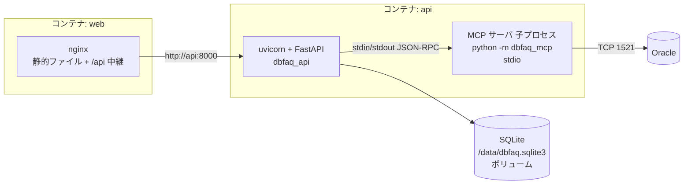

# P003 システム詳細設計書 — DbFAQ(第1リリース)

入力: `docs/P001-requirement.md`、`docs/P002-frontend-spec.md`。
本書は P002 §3 で確定した API の外部仕様と P002 §4 のデータモデルを、backend(FastAPI)・MCP サーバ(FastMCP)・SQLite でどう実現するかを確定する。

## 1. 構成

### 1.1 プロセスとコンテナ



* backend(`dbfaq_api`)は起動時(lifespan)に MCP サーバ(`dbfaq_mcp`)を **子プロセスとして 1 つだけ起動し、stdio セッションを張り続ける**。リクエストのたびに子プロセスを起動しない(Python の起動と Oracle 接続に 1〜2 秒かかるため)。ADR-001
* MCP サーバは Oracle への接続プール(python-oracledb の非同期プール)を持つ。backend は Oracle に接続しない。
* 開発時は frontend を Vite 開発サーバ(5173)、backend を uvicorn(8000)で動かす(§7)。

呼び名の対応(※P011矛盾点#6にもとづき追加):

| P001 の呼び名 | compose のサービス | ソースの場所 / パッケージ |
| --- | --- | --- |
| frontend(React SPA / nginx) | `web` | `client/`、`deploy/web.Dockerfile`、`deploy/nginx.conf` |
| backend(FastAPI) | `api` | `server/src/dbfaq_api` |
| mcp-oracle(FastMCP サーバ) | `api` の子プロセス | `server/src/dbfaq_mcp` |

### 1.2 ソースツリー

```
DbFAQ/
├── server/                       # Python(uv プロジェクト 1 つ)ADR-007
│   ├── pyproject.toml            # 依存: fastapi, uvicorn, fastmcp, oracledb, sqlalchemy, pydantic, pyyaml / dev: pytest, pytest-asyncio, httpx, ruff
│   ├── uv.lock
│   ├── src/
│   │   ├── dbfaq_common/         # backend と MCP サーバの共通部品
│   │   │   ├── config.py         # config.yaml の読み込み(§2)
│   │   │   └── logging.py        # JSON ログ
│   │   ├── dbfaq_mcp/            # MCP サーバ
│   │   │   ├── __main__.py       # python -m dbfaq_mcp(stdio で起動)
│   │   │   ├── server.py         # FastMCP インスタンスとツール登録
│   │   │   ├── db.py             # 接続プール、読み取り専用トランザクション
│   │   │   ├── errors.py         # ツールエラー(コード付き)
│   │   │   ├── identifiers.py    # 識別子の検証・クォート
│   │   │   ├── dictionary.py     # データディクショナリの問い合わせ(Q-00〜Q-05。§3.5)※P011矛盾点#2にもとづき修正
│   │   │   ├── snapshot.py       # 問い合わせ結果 → スナップショット JSON
│   │   │   ├── type_format.py    # data_type_display の組み立て
│   │   │   ├── rows.py           # テーブルデータのページ取得
│   │   │   └── values.py         # セル値の表示用文字列化
│   │   └── dbfaq_api/            # backend
│   │       ├── main.py           # create_app()、lifespan、例外ハンドラ
│   │       ├── errors.py         # ApiError とエラーコード
│   │       ├── mcp_gateway.py    # MCP クライアント(stdio セッションの維持・再接続)
│   │       ├── db.py             # SQLAlchemy エンジン、PRAGMA
│   │       ├── migrate.py        # マイグレーション実行(§5)
│   │       ├── migrations/0001_init.sql
│   │       ├── snapshot_repo.py  # スナップショットの保存・読み出し
│   │       ├── schemas.py        # API のレスポンス型(pydantic)
│   │       ├── services.py       # refresh / 詳細 / rows / health の処理
│   │       └── routers/{schema.py, health.py}
│   └── tests/{unit, integration}/
├── client/                       # Vite + React(P002 §6)
├── e2e/                          # Playwright(受入テスト)
├── deploy/                       # Dockerfile、nginx.conf
├── compose.yaml
├── config.example.yaml
└── docs/
```

* P001 §3.3 は「uv ワークスペース」を想定していたが、backend と MCP サーバは同じコンテナ・同じ依存で動くため、1 つの uv プロジェクトに 3 つのパッケージを置く形にした(P001 も同様に更新済み)。ADR-007
* SQLite へのアクセスは SQLAlchemy **Core**(`Table` 定義と SQL 式)を使う。ORM のオブジェクト対応は使わない。スナップショットは一括削除・一括挿入が中心で、ORM の変更追跡が要らないため。ADR-008

## 2. 設定ファイル

### 2.1 形式

`config.yaml`(Git 管理外)。ひな型 `config.example.yaml` をリポジトリに置く。

```yaml
oracle:
  host: localhost
  port: 1521
  service_name: FREEPDB1
  user: hr
  password: "********"
  schema: HR                 # 省略時は user を大文字にしたもの
  query_timeout_sec: 30      # 1 回の問い合わせの上限(python-oracledb の call_timeout)
  connect_timeout_sec: 10
  pool_min: 1
  pool_max: 4
app:
  sqlite_path: ./data/dbfaq.sqlite3
  log_level: INFO
  mcp_call_timeout_sec: 90   # backend が MCP ツールの応答を待つ上限(query_timeout_sec より長くする)
```

### 2.2 読み込み規則(`dbfaq_common/config.py`)

| 項目 | 規則 |
| --- | --- |
| ファイルの場所 | 環境変数 `DBFAQ_CONFIG`。未設定なら カレントディレクトリの `config.yaml` |
| 環境変数での上書き | `DBFAQ_ORACLE_HOST`、`DBFAQ_ORACLE_PORT`、`DBFAQ_ORACLE_PASSWORD`、`DBFAQ_SQLITE_PATH` があればファイルの値より優先する(compose でコンテナ用の接続先を差し替えるため) |
| 型チェック | pydantic モデル `AppConfig`。必須: host, port, service_name, user, password。port は 1〜65535、各タイムアウトは 1〜600、pool_min ≥ 1、pool_max ≥ pool_min |
| 不正時 | 起動時に例外(どの項目が不正かを表示。パスワードの値は表示しない)で終了する |
| パスワード | `SecretStr` で持ち、`repr`・ログに出さない |
| 受け渡し | backend は MCP の子プロセスを起動するとき、同じ `DBFAQ_CONFIG` と上書き用の環境変数を引き継ぐ(子プロセスが同じ設定を読む) |

## 3. MCP サーバ(`dbfaq_mcp`)

### 3.1 共通

* FastMCP(4.x)で実装し、`python -m dbfaq_mcp` で stdio トランスポートで起動する。
* ログは標準エラー出力へ JSON で出す(標準出力は MCP の通信路のため、決して print しない)。
* python-oracledb は Thin モード。`oracledb.defaults.fetch_decimals = True`(NUMBER を Decimal で受け取り、精度を落とさない)、`oracledb.defaults.fetch_lobs = False`(CLOB は str、BLOB は bytes で受け取る)。
  * ★ACCEPTED★ `fetch_lobs=False` は LOB 全体をメモリに読み込む。DBMS_LOB.SUBSTR で SQL 側で切り詰める方法も検討したが、`SELECT *` の列ごとに型を見て SQL を組み立て直す必要があり複雑になる。1 ページ最大 500 行 × LOB 列の大きさがメモリ量の上限になる。巨大な LOB を持つテーブルでは、limit を小さくして使うことで回避する。
* 接続プールは最初のツール呼び出しで作る(`oracledb.create_pool_async`、`min=pool_min`、`max=pool_max`、`tcp_connect_timeout=connect_timeout_sec`、`getmode=POOL_GETMODE_TIMEDWAIT`、`wait_timeout=connect_timeout_sec×1000`)。Oracle が落ちていても MCP サーバ自体は起動できる。
  * `getmode` の既定(WAIT)では、Oracle に接続できない間 `acquire` が戻らず、backend の待ち時間(`mcp_call_timeout_sec`)まで待たされる(2026-09-23 に最小再現で確認)。TIMEDWAIT にして `DPY-4005` で早く失敗させる。※P202 F006 にもとづき明確化
* 各ツールは接続を借りたら `call_timeout = query_timeout_sec * 1000` を設定し、**読み取り専用トランザクション**の中で実行する(`../OracleSearchMCP` の `withReadOnlyTransaction` を踏襲):

```python
async with pool.acquire() as conn:
    conn.call_timeout = timeout_ms
    await conn.execute("SET TRANSACTION READ ONLY")   # 失敗したら例外(実行しない)
    try:
        return await fn(conn)
    finally:
        try: await conn.rollback()
        except Exception: log.warning(...)           # 元の例外を上書きしない
```

* 実機確認(2026-09-23): 読み取り専用トランザクション中の UPDATE は `ORA-01456` で拒否される。`call_timeout` 超過時は `DPY-4024`(呼び出しタイムアウト)のほか、回復処理が間に合わないと `DPY-4011`(接続が閉じられた。メッセージに `timed out` を含む)になる。いずれの場合も接続は使えなくなるので、プールへ返さず破棄する(python-oracledb のプールが自動で破棄する)。

### 3.2 エラー

ツールは失敗時に `fastmcp.exceptions.ToolError` を送出する。メッセージは次の JSON 文字列とする(backend がこれを解析する)。

```json
{"code": "ORACLE_ERROR", "message": "ORA-00942: table or view does not exist", "ora_code": "ORA-00942"}
```

| code | 条件 |
| --- | --- |
| `INVALID_ARGUMENT` | 引数の検証に失敗(識別子が不正、offset/limit が範囲外) |
| `NOT_FOUND` | 指定のスキーマ(ALL_USERS に無い)・テーブル(ALL_TABLES に無い)が見つからない |
| `ORACLE_TIMEOUT` | `DPY-4024`、`ORA-01013`、`ORA-03156`、またはメッセージに `timed out` を含む `DPY-4011` |
| `ORACLE_ERROR` | 上記以外の `oracledb.Error`。`ora_code` は `err.full_code`(例 `ORA-00942`、`DPY-6005`) |
| `INTERNAL_ERROR` | その他の例外。メッセージは固定文言、詳細は標準エラー出力のログのみ |

メッセージにパスワードを含めない(python-oracledb のエラーは接続文字列のパスワードを含まないが、念のため設定のパスワード文字列が含まれていたら `***` に置き換える)。

### 3.3 識別子の検証(`identifiers.py`)

* 引数の `owner`・`table` は、辞書に格納された値そのまま(大文字小文字を区別)で受け取る。
* 検証: 1〜128 文字、NUL 文字と `"` を含まない。違反は `INVALID_ARGUMENT`。
* SQL に埋め込むときは必ず `"` で囲む(`quote("EMPLOYEES") → "\"EMPLOYEES\""`)。埋め込む前に ALL_TABLES で実在確認する(二重の防御)。

### 3.4 データ型表記(`type_format.py`)

ALL_TAB_COLUMNS の値から `data_type_display` を作る。

| DATA_TYPE | 表記 |
| --- | --- |
| VARCHAR2, CHAR | `CHAR_USED='C'` なら `VARCHAR2(n CHAR)`、それ以外 `VARCHAR2(n)`(n は CHAR_LENGTH) |
| NVARCHAR2, NCHAR | `NVARCHAR2(n)`(n は CHAR_LENGTH) |
| NUMBER | 精度・スケールとも NULL → `NUMBER`。精度 NULL・スケール 0 → `NUMBER(*,0)`。スケール 0 → `NUMBER(p)`。それ以外 `NUMBER(p,s)` |
| FLOAT | `FLOAT(p)`(精度 NULL なら `FLOAT`) |
| RAW | `RAW(n)`(n は DATA_LENGTH) |
| それ以外(DATE、TIMESTAMP(6)、CLOB、BLOB など) | DATA_TYPE そのまま |

### 3.5 ツール `get_schema_snapshot`

* 引数: `owner: str | None = None`(省略時は `oracle.schema`、それも無ければ接続ユーザー)
* 処理(1 つの読み取り専用トランザクション内):

| No | 問い合わせ | 用途 |
| --- | --- | --- |
| Q-00 | `SELECT USERNAME FROM ALL_USERS WHERE USERNAME = :owner` | スキーマの実在確認。0 件なら `NOT_FOUND` |
| Q-01 | `ALL_TABLES t LEFT JOIN ALL_TAB_COMMENTS c` — `TABLE_NAME, NUM_ROWS, LAST_ANALYZED, IOT_TYPE, COMMENTS`。条件: `OWNER=:owner AND NESTED='NO' AND SECONDARY='N' AND DROPPED='NO' AND (IOT_TYPE IS NULL OR IOT_TYPE='IOT')` | テーブル一覧(ごみ箱・入れ子表・IOT のオーバーフロー表を除く) |
| Q-02 | `ALL_TAB_COLUMNS col LEFT JOIN ALL_COL_COMMENTS cc` — `TABLE_NAME, COLUMN_ID, COLUMN_NAME, DATA_TYPE, DATA_LENGTH, DATA_PRECISION, DATA_SCALE, CHAR_LENGTH, CHAR_USED, NULLABLE, DATA_DEFAULT, COMMENTS` | 列。Q-01 に無いテーブル(ビューなど)の行は捨てる |
| Q-03 | `ALL_CONSTRAINTS c JOIN ALL_CONS_COLUMNS cc LEFT JOIN ALL_CONSTRAINTS rc LEFT JOIN ALL_CONS_COLUMNS rcc(POSITION で対応)` — `CONSTRAINT_TYPE IN ('P','U','R')`、`c.OWNER=:owner` | 主キー・一意制約・外部キー(`../OracleSearchMCP` の Q-02/Q-06 と同じ結合)。`R_OWNER`、`DELETE_RULE` も取る |
| Q-04 | `ALL_INDEXES i JOIN ALL_IND_COLUMNS ic` — `TABLE_OWNER=:owner` | インデックスと列(`DESCEND`) |
| Q-05 | `ALL_IND_EXPRESSIONS` — `TABLE_OWNER=:owner` | 関数索引の式。該当する列位置の列名(`SYS_NC...`)を式の文字列に置き換える |
| Q-06 | `SELECT BANNER_FULL FROM V$VERSION` は権限が要るため使わず、`conn.version` を使う | Oracle のバージョン |

* 戻り値(JSON):

```json
{
  "owner": "HR", "oracle_version": "23.26.3.0.0", "fetched_at": "2026-09-23T01:15:02Z",
  "tables": [
    { "name": "EMPLOYEES", "comment": "...", "num_rows": 107, "last_analyzed": "2026-09-22T08:12:32Z", "iot": false,
      "columns": [ { "column_id": 1, "name": "EMPLOYEE_ID", "data_type": "NUMBER", "data_type_display": "NUMBER(6)",
                     "data_length": 22, "data_precision": 6, "data_scale": 0, "char_length": 0, "char_used": null,
                     "nullable": false, "data_default": null, "comment": "..." } ],
      "constraints": [ { "name": "EMP_DEPT_FK", "type": "R", "columns": ["DEPARTMENT_ID"], "ref_owner": "HR",
                         "ref_table": "DEPARTMENTS", "ref_columns": ["DEPARTMENT_ID"], "delete_rule": "NO ACTION" } ],
      "indexes": [ { "name": "EMP_NAME_IX", "unique": false, "index_type": "NORMAL",
                     "columns": [ { "name": "LAST_NAME", "descending": false } ] } ]
    }
  ]
}
```

* `LAST_ANALYZED` は Oracle の DATE(タイムゾーンなし)。DB サーバの時刻として UTC とみなして `Z` を付ける ★ACCEPTED★(2026-09-24 人間承認)検討: DB のタイムゾーンを問い合わせて変換する/承認理由: 統計の取得日は目安で足りる/残存リスク: DB が UTC 以外だと表示する日時がずれる
* `data_default` は LONG 型。文字列として受け取り、前後の空白・改行を取り除く。空なら null。
* 大きなスキーマでも問い合わせ回数は Q-00〜Q-05 の 6 回で固定(テーブルごとに問い合わせない)。

### 3.6 ツール `get_table_rows`

* 引数: `owner: str`, `table: str`, `offset: int = 0`(0〜100,000), `limit: int = 50`(1〜500)
* 処理(1 つの読み取り専用トランザクション内):
  1. 識別子を検証(§3.3)。offset/limit の範囲外は `INVALID_ARGUMENT`。
  2. `SELECT IOT_TYPE FROM ALL_TABLES WHERE OWNER=:o AND TABLE_NAME=:t` で実在確認。0 件なら `NOT_FOUND`。
  3. 主キー列を取得: `ALL_CONSTRAINTS(CONSTRAINT_TYPE='P') JOIN ALL_CONS_COLUMNS ORDER BY POSITION`。
  4. SQL を組み立てる。主キーあり: `SELECT * FROM "O"."T" ORDER BY "PK1", "PK2" OFFSET :off ROWS FETCH NEXT :n ROWS ONLY`。主キーなし: `... ORDER BY ROWID ...`。`:n = limit + 1`。
  5. 実行時間を計測(`time.perf_counter`、ミリ秒の整数)。
  6. `limit + 1` 行目があれば `has_next = true` とし、その行は返さない。
  7. 各セルを §3.7 で文字列化する。
* 戻り値: P002 §3.5 の本文から `owner`・`table` 以外をそのまま返す形(`columns`, `rows`, `truncated`, `offset`, `limit`, `has_next`, `order_basis`, `order_by`, `elapsed_ms`)。`columns[].data_type` は `cursor.description` の型名から `DB_TYPE_` を除いたもの(例 `NUMBER`、`VARCHAR`、`DATE`)。
* ★ACCEPTED★ OFFSET 方式のページ送りは、ページを進めるほど Oracle 側で読み飛ばす行が増えて遅くなる。キーセット方式(前ページ最後の主キーより大きい行を取る)も検討したが、主キーの無いテーブル・複合主キーで条件式が複雑になり、「N ページ目へ直接移動(URL の page)」もできなくなる。offset の上限を 100,000 にして最悪の場合を抑える。
* ★ACCEPTED★ ページ間で他のセッションが行を追加・削除すると、行がずれて重複・欠落して見えることがある。運用中の参照用途では許容する(読み取り専用トランザクションはページごとに別)。

### 3.7 セル値の文字列化(`values.py`)

P002 §3.6 の表のとおり。実装上の規則:

| Python の値 | 文字列化 |
| --- | --- |
| `None` | `None`(JSON null) |
| `Decimal` | `format(v, "f")`(指数表記にしない)。`-0` は `0` |
| `float` | `repr(v)`(BINARY_FLOAT/DOUBLE。`inf`/`nan` もそのまま文字列) |
| `datetime.datetime` | 列が DATE なら `%Y-%m-%d %H:%M:%S`、TIMESTAMP 系なら `%Y-%m-%d %H:%M:%S.%f`。tzinfo があれば ` +HH:MM` を付ける |
| `datetime.timedelta` | `str(v)` |
| `str` | 1,000 文字を超えたら先頭 1,000 文字 + `…`、truncated に記録 |
| `bytes` | 先頭 32 バイトを `0x` + 大文字 16 進。32 バイトを超えたら `…`、truncated に記録 |
| その他 | `str(v)` を 1,000 文字で切る |

### 3.8 ツール `ping`

* 引数: なし
* 処理: 読み取り専用トランザクションで `SELECT USER, SYS_CONTEXT('USERENV','CURRENT_SCHEMA') FROM DUAL`
* 戻り値: `{"version": "23.26.3.0.0", "user": "HR", "current_schema": "HR"}`

## 4. backend(`dbfaq_api`)

### 4.1 MCP ゲートウェイ(`mcp_gateway.py`)

| 項目 | 内容 |
| --- | --- |
| 接続 | `fastmcp.Client(StdioTransport(command=sys.executable, args=["-m", "dbfaq_mcp"], env=親の環境変数 + DBFAQ_CONFIG))`。lifespan の開始時に接続を試みる(失敗しても backend は起動を続ける) |
| 呼び出し | `async call(tool, args) -> dict`。`client.call_tool(tool, args, timeout=mcp_call_timeout_sec, raise_on_error=False)` を呼び、`is_error` なら §3.2 の JSON を解析して `McpToolError(code, message, ora_code)` を送出する。解析できなければ `INTERNAL_ERROR` |
| 同時実行 | 1 つのセッション上で複数の呼び出しを並行させてよい(MCP の JSON-RPC は要求 ID で対応付けるため)。MCP サーバ側のツールは async で、Oracle 接続はプールで並行する |
| 再接続 | 子プロセスの終了・通信エラー(`McpError`、`ClosedResourceError`、`BrokenPipeError`、接続タイムアウト等)を検出したら、そのセッションを閉じて `MCP_UNAVAILABLE` を返し、**次の呼び出しで起動し直す**。起動し直しは `asyncio.Lock` で 1 つにまとめる。起動に 10 秒以上かかったら `MCP_UNAVAILABLE` |
| 終了 | lifespan の終了時にセッションを閉じる(子プロセスも終わる) |
| テスト用の差し替え | `create_app(gateway=...)` で任意のゲートウェイ(偽物)を渡せるようにする。単体テストは偽物を使う |

MCP のツールエラーから API エラーへの対応:

| MCP の code | API の code / HTTP |
| --- | --- |
| `ORACLE_ERROR` | `ORACLE_ERROR` / 502(`ora_code` を引き継ぐ) |
| `ORACLE_TIMEOUT` | `ORACLE_TIMEOUT` / 504 |
| `NOT_FOUND`(rows のとき) | `ORACLE_ERROR` / 502、`ora_code`: `ORA-00942`、message: 「テーブルが Oracle 上に見つかりません(削除された可能性があります)」 |
| `NOT_FOUND`(refresh のとき) | `ORACLE_ERROR` / 502、message: 「スキーマ {owner} が見つかりません」 |
| `INVALID_ARGUMENT` | `VALIDATION_ERROR` / 422 |
| `INTERNAL_ERROR`、解析不能 | `INTERNAL_ERROR` / 500 |
| (通信不能・起動失敗) | `MCP_UNAVAILABLE` / 503 |
| (backend 側の待ち時間超過) | `ORACLE_TIMEOUT` / 504 |

### 4.2 状態の保持

| 状態 | スコープ | 実現方法 |
| --- | --- | --- |
| スキーマのスナップショット | システム(永続) | SQLite(§5) |
| MCP セッション | アプリケーション(プロセス) | `app.state.gateway`(メモリ) |
| 再読み込みの実行中フラグ | アプリケーション(プロセス) | `asyncio.Lock`。`locked()` なら 409 を返す。uvicorn は 1 ワーカーで動かす前提(複数ワーカーにすると MCP 子プロセスもワーカーごとに増え、ロックも効かない)★ACCEPTED★(2026-09-24 人間承認)検討: 複数ワーカー/承認理由: 利用規模に 1 ワーカーで足りる(ADR-001)/残存リスク: 特になし |
| Oracle の接続プール | MCP サーバのプロセス | python-oracledb の非同期プール |

### 4.3 各 API の内部処理

**`GET /api/schema`**

1. `SnapshotRepository.get_er_view(owner=設定の schema)` で読む。無ければ `{"loaded": false, ...}`。※P011矛盾点#1にもとづき修正
2. テーブル・列・制約・(外部キーの)列を 4 回の SELECT で読み、Python で組み立てる(N+1 にしない)。
3. `is_pk` = 列名が主キー制約の列に含まれる。`is_fk` = いずれかの外部キー制約の列に含まれる。
4. `relations` = 型 R の制約。`to_owner`=`ref_owner`、`to_table`=`ref_table`。

**`POST /api/schema/refresh`**

1. `refresh_lock.locked()` なら 409 `REFRESH_IN_PROGRESS`。
2. ロックを取り、`gateway.call("get_schema_snapshot", {"owner": 設定の schema})`。
3. 結果を pydantic モデルで検証(想定外の形なら 500)。
4. `snapshot_repo.replace(snapshot)` — 1 トランザクション(`BEGIN IMMEDIATE`)で `DELETE FROM snapshots WHERE owner=?`(CASCADE で子も消える)→ 全行を `executemany` で挿入 → COMMIT。途中で失敗したら ROLLBACK(前回のスナップショットが残る)。ADR-003
5. 200 で `snapshot` を返す。ログに件数と所要時間を INFO で出す。

**`GET /api/schema/tables/{owner}/{table}`**

1. パスの長さを検証(1〜128)。違反は 422。
2. スナップショットが無ければ 404 `SCHEMA_NOT_LOADED`。`owner` がスナップショットの owner と違う、またはテーブルが無ければ 404 `TABLE_NOT_FOUND`。
3. 列・制約・インデックスを読み、`referenced_by` はスナップショット内の型 R 制約のうち `ref_owner=owner AND ref_table=table` のものから作る。`ref_in_snapshot` は参照先がスナップショット内にあるか。

**`GET /api/schema/tables/{owner}/{table}/rows`**

1. `offset`(0〜100,000、既定 0)・`limit`(1〜500、既定 50)を検証。違反は 422。
2. スナップショットで実在確認(無ければ 404)。
3. `gateway.call("get_table_rows", {...})`。結果に `owner`・`table` を加えて返す。

**`GET /api/health`**

1. `gateway.call("ping", {}, timeout=5 秒)`。成功なら mcp=ok、oracle=ok。
2. `MCP_UNAVAILABLE` なら mcp=error、oracle=error(「MCP サーバに接続できないため確認できません」)。
3. `ORACLE_ERROR`/`ORACLE_TIMEOUT` なら mcp=ok、oracle=error(message にエラー)。
4. `config` は設定から(パスワードを除く)。常に 200。

### 4.4 例外ハンドラ

* `ApiError(code, message, http_status, ora_code=None)` → P002 §3.1 の形式。
* FastAPI の `RequestValidationError` → 422 `VALIDATION_ERROR`(message: 「offset: 0 以上 100000 以下で指定してください」のように 項目名: 理由)。
* 想定外の例外 → 500 `INTERNAL_ERROR`、スタックトレースはログのみ。

### 4.5 ログ

* 形式: 1 行 1 JSON(`ts`, `level`, `logger`, `msg`, 任意の追加項目)。backend は標準出力、MCP サーバは標準エラー出力。MCP 子プロセスの標準エラー出力は backend のコンテナログにそのまま流れる(StdioTransport は子プロセスの stderr を親に引き継ぐ)。
* 出すもの: リクエスト(メソッド、パス、ステータス、所要時間)、refresh の開始・終了(件数、所要時間)、MCP の再接続、Oracle のエラー(ora_code)。
* 出さないもの: パスワード、テーブルデータの中身。

## 5. SQLite とマイグレーション

### 5.1 接続設定(`db.py`)

* `create_engine("sqlite:///{sqlite_path}")`。接続ごとに `PRAGMA foreign_keys=ON`、`PRAGMA journal_mode=WAL`、`PRAGMA busy_timeout=5000`。
* `sqlite_path` の親ディレクトリが無ければ作る。
* SQLite の処理は同期で書き、FastAPI の同期エンドポイント(スレッドプール)またはサービス内の `run_in_threadpool` から呼ぶ。

### 5.2 マイグレーション方式 ADR-002

| 項目 | 内容 |
| --- | --- |
| 適用のタイミング | backend の起動時(lifespan の最初)に `migrate.apply_all(engine)` を実行する |
| 方式 | `dbfaq_api/migrations/NNNN_*.sql` をファイル名順に読み、**適用済みを記録する管理テーブル `schema_migrations(version TEXT PRIMARY KEY, applied_at TEXT NOT NULL)` に無いものだけ**を、1 ファイル = 1 トランザクションで実行して記録する |
| 冪等性 | 冪等。2 回目以降の起動では適用済みのファイルを実行しないため、`ALTER TABLE ... ADD COLUMN` のような条件付き構文の無い DDL を後から追加しても失敗しない。管理テーブル自体は `CREATE TABLE IF NOT EXISTS` で作る |
| 失敗時 | そのファイルのトランザクションをロールバックし、例外で起動を中止する(中途半端な状態で動かない) |
| 既存ファイルの変更 | 適用済みのマイグレーションファイルは書き換えない。変更は新しい番号のファイルで行う |

* **停止・再起動しても正常に起動すること**(同じ SQLite ファイルに対して 2 回以上起動)の確認は、永続化されたファイルに対して行う必要があり、単体テスト・スプリント内結合テスト(一時ファイルを使う)では代替できない。このため `docs/P006-test-plan.md` に運用観点(再起動耐性)として含め、**受け入れ結合テスト(P009)で確認する**。なお単体テストでも「同じファイルに 2 回 `apply_all` しても失敗しない」ことは確かめる。

### 5.3 `0001_init.sql`

P002 §4.2 のテーブルをそのまま作る。加えて次のインデックスを作る。

| インデックス | 用途 |
| --- | --- |
| `db_constraints(ref_owner, ref_table)` | 参照元外部キー(`referenced_by`)の検索 |

内部用のテーブル(ユーザインタフェースに現れない)は `schema_migrations` のみ。

## 6. 非機能要件の実現と委譲

| 非機能要件(P001 §8) | アプリケーションコード側の前提・実現 | インフラ構成の決定の委譲先 |
| --- | --- | --- |
| 性能: ER 図表示 | `GET /api/schema` は 4 回の SELECT で組み立て(§4.3)。レイアウトはブラウザ側(elkjs) | — |
| 性能: 再読み込み | 辞書の問い合わせは 6 回で固定(§3.5) | — |
| 性能: タイムアウト | `query_timeout_sec`(call_timeout)と `mcp_call_timeout_sec` | — |
| 可用性: 自動再起動 | アプリは Oracle が無くても起動できる(接続プールは遅延作成、MCP の接続失敗でも backend は起動)。MCP 子プロセスは次の呼び出しで起動し直す | コンテナの `restart: unless-stopped` と単一ホスト構成は **P005 のインフラ用スプリント**と **P302** で整備する |
| 可用性: バックアップ | SQLite は再読み込みで作り直せる派生データなので、アプリはバックアップ機能を持たない ★ACCEPTED★(2026-09-24 人間承認)検討: バックアップ機能/承認理由: 再読み込みで作り直せる派生データ/残存リスク: ボリュームを失うと、再読み込みするまで ER 図が空になる | ボリュームの扱いは P302 の手順書 |
| セキュリティ: 読み取りのみ | 読み取り専用トランザクション、任意 SQL のツールを持たない、識別子の検証とクォート | 読み取り専用ユーザーの作成手順は P302 の手順書 |
| セキュリティ: 公開範囲 | backend は nginx からのみ呼ばれる前提で CORS を設定しない | ホストに公開するのは web コンテナのポートだけにする構成は **P005・P302** |
| セキュリティ: TLS | アプリは HTTP のみ。TLS 終端は運用環境のリバースプロキシで行う前提 | **P302**(手順書に前提として記載) |
| セキュリティ: パスワード | `SecretStr`、ログ・API に出さない、`config.yaml` を Git 管理外 | イメージに含めない(マウント)構成は **P005・P302** |
| スケーラビリティ | uvicorn 1 ワーカー、SQLite WAL、refresh の排他 | — |
| ログ・監視 | JSON ログを標準出力・標準エラー出力へ。`/api/health` | `docker compose logs` での確認手順と外部監視からの `/api/health` 利用は **P302** |

## 7. 開発時・テスト時のオリジン(CORS)方針 ADR-004

* 開発時: Vite 開発サーバ(`http://localhost:5173`)の `server.proxy` で `/api` を `http://localhost:8000` に中継し、ブラウザからは同一オリジンに見せる。
* 本番(compose): nginx が静的ファイルと `/api` の中継を同じオリジン(`http://<host>:8088`)で行う。
* このため backend は CORS ヘッダを一切返さない(認証が無く Cookie も使わないが、不要な許可を持たないため)。
* 受入テスト(Playwright)は compose で起動した nginx のオリジンに対して実行する。backend の結合テストは `httpx.AsyncClient(transport=ASGITransport(app))` で直接呼ぶ(ブラウザを通さないので CORS は関係しない)。

## 8. ADR 一覧(P021 で確定済み。本文は `docs/ADR.md`)

| ADR | 決定 | 本書の箇所 |
| --- | --- | --- |
| ADR-001 | MCP サーバを backend の子プロセスとして stdio で 1 つ起動し、セッションを維持する | §1.1、§4.1 |
| ADR-002 | SQLite のマイグレーションは管理テーブル付きの差分適用 | §5.2 |
| ADR-003 | スナップショットはスキーマごとに最新 1 件、1 トランザクションで置き換える | §4.3 |
| ADR-004 | 同一オリジン(Vite proxy / nginx)で CORS を使わない | §7 |
| ADR-005 | セル値は MCP サーバで表示用文字列にして返す(`fetch_decimals`、`fetch_lobs=False`) | §3.1、§3.7 |
| ADR-006 | データタブは主キー順(無ければ ROWID 順)の OFFSET 方式、件数は数えない | §3.6 |
| ADR-007 | Python は 1 つの uv プロジェクトに 3 パッケージ | §1.2 |
| ADR-008 | SQLite へは SQLAlchemy Core でアクセスする | §1.2 |
