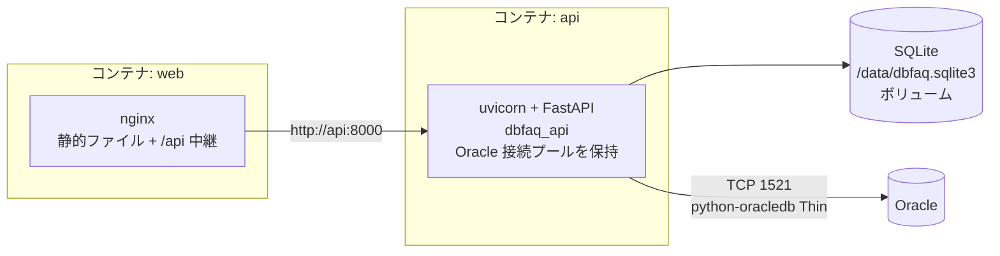

# P003 システム詳細設計書 — DbFAQ(第1リリース)

入力: `docs/P001-requirement.md`、`docs/P002-frontend-spec.md`。
本書は P002 §3 で確定した API の外部仕様と P002 §4 のデータモデルを、backend(FastAPI)・SQLite でどう実現するかを確定する。Oracle へは backend が直接接続する(※CR-002により MCP サーバ(FastMCP)を廃止し、Oracle アクセスを backend に統合した)。

## 1. 構成

### 1.1 プロセスとコンテナ



* backend(`dbfaq_api`)が Oracle への接続プール(python-oracledb の非同期プール)を持ち、Oracle に直接問い合わせる。子プロセスは起動しない。ADR-014
* ※CR-002により変更。以前は backend が MCP サーバ(`dbfaq_mcp`)を子プロセスとして起動し、stdio の MCP セッション経由で Oracle にアクセスしていた(旧 ADR-001)。
* 開発時は frontend を Vite 開発サーバ(5173)、backend を uvicorn(8000)で動かす(§7)。

呼び名の対応(※P011矛盾点#6にもとづき追加):

| P001 の呼び名 | compose のサービス | ソースの場所 / パッケージ |
| --- | --- | --- |
| frontend(React SPA / nginx) | `web` | `client/`、`deploy/web.Dockerfile`、`deploy/nginx.conf` |
| backend(FastAPI) | `api` | `server/src/dbfaq_api` |

### 1.2 ソースツリー

```
DbFAQ/
├── server/                       # Python(uv プロジェクト 1 つ)ADR-007
│   ├── pyproject.toml            # 依存: fastapi, uvicorn, oracledb, sqlalchemy, pydantic, pyyaml / dev: pytest, pytest-asyncio, httpx, ruff
│   ├── uv.lock
│   ├── src/
│   │   └── dbfaq_api/            # backend(※CR-003により dbfaq_common を統合して 1 パッケージ)
│   │       ├── main.py           # create_app()、lifespan、例外ハンドラ
│   │       ├── config.py         # config.yaml の読み込み(§2)※CR-003により dbfaq_common から移設
│   │       ├── log.py            # JSON ログ、パスワードのマスク(§4.5)※CR-003により dbfaq_common/logging.py から移設・改名
│   │       ├── errors.py         # ApiError とエラーコード
│   │       ├── oracle/           # Oracle アクセス(§3)※CR-002により dbfaq_mcp から移設
│   │       │   ├── client.py     # OracleClient(スキーマの読み取り・テーブルデータ・疎通確認の入口)
│   │       │   ├── db.py         # 接続プール、読み取り専用トランザクション
│   │       │   ├── errors.py     # OracleFailure(コード付き)
│   │       │   ├── identifiers.py # 識別子の検証・クォート
│   │       │   ├── dictionary.py # データディクショナリの問い合わせ(Q-00〜Q-05。§3.5)
│   │       │   ├── snapshot.py   # 問い合わせ結果 → スナップショット
│   │       │   ├── type_format.py # data_type_display の組み立て
│   │       │   ├── rows.py       # テーブルデータのページ取得
│   │       │   ├── sql_guard.py  # 利用者の SQL の検査(§3.10)※CR-004により追加
│   │       │   ├── query.py      # 利用者の SELECT の実行・CSV(§3.11)※CR-004により追加
│   │       │   └── values.py     # セル値の表示用文字列化
│   │       ├── db.py             # SQLAlchemy エンジン、PRAGMA
│   │       ├── migrate.py        # マイグレーション実行(§5)
│   │       ├── migrations/0001_init.sql
│   │       ├── snapshot_repo.py  # スナップショットの保存・読み出し
│   │       ├── schemas.py        # API のレスポンス型(pydantic)
│   │       ├── services.py       # refresh / 詳細 / rows / health / query の処理
│   │       └── routers/{schema.py, health.py, query.py}  # query.py は ※CR-004により追加
│   └── tests/{unit, integration}/
├── client/                       # Vite + React(P002 §6)
├── e2e/                          # Playwright(受入テスト)
├── deploy/                       # Dockerfile、nginx.conf
├── compose.yaml
├── config.example.yaml
└── docs/
```

* 1 つの uv プロジェクトに 1 つのパッケージ(`dbfaq_api`)を置く。ADR-007(※CR-002により `dbfaq_mcp` を削除して 3 → 2 パッケージ。※CR-003により `dbfaq_common` を `dbfaq_api` に統合して 2 → 1 パッケージ)
  * ログのモジュール名は `log.py` とする。パッケージ内で標準ライブラリの `logging` と同じ名前にしないため(CR-003)。
  * ※CR-003により撤回: CR-002 で「`dbfaq_common` を分けたまま残す」とした ★ACCEPTED★(2026-09-27 人間承認)は、依頼者が統合を指示したため撤回した(統合前の記述は `docs/P001-requirement-old/` と Git の履歴を参照)。
* SQLite へのアクセスは SQLAlchemy **Core**(`Table` 定義と SQL 式)を使う。ORM のオブジェクト対応は使わない。スナップショットは一括削除・一括挿入が中心で、ORM の変更追跡が要らないため。ADR-008

## 2. 設定ファイル

### 2.1 形式

`config.yaml`(Git 管理外)。ひな型 `config.example.yaml` をリポジトリに置く。

```yaml
oracle:
  host: localhost
  port: 1521
  service_name: FREEPDB1
  user: hr
  password: "********"
  schema: HR                 # 省略時は user を大文字にしたもの
  query_timeout_sec: 30      # 1 回の問い合わせの上限(python-oracledb の call_timeout)
  connect_timeout_sec: 10
  pool_min: 1
  pool_max: 4
app:
  sqlite_path: ./data/dbfaq.sqlite3
  log_level: INFO
```

* ※CR-002により `app.mcp_call_timeout_sec`(backend が MCP ツールの応答を待つ上限)を廃止した。既存の `config.yaml` に残っていても無視する(pydantic の既定で未知の項目は無視される)。

### 2.2 読み込み規則(`dbfaq_api/config.py`。※CR-003により `dbfaq_common/config.py` から移設)

| 項目 | 規則 |
| --- | --- |
| ファイルの場所 | 環境変数 `DBFAQ_CONFIG`。未設定なら カレントディレクトリの `config.yaml` |
| 環境変数での上書き | `DBFAQ_ORACLE_HOST`、`DBFAQ_ORACLE_PORT`、`DBFAQ_ORACLE_PASSWORD`、`DBFAQ_SQLITE_PATH` があればファイルの値より優先する(compose でコンテナ用の接続先を差し替えるため) |
| 型チェック | pydantic モデル `AppConfig`。必須: host, port, service_name, user, password。port は 1〜65535、各タイムアウトは 1〜600、pool_min ≥ 1、pool_max ≥ pool_min |
| 不正時 | 起動時に例外(どの項目が不正かを表示。パスワードの値は表示しない)で終了する |
| パスワード | `SecretStr` で持ち、`repr`・ログに出さない |

## 3. Oracle アクセス(`dbfaq_api/oracle`)

※CR-002により「MCP サーバ(`dbfaq_mcp`)」から変更。発行する SQL・読み取り専用トランザクション・識別子の扱い・値の表示形式は変えず、MCP のツールだったものを backend のプロセス内の関数として呼ぶ。

### 3.1 共通

* python-oracledb は Thin モード。`oracledb.defaults.fetch_decimals = True`(NUMBER を Decimal で受け取り、精度を落とさない)、`oracledb.defaults.fetch_lobs = False`(CLOB は str、BLOB は bytes で受け取る)。
  * ★ACCEPTED★ `fetch_lobs=False` は LOB 全体をメモリに読み込む。DBMS_LOB.SUBSTR で SQL 側で切り詰める方法も検討したが、`SELECT *` の列ごとに型を見て SQL を組み立て直す必要があり複雑になる。1 ページ最大 500 行 × LOB 列の大きさがメモリ量の上限になる。巨大な LOB を持つテーブルでは、limit を小さくして使うことで回避する。
* 接続プールは最初の Oracle アクセスで作る(`oracledb.create_pool_async`、`min=pool_min`、`max=pool_max`、`tcp_connect_timeout=connect_timeout_sec`、`getmode=POOL_GETMODE_TIMEDWAIT`、`wait_timeout=connect_timeout_sec×1000`)。Oracle が落ちていても backend は起動できる。プールは lifespan の終了時に閉じる。
  * ★ACCEPTED★(2026-09-27 人間承認) Oracle のリスナーに届かない間は、python-oracledb 26.0.0 のプールの `close(force=True)` が約 2 分戻らない(2026-09-27 に最小再現で確認。`docs/ArchitectureHandbook.md` §9)。close の待ち時間を `connect_timeout_sec` で打ち切り、時間切れならプールを捨てる。検討: 打ち切らない/不採用理由: api の停止・再起動が止まる(docker の停止猶予を超えて強制終了になる)/残存リスク: 打ち切ったときに閉じ切らない接続が残りうるが、プロセスの終了時なので OS が片付ける。§3.8 で避けた「処理の取り消し」と違い、ここは以後プールを使わないため接続の状態が壊れても影響しない。※P202 F008 にもとづき追加
  * `getmode` の既定(WAIT)では、Oracle に接続できない間 `acquire` が戻らず、リクエストが返らなくなる(2026-09-23 に最小再現で確認)。TIMEDWAIT にして `DPY-4005` で早く失敗させる。※P202 F006 にもとづき明確化(※CR-002により「backend の待ち時間(`mcp_call_timeout_sec`)まで待たされる」を変更)
* 各処理は接続を借りたら `call_timeout = query_timeout_sec * 1000`(疎通確認は §3.8 の 5 秒)を設定し、**読み取り専用トランザクション**の中で実行する(`../OracleSearchMCP` の `withReadOnlyTransaction` を踏襲):

```python
async with pool.acquire() as conn:
    conn.call_timeout = timeout_ms
    await conn.execute("SET TRANSACTION READ ONLY")   # 失敗したら例外(実行しない)
    try:
        return await fn(conn)
    finally:
        try: await conn.rollback()
        except Exception: log.warning(...)           # 元の例外を上書きしない
```

* 実機確認(2026-09-23): 読み取り専用トランザクション中の UPDATE は `ORA-01456` で拒否される。`call_timeout` 超過時は `DPY-4024`(呼び出しタイムアウト)のほか、回復処理が間に合わないと `DPY-4011`(接続が閉じられた。メッセージに `timed out` を含む)になる。いずれの場合も接続は使えなくなるので、プールへ返さず破棄する(python-oracledb のプールが自動で破棄する)。

### 3.2 エラー

Oracle アクセスの処理は、失敗時に例外 `OracleFailure(code, message, ora_code)` を送出する。API 層(§4.1)がこれを API エラーに変換する。※CR-002により「`fastmcp.exceptions.ToolError` に JSON 文字列を入れて送出し、backend が解析する」から変更

| code | 条件 |
| --- | --- |
| `INVALID_ARGUMENT` | 引数の検証に失敗(識別子が不正、offset/limit が範囲外) |
| `SQL_REJECTED` | 利用者の SQL が検査(§3.10)で拒否された。※CR-004により追加 |
| `NOT_FOUND` | 指定のスキーマ(ALL_USERS に無い)・テーブル(ALL_TABLES に無い)が見つからない |
| `ORACLE_TIMEOUT` | `DPY-4024`、`ORA-01013`、`ORA-03156`、またはメッセージに `timed out` を含む `DPY-4011` |
| `ORACLE_ERROR` | 上記以外の `oracledb.Error`。`ora_code` は `err.full_code`(例 `ORA-00942`、`DPY-6005`)。利用者の SQL の実行・取得で起きたエラーで、`err.offset` が 0 より大きいときは `position`(§3.11)を付ける(※CR-004により追加) |

* python-oracledb は、ホスト名を解決できないときなどに `oracledb.Error` ではなく `OSError`(`socket.gaierror` など)をそのまま送出する(2026-09-27 実機確認)。`run_readonly` はこれも変換する: `TimeoutError` → `ORACLE_TIMEOUT`、その他の `OSError` → `ORACLE_ERROR`(ora_code なし、message「Oracle に接続できません: …」)。※P202 F007 にもとづき追加
* `OracleFailure` 以外の想定外の例外はそのまま送出し、API の例外ハンドラ(§4.4)が 500 `INTERNAL_ERROR` にする(詳細はログのみ)。※CR-002により `INTERNAL_ERROR` のコードを Oracle アクセス側から削除

メッセージにパスワードを含めない(python-oracledb のエラーは接続文字列のパスワードを含まないが、念のため設定のパスワード文字列が含まれていたら `***` に置き換える)。

### 3.3 識別子の検証(`identifiers.py`)

* 引数(API のパスから渡される値)の `owner`・`table` は、辞書に格納された値そのまま(大文字小文字を区別)で受け取る。
* 検証: 1〜128 文字、NUL 文字と `"` を含まない。違反は `INVALID_ARGUMENT`。
* SQL に埋め込むときは必ず `"` で囲む(`quote("EMPLOYEES") → "\"EMPLOYEES\""`)。埋め込む前に ALL_TABLES で実在確認する(二重の防御)。

### 3.4 データ型表記(`type_format.py`)

ALL_TAB_COLUMNS の値から `data_type_display` を作る。

| DATA_TYPE | 表記 |
| --- | --- |
| VARCHAR2, CHAR | `CHAR_USED='C'` なら `VARCHAR2(n CHAR)`、それ以外 `VARCHAR2(n)`(n は CHAR_LENGTH) |
| NVARCHAR2, NCHAR | `NVARCHAR2(n)`(n は CHAR_LENGTH) |
| NUMBER | 精度・スケールとも NULL → `NUMBER`。精度 NULL・スケール 0 → `NUMBER(*,0)`。スケール 0 → `NUMBER(p)`。それ以外 `NUMBER(p,s)` |
| FLOAT | `FLOAT(p)`(精度 NULL なら `FLOAT`) |
| RAW | `RAW(n)`(n は DATA_LENGTH) |
| それ以外(DATE、TIMESTAMP(6)、CLOB、BLOB など) | DATA_TYPE そのまま |

### 3.5 スキーマの読み取り `OracleClient.get_schema_snapshot`(※CR-002により「ツール」から変更)

* 引数: `owner: str | None = None`(省略時は `oracle.schema`、それも無ければ接続ユーザー)
* 処理(1 つの読み取り専用トランザクション内):

| No | 問い合わせ | 用途 |
| --- | --- | --- |
| Q-00 | `SELECT USERNAME FROM ALL_USERS WHERE USERNAME = :owner` | スキーマの実在確認。0 件なら `NOT_FOUND` |
| Q-01 | `ALL_TABLES t LEFT JOIN ALL_TAB_COMMENTS c` — `TABLE_NAME, NUM_ROWS, LAST_ANALYZED, IOT_TYPE, COMMENTS`。条件: `OWNER=:owner AND NESTED='NO' AND SECONDARY='N' AND DROPPED='NO' AND (IOT_TYPE IS NULL OR IOT_TYPE='IOT')` | テーブル一覧(ごみ箱・入れ子表・IOT のオーバーフロー表を除く) |
| Q-02 | `ALL_TAB_COLUMNS col LEFT JOIN ALL_COL_COMMENTS cc` — `TABLE_NAME, COLUMN_ID, COLUMN_NAME, DATA_TYPE, DATA_LENGTH, DATA_PRECISION, DATA_SCALE, CHAR_LENGTH, CHAR_USED, NULLABLE, DATA_DEFAULT, COMMENTS` | 列。Q-01 に無いテーブル(ビューなど)の行は捨てる |
| Q-03 | `ALL_CONSTRAINTS c JOIN ALL_CONS_COLUMNS cc LEFT JOIN ALL_CONSTRAINTS rc LEFT JOIN ALL_CONS_COLUMNS rcc(POSITION で対応)` — `CONSTRAINT_TYPE IN ('P','U','R')`、`c.OWNER=:owner` | 主キー・一意制約・外部キー(`../OracleSearchMCP` の Q-02/Q-06 と同じ結合)。`R_OWNER`、`DELETE_RULE` も取る |
| Q-04 | `ALL_INDEXES i JOIN ALL_IND_COLUMNS ic` — `TABLE_OWNER=:owner` | インデックスと列(`DESCEND`) |
| Q-05 | `ALL_IND_EXPRESSIONS` — `TABLE_OWNER=:owner` | 関数索引の式。該当する列位置の列名(`SYS_NC...`)を式の文字列に置き換える |
| Q-06 | `SELECT BANNER_FULL FROM V$VERSION` は権限が要るため使わず、`conn.version` を使う | Oracle のバージョン |

* 戻り値(dict。SQLite への保存にそのまま使う):

```json
{
  "owner": "HR", "oracle_version": "23.26.3.0.0", "fetched_at": "2026-09-23T01:15:02Z",
  "tables": [
    { "name": "EMPLOYEES", "comment": "...", "num_rows": 107, "last_analyzed": "2026-09-22T08:12:32Z", "iot": false,
      "columns": [ { "column_id": 1, "name": "EMPLOYEE_ID", "data_type": "NUMBER", "data_type_display": "NUMBER(6)",
                     "data_length": 22, "data_precision": 6, "data_scale": 0, "char_length": 0, "char_used": null,
                     "nullable": false, "data_default": null, "comment": "..." } ],
      "constraints": [ { "name": "EMP_DEPT_FK", "type": "R", "columns": ["DEPARTMENT_ID"], "ref_owner": "HR",
                         "ref_table": "DEPARTMENTS", "ref_columns": ["DEPARTMENT_ID"], "delete_rule": "NO ACTION" } ],
      "indexes": [ { "name": "EMP_NAME_IX", "unique": false, "index_type": "NORMAL",
                     "columns": [ { "name": "LAST_NAME", "descending": false } ] } ]
    }
  ]
}
```

* `LAST_ANALYZED` は Oracle の DATE(タイムゾーンなし)。DB サーバの時刻として UTC とみなして `Z` を付ける ★ACCEPTED★(2026-09-24 人間承認)検討: DB のタイムゾーンを問い合わせて変換する/承認理由: 統計の取得日は目安で足りる/残存リスク: DB が UTC 以外だと表示する日時がずれる
* `data_default` は LONG 型。文字列として受け取り、前後の空白・改行を取り除く。空なら null。
* 大きなスキーマでも問い合わせ回数は Q-00〜Q-05 の 6 回で固定(テーブルごとに問い合わせない)。

### 3.6 テーブルデータの取得 `OracleClient.get_table_rows`(※CR-002により「ツール」から変更)

* 引数: `owner: str`, `table: str`, `offset: int = 0`(0〜100,000), `limit: int = 50`(1〜500)
* 処理(1 つの読み取り専用トランザクション内):
  1. 識別子を検証(§3.3)。offset/limit の範囲外は `INVALID_ARGUMENT`。
  2. `SELECT IOT_TYPE FROM ALL_TABLES WHERE OWNER=:o AND TABLE_NAME=:t` で実在確認。0 件なら `NOT_FOUND`。
  3. 主キー列を取得: `ALL_CONSTRAINTS(CONSTRAINT_TYPE='P') JOIN ALL_CONS_COLUMNS ORDER BY POSITION`。
  4. SQL を組み立てる。主キーあり: `SELECT * FROM "O"."T" ORDER BY "PK1", "PK2" OFFSET :off ROWS FETCH NEXT :n ROWS ONLY`。主キーなし: `... ORDER BY ROWID ...`。`:n = limit + 1`。
  5. 実行時間を計測(`time.perf_counter`、ミリ秒の整数)。
  6. `limit + 1` 行目があれば `has_next = true` とし、その行は返さない。
  7. 各セルを §3.7 で文字列化する。
* 戻り値: P002 §3.5 の本文から `owner`・`table` 以外をそのまま返す形(`columns`, `rows`, `truncated`, `offset`, `limit`, `has_next`, `order_basis`, `order_by`, `elapsed_ms`)。`columns[].data_type` は `cursor.description` の型名から `DB_TYPE_` を除いたもの(例 `NUMBER`、`VARCHAR`、`DATE`)。
* ★ACCEPTED★ OFFSET 方式のページ送りは、ページを進めるほど Oracle 側で読み飛ばす行が増えて遅くなる。キーセット方式(前ページ最後の主キーより大きい行を取る)も検討したが、主キーの無いテーブル・複合主キーで条件式が複雑になり、「N ページ目へ直接移動(URL の page)」もできなくなる。offset の上限を 100,000 にして最悪の場合を抑える。
* ★ACCEPTED★ ページ間で他のセッションが行を追加・削除すると、行がずれて重複・欠落して見えることがある。運用中の参照用途では許容する(読み取り専用トランザクションはページごとに別)。

### 3.7 セル値の文字列化(`values.py`)

P002 §3.6 の表のとおり。実装上の規則:

| Python の値 | 文字列化 |
| --- | --- |
| `None` | `None`(JSON null) |
| `Decimal` | `format(v, "f")`(指数表記にしない)。`-0` は `0` |
| `float` | `repr(v)`(BINARY_FLOAT/DOUBLE。`inf`/`nan` もそのまま文字列) |
| `datetime.datetime` | 列が DATE なら `%Y-%m-%d %H:%M:%S`、TIMESTAMP 系なら `%Y-%m-%d %H:%M:%S.%f`。tzinfo があれば ` +HH:MM` を付ける |
| `datetime.timedelta` | `str(v)` |
| `str` | 1,000 文字を超えたら先頭 1,000 文字 + `…`、truncated に記録 |
| `bytes` | 先頭 32 バイトを `0x` + 大文字 16 進。32 バイトを超えたら `…`、truncated に記録 |
| その他 | `str(v)` を 1,000 文字で切る |

### 3.8 疎通確認 `OracleClient.ping`(※CR-002により「ツール」から変更)

* 引数: なし
* 処理: 読み取り専用トランザクションで `SELECT USER, SYS_CONTEXT('USERENV','CURRENT_SCHEMA') FROM DUAL`。`call_timeout` は 5 秒(`HEALTH_TIMEOUT_SEC`)とする(`/api/health` が長く待たないように。以前は backend が MCP の呼び出しを 5 秒で打ち切っていた)
* 戻り値: `{"version": "23.26.3.0.0", "user": "HR", "current_schema": "HR"}`
* ★ACCEPTED★(2026-09-27 人間承認) Oracle に接続できないときの待ち時間は、接続の確立(`tcp_connect_timeout`・プールの `wait_timeout` = `connect_timeout_sec`、既定 10 秒)で決まり、5 秒を超えうる。検討: `asyncio.wait_for` で全体を 5 秒で打ち切る/不採用理由: python-oracledb の非同期処理を途中で取り消すと、通信の途中の接続がプールに戻りうる(接続の状態が壊れる)ため、ドライバ自身のタイムアウトに任せる/残存リスク: Oracle のホストに届かない(応答が無い)とき、health の応答に最大で `connect_timeout_sec` 程度かかる(接続拒否のときはすぐ返る)

### 3.9 `OracleClient`(`client.py`)※CR-002により追加

* §3.5・§3.6・§3.8 の 3 つの処理の入口をまとめたクラス。`Database`(§3.1 の接続プール)を 1 つ持ち、`get_schema_snapshot(owner)`、`get_table_rows(owner, table, offset, limit)`、`ping()`、`close()` を持つ。
* ※CR-004により `run_query(sql, max_rows)`(§3.11)と `export_csv(sql)`(§3.11)を追加。
* backend は lifespan の開始時に 1 つ作って `SchemaService` に渡し、終了時に `close()`(プールを閉じる)する。
* 単体テストでは、同じメソッドを持つ偽物(`OracleAccess` プロトコル)を `create_app(oracle=...)` で渡す。

### 3.10 利用者の SQL の検査(`sql_guard.py`)※CR-004により追加

P002 §3.8 の検査を Oracle に送る前に行う(多層防御の 1 層目。2 層目は §3.1 の読み取り専用トランザクション)。`../OracleSearchMCP/app/src/guard/`(`sql-lexer.ts`・`sql-guard.ts`)を Python に移す。ADR-015(※P011(CR-004)矛盾点#1にもとづき暫定番号とし、P021 で確定)

**正規化**(判定用の文字列を作る。実行には元の SQL を使う)。1 パスの状態機械で先頭から走査する:

| No | 対象 | 扱い |
| --- | --- | --- |
| N1 | 行コメント `-- ...`(改行まで) | 空白 1 個に置き換える |
| N2 | ブロックコメント `/* ... */` | 空白 1 個に置き換える。ただし `/*+ ... */`(ヒント句)はそのまま残す |
| N3 | 文字列リテラル `'...'`(`''` はエスケープ) | `''` に置き換える |
| N4 | 代替引用符 `q'X...X'`(`[`↔`]`、`{`↔`}`、`(`↔`)`、`<`↔`>`、それ以外は同じ文字) | `''` に置き換える |
| N5 | 引用符付き識別子 `"..."` | そのまま残し、範囲を記録する(キーワードの判定から除外する) |
| N6 | 空白 | 連続する空白(全角空白を含む)を 1 個にし、前後を除き、大文字にする |

**拒否規則**(順に判定し、最初に当たったもので `SQL_REJECTED`。メッセージは日本語で理由を示す):

| No | 規則 | メッセージの例 |
| --- | --- | --- |
| G1 | 先頭の語が `BEGIN`・`DECLARE`、または `EXECUTE IMMEDIATE`・`DBMS_SQL` を含む | 「PL/SQL ブロックと動的 SQL は実行できません」 |
| G2 | 先頭の語が `SELECT`・`WITH` 以外 | 「SELECT または WITH で始まる問い合わせだけを実行できます(先頭: UPDATE)」 |
| G3 | 引用符付き識別子の外の `;` が 2 個以上、または 1 個でその後に文字がある | 「複数の文は実行できません」 |
| G4 | `FOR UPDATE` を含む | 「FOR UPDATE(行ロック)は使えません」 |
| G5 | `INSERT`・`UPDATE`・`DELETE`・`MERGE`・`DROP`・`TRUNCATE`・`ALTER`・`CREATE`・`GRANT`・`REVOKE`・`COMMIT`・`ROLLBACK`・`SAVEPOINT`・`LOCK TABLE` のいずれかを独立した語として含む | 「更新・定義・トランザクション制御のキーワード(DELETE)を含む SQL は実行できません」 |

* 語の判定は、前後が識別子の文字(英数字・`_`・`$`・`#`)でないこと、引用符付き識別子の範囲の外であることを条件にする。
* 検査を通ったら、実行用の SQL は元の SQL から末尾の空白とセミコロン 1 個を取り除いたものにする(先頭は変えない。エラー位置が元の SQL の位置と一致するように)。
* ★FIXME★ 誤検知: 列名・別名に `UPDATE` などの語を引用符なしで使った正当な SELECT も拒否する(OracleSearchMCP と同じ割り切り)。見逃し: 副作用のある既存のストアドファンクション(自律型トランザクション)を SELECT から呼ぶことは字句では防げない。読み取り専用トランザクションも自律型トランザクションには及ばないため、運用では読み取り専用ユーザーを使う(P302 の手順書)

### 3.11 利用者の SELECT の実行(`query.py`)※CR-004により追加

**`run_query(db, sql, max_rows=500)`**(`POST /api/query`)

1. §3.10 で検査し、実行用の SQL を得る。
2. 1 つの読み取り専用トランザクション内(§3.1。`call_timeout` は `query_timeout_sec`)で、カーソルの `arraysize` と `prefetchrows` を `max_rows + 1` にして実行し、`fetchmany(max_rows + 1)` で取得する。SQL をサブクエリで包まない(エラー位置が利用者の SQL の位置と一致するように、また ORDER BY などをそのまま生かすため)。
3. `max_rows + 1` 行目があれば `has_more = true` とし、その行は返さない。
4. 各セルを §3.7 で文字列化する(1,000 文字・32 バイトでの切り詰めを含む)。`columns` は §3.6 と同じく `cursor.description` から。
5. 実行時間は実行開始から取得完了まで(`time.perf_counter`、ミリ秒の整数)。
6. 戻り値: P002 §3.8 の 200 の本文。

**`export_csv(db, sql)`**(`POST /api/query/csv`)

1. §3.10 で検査する。
2. 1 つの読み取り専用トランザクション内で実行し、`fetchmany(1000)` を繰り返して全行を取得する(`arraysize=1000`)。
3. 各セルを §3.7 の規則で、ただし**切り詰めずに**文字列化する(`values.format_cell(..., full=True)`。NULL は空文字)。
4. `tempfile.SpooledTemporaryFile(max_size=8 MiB)` に `csv.writer`(`lineterminator="\r\n"`、`QUOTE_MINIMAL`)で、UTF-8(BOM 付き。`encoding="utf-8-sig"`)で見出し行と全行を書く。8 MiB を超えた分は一時ディレクトリのファイルになる。
5. 全行を書き終えたら、ファイルを先頭に戻して(ファイル, 行数)を返す。途中で失敗したらファイルを閉じて例外を送出する(応答を始める前なので JSON のエラーで返せる)。
6. API 層はファイルを 64 KiB ずつ読む `StreamingResponse` で返し、送り終えたら(利用者が途中で切断しても)ファイルを閉じる。

* ★FIXME★ 全行を一時ファイルに書いてから返すため、結果の大きさだけ api コンテナのディスクを使い、取得中は接続プールの接続を 1 つ占有する(既定 `pool_max=4`)。行数・時間の上限は設けない(人間の指示「全てのデータ」)。直接ストリーミングする方式も検討したが、途中のエラーを利用者に伝えられず(壊れた CSV が保存される)、ダウンロードの遅い利用者が Oracle の接続とトランザクションを長く占有するため採らなかった
* ★FIXME★ CSV の値は数式として解釈されうる文字(`=`・`+`・`-`・`@`)で始まってもそのまま出す(データを変えないため)。表計算ソフトで開くときの数式の実行(CSV インジェクション)は利用者の注意に任せる

**エラー位置**(`run_query`・`export_csv` 共通)

* 実行・取得で `oracledb.Error` が起きたら `from_oracle_error` で変換し、`err.offset` が 0 より大きければ `position` を付ける。
* `err.offset` は**実行した SQL の UTF-8 のバイト位置(0 始まり)**である(2026-10-04 に HR で確認: `-- 日本語コメント\nSELECT ほげ FROM EMPLOYEES` の ORA-00904 は 32 = 「ほげ」の先頭のバイト位置)。実行用の SQL を UTF-8 に変換し、先頭からそのバイト位置までを復号した文字数を `offset`(コードポイント単位)とする。バイト位置が文字の途中や SQL の長さを超える場合は `position` を付けない。
* `line` = `offset` までの `\n` の数 + 1、`column` = `offset` − 直前の `\n` の次の位置 + 1。
* 実行用の SQL は元の SQL の先頭部分そのもの(§3.10)なので、位置は利用者が入力した SQL の位置と一致する。

## 4. backend(`dbfaq_api`)

### 4.1 Oracle アクセスの呼び出しとエラー変換(※CR-002により「MCP ゲートウェイ(`mcp_gateway.py`)」から変更)

| 項目 | 内容 |
| --- | --- |
| 呼び出し | `SchemaService` が `OracleClient`(§3.9)のメソッドを直接 `await` する。子プロセス・セッションは無い |
| 同時実行 | 各処理は async で、Oracle 接続はプール(`pool_max`、既定 4)で並行する。プールが埋まっているときは `wait_timeout` まで待ち、超えたら `ORACLE_ERROR`(`DPY-4005`) |
| Oracle が戻ったとき | プールは接続を借りるときに壊れた接続を捨てて作り直すため、Oracle が再起動しても backend の再起動は要らない。接続できない間の失敗は `ORACLE_ERROR`/`ORACLE_TIMEOUT` になる |
| 終了 | lifespan の終了時に `OracleClient.close()` でプールを閉じる |
| テスト用の差し替え | `create_app(oracle=...)` で偽物を渡せるようにする。単体テストは偽物を使う |

`OracleFailure` の code から API エラーへの対応:

| `OracleFailure` の code | API の code / HTTP |
| --- | --- |
| `ORACLE_ERROR` | `ORACLE_ERROR` / 502(`ora_code` を引き継ぐ) |
| `ORACLE_TIMEOUT` | `ORACLE_TIMEOUT` / 504 |
| `NOT_FOUND`(rows のとき) | `ORACLE_ERROR` / 502、`ora_code`: `ORA-00942`、message: 「テーブルが Oracle 上に見つかりません(削除された可能性があります)」 |
| `NOT_FOUND`(refresh のとき) | `ORACLE_ERROR` / 502、message: 「スキーマ {owner} が見つかりません」 |
| `INVALID_ARGUMENT` | `VALIDATION_ERROR` / 422 |
| `SQL_REJECTED` | `SQL_REJECTED` / 422(※CR-004により追加) |
| `ORACLE_ERROR`(query のとき) | `ORACLE_ERROR` / 502。`ora_code` と `position` を引き継ぐ(※CR-004により追加) |
| (`OracleFailure` 以外の例外) | `INTERNAL_ERROR` / 500(§4.4 の例外ハンドラ) |

※CR-002により「(通信不能・起動失敗)→ `MCP_UNAVAILABLE` / 503」「(backend 側の待ち時間超過)→ `ORACLE_TIMEOUT` / 504」「解析不能 → `INTERNAL_ERROR`」の行を削除(MCP の通信が無くなったため)。

### 4.2 状態の保持

| 状態 | スコープ | 実現方法 |
| --- | --- | --- |
| スキーマのスナップショット | システム(永続) | SQLite(§5) |
| 再読み込みの実行中フラグ | アプリケーション(プロセス) | `asyncio.Lock`。`locked()` なら 409 を返す。uvicorn は 1 ワーカーで動かす前提(複数ワーカーにするとロックが効かず、Oracle の接続プールもワーカーごとに増える)★ACCEPTED★(2026-09-24 人間承認)検討: 複数ワーカー/承認理由: 利用規模に 1 ワーカーで足りる(ADR-014)/残存リスク: 特になし(※CR-002により「MCP 子プロセスもワーカーごとに増え」を変更) |
| Oracle の接続プール | アプリケーション(backend のプロセス) | python-oracledb の非同期プール。`OracleClient` が持つ(※CR-002により「MCP サーバのプロセス」から変更) |

### 4.3 各 API の内部処理

**`GET /api/schema`**

1. `SnapshotRepository.get_er_view(owner=設定の schema)` で読む。無ければ `{"loaded": false, ...}`。※P011矛盾点#1にもとづき修正
2. テーブル・列・制約・(外部キーの)列を 4 回の SELECT で読み、Python で組み立てる(N+1 にしない)。
3. `is_pk` = 列名が主キー制約の列に含まれる。`is_fk` = いずれかの外部キー制約の列に含まれる。
4. `relations` = 型 R の制約。`to_owner`=`ref_owner`、`to_table`=`ref_table`。

**`POST /api/schema/refresh`**

1. `refresh_lock.locked()` なら 409 `REFRESH_IN_PROGRESS`。
2. ロックを取り、`oracle.get_schema_snapshot(設定の schema)`。
3. ※CR-002により「結果を pydantic モデルで検証(想定外の形なら 500)」を削除。プロセス間の境界が無くなり、スナップショットは同じプロセスの §3.5 が組み立てるため。
4. `snapshot_repo.replace(snapshot)` — 1 トランザクション(`BEGIN IMMEDIATE`)で `DELETE FROM snapshots WHERE owner=?`(CASCADE で子も消える)→ 全行を `executemany` で挿入 → COMMIT。途中で失敗したら ROLLBACK(前回のスナップショットが残る)。ADR-003
5. 200 で `snapshot` を返す。ログに件数と所要時間を INFO で出す。

**`GET /api/schema/tables/{owner}/{table}`**

1. パスの長さを検証(1〜128)。違反は 422。
2. スナップショットが無ければ 404 `SCHEMA_NOT_LOADED`。`owner` がスナップショットの owner と違う、またはテーブルが無ければ 404 `TABLE_NOT_FOUND`。
3. 列・制約・インデックスを読み、`referenced_by` はスナップショット内の型 R 制約のうち `ref_owner=owner AND ref_table=table` のものから作る。`ref_in_snapshot` は参照先がスナップショット内にあるか。

**`GET /api/schema/tables/{owner}/{table}/rows`**

1. `offset`(0〜100,000、既定 0)・`limit`(1〜500、既定 50)を検証。違反は 422。
2. スナップショットで実在確認(無ければ 404)。
3. `oracle.get_table_rows(owner, table, offset, limit)`。結果に `owner`・`table` を加えて返す。

**`POST /api/query`**(※CR-004により追加)

1. 本文を pydantic で検証(`sql` は 1〜100,000 文字、空白だけは不可)。違反は 422 `VALIDATION_ERROR`。
2. `oracle.run_query(sql, 500)`(§3.11)。スナップショットの有無は問わない(SQL は SC-02 のテーブルに限らない)。
3. ログに `sql_chars`(文字数)、`row_count`、`has_more`、`elapsed_ms`、エラー時は `ora_code` を INFO で出す。SQL の本文は出さない ★FIXME★ SQL の本文をログに出さないのは Agent の想定(リテラルに業務データを含みうるため。監査の目的で残したい場合は CR で変更する)

**`POST /api/query/csv`**(※CR-004により追加)

1. 検証は `POST /api/query` と同じ。
2. `oracle.export_csv(sql)`(§3.11)。失敗したら JSON のエラー。
3. `StreamingResponse`(`text/csv; charset=utf-8`、`Content-Disposition: attachment; filename="query.csv"`、`X-Row-Count`)で返す。ログは `POST /api/query` と同じ項目(`row_count` は全行数)。

**`GET /api/health`**

1. `oracle.ping()`(§3.8。問い合わせの上限 5 秒)。成功なら oracle=ok。
2. `OracleFailure`(`ORACLE_ERROR`/`ORACLE_TIMEOUT`)なら oracle=error(message にエラー)。想定外の例外でも、ログに出して oracle=error(message「内部エラーが発生しました」)とする(※P202 F007 にもとづき追加)。
3. `config` は設定から(パスワードを除く)。常に 200。
4. ※CR-002により mcp の状態(MCP_UNAVAILABLE のときの mcp=error)を削除。

### 4.4 例外ハンドラ

* `ApiError(code, message, http_status, ora_code=None, position=None)` → P002 §3.1 の形式(`position` は ※CR-004により追加)。
* FastAPI の `RequestValidationError` → 422 `VALIDATION_ERROR`(message: 「offset: 0 以上 100000 以下で指定してください」のように 項目名: 理由)。
* 想定外の例外 → 500 `INTERNAL_ERROR`、スタックトレースはログのみ。

### 4.5 ログ

* 形式: 1 行 1 JSON(`ts`, `level`, `logger`, `msg`, 任意の追加項目)。標準出力へ出す。
* 出すもの: リクエスト(メソッド、パス、ステータス、所要時間)、refresh の開始・終了(件数、所要時間)、Oracle のエラー(ora_code)。
* ※CR-002により MCP サーバのログ(標準エラー出力)と「MCP の再接続」を削除。
* 出さないもの: パスワード、テーブルデータの中身、Query の SQL の本文と結果(※CR-004により追加)。

## 5. SQLite とマイグレーション

### 5.1 接続設定(`db.py`)

* `create_engine("sqlite:///{sqlite_path}")`。接続ごとに `PRAGMA foreign_keys=ON`、`PRAGMA journal_mode=WAL`、`PRAGMA busy_timeout=5000`。
* `sqlite_path` の親ディレクトリが無ければ作る。
* SQLite の処理は同期で書き、FastAPI の同期エンドポイント(スレッドプール)またはサービス内の `run_in_threadpool` から呼ぶ。

### 5.2 マイグレーション方式 ADR-002

| 項目 | 内容 |
| --- | --- |
| 適用のタイミング | backend の起動時(lifespan の最初)に `migrate.apply_all(engine)` を実行する |
| 方式 | `dbfaq_api/migrations/NNNN_*.sql` をファイル名順に読み、**適用済みを記録する管理テーブル `schema_migrations(version TEXT PRIMARY KEY, applied_at TEXT NOT NULL)` に無いものだけ**を、1 ファイル = 1 トランザクションで実行して記録する |
| 冪等性 | 冪等。2 回目以降の起動では適用済みのファイルを実行しないため、`ALTER TABLE ... ADD COLUMN` のような条件付き構文の無い DDL を後から追加しても失敗しない。管理テーブル自体は `CREATE TABLE IF NOT EXISTS` で作る |
| 失敗時 | そのファイルのトランザクションをロールバックし、例外で起動を中止する(中途半端な状態で動かない) |
| 既存ファイルの変更 | 適用済みのマイグレーションファイルは書き換えない。変更は新しい番号のファイルで行う |

* **停止・再起動しても正常に起動すること**(同じ SQLite ファイルに対して 2 回以上起動)の確認は、永続化されたファイルに対して行う必要があり、単体テスト・スプリント内結合テスト(一時ファイルを使う)では代替できない。このため `docs/P006-test-plan.md` に運用観点(再起動耐性)として含め、**受け入れ結合テスト(P009)で確認する**。なお単体テストでも「同じファイルに 2 回 `apply_all` しても失敗しない」ことは確かめる。

### 5.3 `0001_init.sql`

P002 §4.2 のテーブルをそのまま作る。加えて次のインデックスを作る。

| インデックス | 用途 |
| --- | --- |
| `db_constraints(ref_owner, ref_table)` | 参照元外部キー(`referenced_by`)の検索 |

内部用のテーブル(ユーザインタフェースに現れない)は `schema_migrations` のみ。

## 6. 非機能要件の実現と委譲

| 非機能要件(P001 §8) | アプリケーションコード側の前提・実現 | インフラ構成の決定の委譲先 |
| --- | --- | --- |
| 性能: ER 図表示 | `GET /api/schema` は 4 回の SELECT で組み立て(§4.3)。レイアウトはブラウザ側(elkjs) | — |
| 性能: 再読み込み | 辞書の問い合わせは 6 回で固定(§3.5) | — |
| 性能: タイムアウト | `query_timeout_sec`(call_timeout。問い合わせ 1 回ごと)と `connect_timeout_sec`(接続の確立・プールの待ち)。※CR-002により `mcp_call_timeout_sec` を削除。Query の CSV は全行の取得に往復を繰り返すため、全体の時間は `query_timeout_sec` を超えうる(※CR-004により追加) | nginx の中継の待ち時間(既定 120 秒)を、`/api/query/csv` だけ 600 秒にし、応答をバッファしない(`proxy_buffering off`)構成は **P005 の U009** で整備する ★FIXME★ 600 秒は Agent の想定 |
| 性能: Query の実行 | 501 行だけを取得し(§3.11)、SQL を包まない | — |
| 可用性: 自動再起動 | アプリは Oracle が無くても起動できる(接続プールは遅延作成)。Oracle が戻れば次の呼び出しから使える(§4.1)。※CR-002により MCP 子プロセスの記述を削除 | コンテナの `restart: unless-stopped` と単一ホスト構成は **P005 のインフラ用スプリント**と **P302** で整備する |
| 可用性: バックアップ | SQLite は再読み込みで作り直せる派生データなので、アプリはバックアップ機能を持たない ★ACCEPTED★(2026-09-24 人間承認)検討: バックアップ機能/承認理由: 再読み込みで作り直せる派生データ/残存リスク: ボリュームを失うと、再読み込みするまで ER 図が空になる | ボリュームの扱いは P302 の手順書 |
| セキュリティ: 読み取りのみ | 読み取り専用トランザクション、識別子の検証とクォート。※CR-004により「任意 SQL を実行する機能を持たない」を変更: Query の SQL は字句の検査(§3.10)を通したうえで読み取り専用トランザクションで実行する | 読み取り専用ユーザーの作成手順は P302 の手順書(Query タブがあるため、推奨の重要度が上がった旨を記載する) |
| セキュリティ: 公開範囲 | backend は nginx からのみ呼ばれる前提で CORS を設定しない | ホストに公開するのは web コンテナのポートだけにする構成は **P005・P302** |
| セキュリティ: TLS | アプリは HTTP のみ。TLS 終端は運用環境のリバースプロキシで行う前提 | **P302**(手順書に前提として記載) |
| セキュリティ: パスワード | `SecretStr`、ログ・API に出さない、`config.yaml` を Git 管理外 | イメージに含めない(マウント)構成は **P005・P302** |
| スケーラビリティ | uvicorn 1 ワーカー、SQLite WAL、refresh の排他 | — |
| ログ・監視 | JSON ログを標準出力へ。`/api/health` | `docker compose logs` での確認手順と外部監視からの `/api/health` 利用は **P302** |

## 7. 開発時・テスト時のオリジン(CORS)方針 ADR-004

* 開発時: Vite 開発サーバ(`http://localhost:5173`)の `server.proxy` で `/api` を `http://localhost:8000` に中継し、ブラウザからは同一オリジンに見せる。
* 本番(compose): nginx が静的ファイルと `/api` の中継を同じオリジン(`http://<host>:8088`)で行う。
* このため backend は CORS ヘッダを一切返さない(認証が無く Cookie も使わないが、不要な許可を持たないため)。
* 受入テスト(Playwright)は compose で起動した nginx のオリジンに対して実行する。backend の結合テストは `httpx.AsyncClient(transport=ASGITransport(app))` で直接呼ぶ(ブラウザを通さないので CORS は関係しない)。

## 8. ADR 一覧(P021 で確定済み。本文は `docs/ADR.md`)

| ADR | 決定 | 本書の箇所 |
| --- | --- | --- |
| ADR-002 | SQLite のマイグレーションは管理テーブル付きの差分適用 | §5.2 |
| ADR-003 | スナップショットはスキーマごとに最新 1 件、1 トランザクションで置き換える | §4.3 |
| ADR-004 | 同一オリジン(Vite proxy / nginx)で CORS を使わない | §7 |
| ADR-005 | セル値は backend で表示用文字列にして返す(`fetch_decimals`、`fetch_lobs=False`) | §3.1、§3.7 |
| ADR-006 | データタブは主キー順(無ければ ROWID 順)の OFFSET 方式、件数は数えない | §3.6 |
| ADR-007 | Python は 1 つの uv プロジェクトに 1 パッケージ(CR-002 で 3 → 2、CR-003 で 2 → 1。※P011(CR-003)矛盾点#1にもとづき修正) | §1.2 |
| ADR-008 | SQLite へは SQLAlchemy Core でアクセスする | §1.2 |
| ADR-011 | Oracle へは python-oracledb(Thin)で読み取り専用トランザクション内でのみアクセスする(※CR-004により「任意 SQL を受け付ける機能は作らない」を変更) | §3.1 |
| ADR-015(※P011(CR-004)矛盾点#1にもとづき暫定番号とし、P021 で確定) | 利用者の SELECT は字句の検査と読み取り専用トランザクションの二重で守り、SQL を包まずに実行する。CSV は一時ファイルに書いてから返す(※CR-004により追加) | §3.10、§3.11 |
| ADR-014 | backend のプロセス内で python-oracledb の非同期プールにより Oracle に直接接続する(MCP を使わない)。※CR-002により追加。旧 ADR-001(MCP サーバを子プロセスとして常駐)は廃止 | §1.1、§3、§4.1 |
