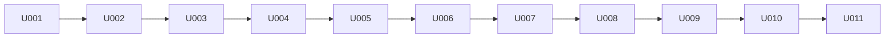

# P005 実装計画書 — DbFAQ(第1リリース)

入力: `docs/P001-requirement.md`、`docs/P002-frontend-spec.md`、`docs/P003-backend-spec.md`、`docs/P004-traceability-matrix.md`。

## 1. スプリント構成

6 スプリントに分ける(CR-002 で改修スプリント U007 を追加し 7 スプリント)。不確定要素の大きい MCP サーバ(FastMCP 4.x の stdio、python-oracledb の非同期プール、Oracle の辞書ビュー)を先に作り、その上に backend、frontend、配布を積む。

| No | 名称 | 位置づけ | 重さ(目安) |
|---|---|---|---|
| U001 | foundation | uv プロジェクト、共通の設定読み込み・ログ、開発用 Oracle(既存コンテナ、HR)への疎通確認。以降の全スプリントの土台 | 小(ファイル 6) |
| U002 | mcp-server | MCP サーバ `dbfaq_mcp`(ツール 3 本、識別子、型表記、値の文字列化、読み取り専用トランザクション) | 大(ファイル 9、外部システム連携あり) |
| U003 | backend-api | SQLite(マイグレーション、スナップショット)、MCP ゲートウェイ、API 5 本 | 大(ファイル 11、子プロセス管理・排他あり) |
| U004 | frontend-er | frontend の土台(Vite、ルーティング、API クライアント、共通ヘッダ)と SC-01 ER 図 | 中〜大(ファイル 12、レイアウト計算の不確定要素) |
| U005 | frontend-detail | SC-02 テーブル詳細(スキーマ情報タブ、データタブ) | 中(ファイル 7) |
| U006 | deploy | Dockerfile(api / web)、nginx、compose.yaml、受入テスト(Playwright)の実行環境 | 中(ファイル 7、インフラ) |
| U007 | oracle-in-backend | ※CR-002により追加。MCP サーバ(U002 の成果物)と MCP ゲートウェイ(U003 の一部)を廃止し、Oracle アクセスを `dbfaq_api/oracle` に移す。health から mcp を除く(backend・frontend の型)。依存・設定・Dockerfile・compose・受入テストのスクリプトから MCP を除く | 中(移設が中心。ファイル 約 30(移動を含む)、ロジックの新規作成は `client.py` のみ) |
| U009 | query-tab | ※CR-004により追加。backend: 利用者の SQL の検査(`oracle/sql_guard.py`)、SELECT の実行・CSV(`oracle/query.py`)、エラー位置、API 2 本(`routers/query.py`)。frontend: SC-02 の Query タブ(`QueryTab.tsx`)、ひな形の組み立て(`query/template.ts`)、CSV の保存。nginx の CSV の待ち時間。受入テスト A09 と A06 の追加分 | 大(ファイル 新規 約 10・変更 約 12、外部システム連携あり) |
| U010 | saved-queries-pdb | ※CR-005により追加。backend: マイグレーション 0002、保存済み Query のリポジトリ・API 4 本、PDB のひな型と起動時の登録、PDB 情報の読み取り・API。frontend: 保存済み Query の部品(`SavedQueries`)、`QueryTab` のテーブル/PDB 共用化、SC-01 のドラム缶のアイコン(`PdbIcon`)、SC-03(`PdbPage`・`PdbInfoTab`)。受入テスト A10 | 大(ファイル 新規 約 14・変更 約 14、外部システム連携あり) |
| U011 | readonly-user | ※CR-006により追加。backend: 接続のカレントスキーマを対象スキーマに(`oracle/db.py`)、PDB 情報の SQL(`oracle/pdb.py`)、ひな型を対象スキーマ基準に直し以前の版を残す(`pdb_templates.py`)、未変更のひな型の更新(`saved_query_repo.py`)。テストの接続ユーザーを `dbfaq_ro` に(T03・T14・T15・A10)。`config.example.yaml`、README.md | 中(ファイル 変更 約 12、外部システム連携あり) |
| U008 | merge-common | ※CR-003により追加。`dbfaq_common`(`config.py`・`logging.py`)を `dbfaq_api`(`config.py`・`log.py`)に移し、import を直す。振る舞いは変えない | 小(移設が中心。import の変更 約 20 ファイル) |

* ※CR-002: U002(mcp-server)は U007 で廃止した(成果物のコードは `dbfaq_api/oracle` に移り、MCP のツール登録・stdio 起動は削除)。U003 の「MCP ゲートウェイ」も U007 で廃止した。U001〜U006 の記述は第 1 リリース時点の記録として残す。

## 2. 各スプリントの内容

### U001 foundation

| 種別 | 対象 |
|---|---|
| 画面 | なし |
| API | なし |
| データモデル | なし |
| その他 | `server/pyproject.toml`(uv、Python 3.12)、`dbfaq_common/config.py`(P003 §2)、`dbfaq_common/logging.py`(P003 §4.5)、`config.example.yaml`、`.gitignore` への `config.yaml`・`data/` 追加、ローカルの `config.yaml`(人間が指定した接続先。Git 管理外)、開発用 Oracle(`localhost:1521/FREEPDB1`、hr)への疎通確認 |
| インフラ | 開発・テスト用 Oracle は既存のコンテナ(`oracle-db-free`)を使う。本プロジェクトの compose には含めない ★ACCEPTED★(2026-09-24 人間承認)P001 §2 の「人間が指定した既存の Oracle」に従う。検討: compose に Oracle を含める/承認理由: 既存の DB を使う/残存リスク: 特になし |

### U002 mcp-server

| 種別 | 対象 |
|---|---|
| 画面 | なし |
| API | なし(MCP ツール: `get_schema_snapshot`、`get_table_rows`、`ping`) |
| データモデル | スナップショット JSON(P003 §3.5)、rows JSON(P003 §3.6) |
| その他 | `dbfaq_mcp/` 一式(P003 §3) |

### U003 backend-api

| 種別 | 対象 |
|---|---|
| 画面 | なし |
| API | `GET /api/schema`、`POST /api/schema/refresh`、`GET /api/schema/tables/{owner}/{table}`、`GET /api/schema/tables/{owner}/{table}/rows`、`GET /api/health` |
| データモデル | SQLite: `schema_migrations`、`snapshots`、`db_tables`、`db_columns`、`db_constraints`、`db_constraint_columns`、`db_indexes`、`db_index_columns` |
| その他 | `dbfaq_api/` 一式(P003 §4、§5)、MCP ゲートウェイ |

### U007 oracle-in-backend(※CR-002により追加)

| 種別 | 対象 |
|---|---|
| 画面 | 変更なし(`client/src/api/types.ts` の health の型と `client/src/test/fetchMock.ts` から `mcp` を除く) |
| API | `GET /api/health` の応答から `mcp` を除く。エラーコード `MCP_UNAVAILABLE` を削除。その他は変えない |
| データモデル | 変更なし |
| その他 | `dbfaq_mcp/` の Oracle アクセスのモジュールを `dbfaq_api/oracle/` に移し、`OracleClient` を作る(P003 §3)。`dbfaq_mcp/__main__.py`・`server.py`、`dbfaq_api/mcp_gateway.py` を削除。`services.py`・`main.py`・`errors.py`・`schemas.py` を Oracle の直接呼び出しに合わせる。`pyproject.toml` から `fastmcp` を外す。`config.py`・`config.example.yaml` から `mcp_call_timeout_sec` を外す。単体テスト・結合テスト(T01〜T04 の書き換え、T05・T09 の削除)を合わせる |
| インフラ | `deploy/api.Dockerfile`・`compose.yaml` のコメント、`e2e/scripts/a04-restart.sh` の手順 7 を「MCP 子プロセスの強制終了からの回復」から「api コンテナに `dbfaq_mcp` のプロセスが無いこと」の確認に置き換える(※P011(CR-002)矛盾点#1にもとづき修正) |

### U008 merge-common(※CR-003により追加)

| 種別 | 対象 |
|---|---|
| 画面 | なし |
| API | なし |
| データモデル | なし |
| その他 | `dbfaq_common/config.py` → `dbfaq_api/config.py`、`dbfaq_common/logging.py` → `dbfaq_api/log.py`(`git mv`)。`dbfaq_common` を削除。`server/src`・`server/tests`・`server/scripts` の import、`pyproject.toml` のパッケージ一覧 |
| インフラ | なし(Dockerfile は `server/src` をまとめてコピーしており変更不要) |

### U009 query-tab(※CR-004により追加)

| 種別 | 対象 |
|---|---|
| 画面 | SC-02 に Query タブを追加(P002 §2.2.6・§2.2.7)。URL の `tab=query` |
| API | `POST /api/query`、`POST /api/query/csv`(P002 §3.8・§3.9)、エラーの `SQL_REJECTED` と `position`(P002 §3.1) |
| データモデル | 変更なし |
| その他 | backend: `dbfaq_api/oracle/sql_guard.py`・`query.py`(新規)、`oracle/errors.py`(`SQL_REJECTED`、エラー位置)、`oracle/values.py`(切り詰めない文字列化)、`oracle/client.py`(`run_query`・`export_csv`)、`errors.py`・`schemas.py`・`services.py`・`main.py`・`routers/query.py`(新規)、`tests/fakes.py`。frontend: `src/query/template.ts`(新規)、`src/pages/QueryTab.tsx`(新規)、`TableDetailPage.tsx`・`urlState.ts`、`src/api/`(型・関数・`ApiError` の `position`) |
| インフラ | `deploy/nginx.conf` に `location /api/query/csv`(`proxy_read_timeout 600s`、`proxy_buffering off`)を追加(P003 §6)。`e2e/tests/a09-query-tab.spec.ts`(新規)、`e2e/scripts/a06-security.sh`(Query API の拒否を追加)、`e2e/scripts/a05-perf-api.sh`(Query の性能。※P011(CR-004)矛盾点#2にもとづき追加)、`e2e/scripts/run-suite.sh`(A09 を追加) |

### U010 saved-queries-pdb(※CR-005により追加)

| 種別 | 対象 |
|---|---|
| 画面 | SC-01 にドラム缶のアイコン(P002 §2.1)。SC-02 Query タブに保存済み Query(§2.2.8)。SC-03 PDB(§2.3)。ルーティング `/pdb`(§1.2) |
| API | `GET/POST /api/saved-queries`、`PUT/DELETE /api/saved-queries/{id}`、`GET /api/pdb`(P002 §3.10〜§3.14)。エラーコード `SAVED_QUERY_NOT_FOUND`・`QUERY_NAME_CONFLICT`(§3.1) |
| データモデル | `migrations/0002_saved_queries.sql`(`saved_queries`・`query_template_seeds`。P002 §4.2、P003 §5.4) |
| その他 | backend: `saved_query_repo.py`・`pdb_templates.py`・`oracle/pdb.py`・`routers/saved_queries.py`・`routers/pdb.py`(新規)、`oracle/client.py`(`get_pdb_info`)、`errors.py`・`schemas.py`・`services.py`(`SavedQueryService`・`PdbService`)・`main.py`(ひな型の登録)、`tests/fakes.py`。frontend: `src/components/PdbIcon.tsx`・`src/components/SavedQueries.tsx`・`src/pages/PdbPage.tsx`・`src/pages/PdbInfoTab.tsx`(新規)、`QueryTab.tsx`(テーブル/PDB の共用、保存済み Query の組み込み)、`ErDiagramPage.tsx`(アイコン)、`App.tsx`(`/pdb`)、`urlState.ts`(`parsePdbTab`)、`src/api/`(型・関数・フック) |
| インフラ | 変更なし(nginx は `/api/` を一括で中継する)。`e2e/tests/a10-saved-queries-pdb.spec.ts`(新規)、`e2e/scripts/run-suite.sh`(A10 を追加)。P302 の手順書に SQLite のバックアップ手順を追加(P003 §6) |

### U011 readonly-user(※CR-006により追加)

| 種別 | 対象 |
|---|---|
| 画面 | 変更なし(PDB 情報タブの項目名は API の値で変わる) |
| API | `GET /api/pdb` の `overview`・`ts_quotas`・`segments` の内容(P002 §3.14)。形は変えない |
| データモデル | 変更なし |
| その他 | backend: `oracle/db.py`(`current_schema`)、`oracle/pdb.py`、`pdb_templates.py`(`previous`)、`saved_query_repo.py`(`seed_templates` の更新)。テスト: `tests/unit/oracle/test_db.py` か既存の偽の接続(`current_schema`)、`test_pdb.py`、`test_pdb_templates.py`、`test_saved_query_repo.py`、`tests/integration/test_t03_readonly.py`・`test_t14_pdb.py`・`test_t15_saved_queries.py`。`config.example.yaml`、README.md |
| インフラ | 変更なし。`e2e/tests/a10-saved-queries-pdb.spec.ts`(手順 10〜13 の期待値) |

### U004 frontend-er

| 種別 | 対象 |
|---|---|
| 画面 | 共通ヘッダ、SC-01 ER 図、ページが見つからない画面 |
| API(利用) | `GET /api/schema`、`POST /api/schema/refresh`、`GET /api/health` |
| データモデル | なし(API の型定義のみ) |
| その他 | `client/`(Vite + React 19 + TypeScript、React Router、TanStack Query、Mantine、@xyflow/react、elkjs、Vitest) |

### U005 frontend-detail

| 種別 | 対象 |
|---|---|
| 画面 | SC-02 テーブル詳細(スキーマ情報タブ、データタブ) |
| API(利用) | `GET /api/schema/tables/{owner}/{table}`、`GET /api/schema/tables/{owner}/{table}/rows` |
| データモデル | なし |

### U006 deploy

| 種別 | 対象 |
|---|---|
| 画面 | なし |
| API | なし |
| データモデル | なし |
| インフラ | `deploy/api.Dockerfile`(python:3.12-slim + uv、`server/` を入れ、uvicorn 1 ワーカー)、`deploy/web.Dockerfile`(node でビルド → nginx)、`deploy/nginx.conf`(静的配信 + `/api` を `http://api:8000` へ中継、SPA のフォールバック)、`compose.yaml`(web: ホストの `${DBFAQ_PORT:-8088}` → 80 のみ公開、api: ポート非公開、`extra_hosts: host.docker.internal:host-gateway`、`DBFAQ_ORACLE_HOST=host.docker.internal`、`./config.yaml` を読み取り専用でマウント、名前付きボリューム `dbfaq-data` を `/data` に、両サービス `restart: unless-stopped`)、`e2e/`(Playwright の設定) |

## 3. 対応表(実装漏れの検証)

| 対象 | U001 | U002 | U003 | U004 | U005 | U006 |
|---|---|---|---|---|---|---|
| 共通ヘッダ | | | | ● | | |
| SC-01 ER 図 | | | | ● | | |
| SC-02 テーブル詳細 | | | | | ● | |
| GET /api/schema | | | ● | (利用: SC-01・ヘッダ) | | |
| POST /api/schema/refresh | | | ● | (利用) | | |
| GET /api/schema/tables/{owner}/{table} | | | ● | | (利用) | |
| GET /api/schema/tables/{owner}/{table}/rows | | | ● | | (利用) | |
| GET /api/health | | | ● | (利用) | | |
| Oracle: スキーマの読み取り(旧 MCP get_schema_snapshot) | | ●(CR-002 で廃止) | (利用) | | | |
| Oracle: テーブルデータ(旧 MCP get_table_rows) | | ●(CR-002 で廃止) | (利用) | | | |
| Oracle: 疎通確認(旧 MCP ping) | | ●(CR-002 で廃止) | (利用) | | | |
| SQLite 全テーブル + マイグレーション | | | ● | | | |
| 設定ファイル・ログ | ● | (利用) | (利用) | | | (マウント) |
| Docker Compose・nginx | | | | | | ● |
| 可用性(restart)・公開範囲・イメージにパスワードを含めない | | | | | | ● |

P004 の全要求 ID は上表のいずれかのスプリントに割り当たっている(REQ-SCREEN-* は U004/U005、REQ-API-* は U003、REQ-ARCH-003〜006・008 は U001〜U003、REQ-ARCH-007・REQ-NFR-003 の構成部分は U006、REQ-NFR-* のアプリ側は U002/U003)。

※CR-002により: 上表の「Oracle:」3 行と REQ-ORA-001〜004・REQ-ARCH-001(backend が Oracle に直接接続)・REQ-API-005(health から mcp を除く)・REQ-NFR-003/006 の CR-002 での変更分は **U007** が担う(U007 は上表の全列の後に追加したスプリントのため、列を増やさず本注記で割り当てる)。REQ-ARCH-002 は削除された。

※CR-004により: REQ-SCREEN-016〜019(Query タブ)、REQ-API-006・007、REQ-ORA-005、REQ-SCREEN-010・REQ-NFR-001・REQ-NFR-004 の CR-004 での変更分は **U009** が担う(U007 と同じく列を増やさず本注記で割り当てる)。

※CR-005により: REQ-SCREEN-020〜027(保存済み Query、PDB のアイコン、SC-03、ひな型)、REQ-API-008〜012、REQ-ORA-006、REQ-ARCH-003・REQ-NFR-001・REQ-NFR-003・REQ-NFR-004 の CR-005 での変更分は **U010** が担う(列を増やさず本注記で割り当てる)。

※CR-006により: REQ-SCREEN-025・027、REQ-ORA-006、REQ-NFR-004 の CR-006 での変更分と REQ-DOC-001 は **U011** が担う。

※P011矛盾点#5にもとづき `GET /api/schema` 行の U005 列を修正。

## 4. 依存関係

* U011(CR-006)は U010 の後に行う改修スプリント。backend(カレントスキーマ → PDB 情報 → ひな型と更新)→ テストの期待値 → README・設定のひな型の順。

* U010(CR-005)は U009 の後に行う改修スプリント(U009 の Query タブ・実行 API を使う)。backend(マイグレーション・リポジトリ・ひな型 → API → PDB 情報)→ frontend(API クライアント → 保存済み Query の部品 → Query タブの共用化 → アイコン・SC-03)→ 受入テストの順に作る。

* U008(CR-003)は U007 の後に行う改修スプリント。
* U009(CR-004)は U008 の後に行う改修スプリント。backend(SQL の検査・実行・API)→ frontend(ひな形・Query タブ)→ nginx・受入テストの順に作る。

* U007(CR-002)は U001〜U006 の完成後に行う改修スプリント。

* U004 は U003 の API を実物の backend として使って結合テストできる(開発時は Vite proxy)。
* U006 は全スプリントの成果物をコンテナにまとめる。
