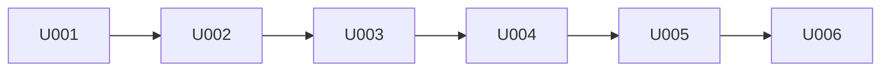

# P005 実装計画書 — DbFAQ(第1リリース)

入力: `docs/P001-requirement.md`、`docs/P002-frontend-spec.md`、`docs/P003-backend-spec.md`、`docs/P004-traceability-matrix.md`。

## 1. スプリント構成

6 スプリントに分ける。不確定要素の大きい MCP サーバ(FastMCP 4.x の stdio、python-oracledb の非同期プール、Oracle の辞書ビュー)を先に作り、その上に backend、frontend、配布を積む。

| No | 名称 | 位置づけ | 重さ(目安) |
|---|---|---|---|
| U001 | foundation | uv プロジェクト、共通の設定読み込み・ログ、開発用 Oracle(既存コンテナ、HR)への疎通確認。以降の全スプリントの土台 | 小(ファイル 6) |
| U002 | mcp-server | MCP サーバ `dbfaq_mcp`(ツール 3 本、識別子、型表記、値の文字列化、読み取り専用トランザクション) | 大(ファイル 9、外部システム連携あり) |
| U003 | backend-api | SQLite(マイグレーション、スナップショット)、MCP ゲートウェイ、API 5 本 | 大(ファイル 11、子プロセス管理・排他あり) |
| U004 | frontend-er | frontend の土台(Vite、ルーティング、API クライアント、共通ヘッダ)と SC-01 ER 図 | 中〜大(ファイル 12、レイアウト計算の不確定要素) |
| U005 | frontend-detail | SC-02 テーブル詳細(スキーマ情報タブ、データタブ) | 中(ファイル 7) |
| U006 | deploy | Dockerfile(api / web)、nginx、compose.yaml、受入テスト(Playwright)の実行環境 | 中(ファイル 7、インフラ) |

## 2. 各スプリントの内容

### U001 foundation

| 種別 | 対象 |
|---|---|
| 画面 | なし |
| API | なし |
| データモデル | なし |
| その他 | `server/pyproject.toml`(uv、Python 3.12)、`dbfaq_common/config.py`(P003 §2)、`dbfaq_common/logging.py`(P003 §4.5)、`config.example.yaml`、`.gitignore` への `config.yaml`・`data/` 追加、ローカルの `config.yaml`(人間が指定した接続先。Git 管理外)、開発用 Oracle(`localhost:1521/FREEPDB1`、hr)への疎通確認 |
| インフラ | 開発・テスト用 Oracle は既存のコンテナ(`oracle-db-free`)を使う。本プロジェクトの compose には含めない ★ACCEPTED★(2026-09-24 人間承認)P001 §2 の「人間が指定した既存の Oracle」に従う。検討: compose に Oracle を含める/承認理由: 既存の DB を使う/残存リスク: 特になし |

### U002 mcp-server

| 種別 | 対象 |
|---|---|
| 画面 | なし |
| API | なし(MCP ツール: `get_schema_snapshot`、`get_table_rows`、`ping`) |
| データモデル | スナップショット JSON(P003 §3.5)、rows JSON(P003 §3.6) |
| その他 | `dbfaq_mcp/` 一式(P003 §3) |

### U003 backend-api

| 種別 | 対象 |
|---|---|
| 画面 | なし |
| API | `GET /api/schema`、`POST /api/schema/refresh`、`GET /api/schema/tables/{owner}/{table}`、`GET /api/schema/tables/{owner}/{table}/rows`、`GET /api/health` |
| データモデル | SQLite: `schema_migrations`、`snapshots`、`db_tables`、`db_columns`、`db_constraints`、`db_constraint_columns`、`db_indexes`、`db_index_columns` |
| その他 | `dbfaq_api/` 一式(P003 §4、§5)、MCP ゲートウェイ |

### U004 frontend-er

| 種別 | 対象 |
|---|---|
| 画面 | 共通ヘッダ、SC-01 ER 図、ページが見つからない画面 |
| API(利用) | `GET /api/schema`、`POST /api/schema/refresh`、`GET /api/health` |
| データモデル | なし(API の型定義のみ) |
| その他 | `client/`(Vite + React 19 + TypeScript、React Router、TanStack Query、Mantine、@xyflow/react、elkjs、Vitest) |

### U005 frontend-detail

| 種別 | 対象 |
|---|---|
| 画面 | SC-02 テーブル詳細(スキーマ情報タブ、データタブ) |
| API(利用) | `GET /api/schema/tables/{owner}/{table}`、`GET /api/schema/tables/{owner}/{table}/rows` |
| データモデル | なし |

### U006 deploy

| 種別 | 対象 |
|---|---|
| 画面 | なし |
| API | なし |
| データモデル | なし |
| インフラ | `deploy/api.Dockerfile`(python:3.12-slim + uv、`server/` を入れ、uvicorn 1 ワーカー)、`deploy/web.Dockerfile`(node でビルド → nginx)、`deploy/nginx.conf`(静的配信 + `/api` を `http://api:8000` へ中継、SPA のフォールバック)、`compose.yaml`(web: ホストの `${DBFAQ_PORT:-8088}` → 80 のみ公開、api: ポート非公開、`extra_hosts: host.docker.internal:host-gateway`、`DBFAQ_ORACLE_HOST=host.docker.internal`、`./config.yaml` を読み取り専用でマウント、名前付きボリューム `dbfaq-data` を `/data` に、両サービス `restart: unless-stopped`)、`e2e/`(Playwright の設定) |

## 3. 対応表(実装漏れの検証)

| 対象 | U001 | U002 | U003 | U004 | U005 | U006 |
|---|---|---|---|---|---|---|
| 共通ヘッダ | | | | ● | | |
| SC-01 ER 図 | | | | ● | | |
| SC-02 テーブル詳細 | | | | | ● | |
| GET /api/schema | | | ● | (利用: SC-01・ヘッダ) | | |
| POST /api/schema/refresh | | | ● | (利用) | | |
| GET /api/schema/tables/{owner}/{table} | | | ● | | (利用) | |
| GET /api/schema/tables/{owner}/{table}/rows | | | ● | | (利用) | |
| GET /api/health | | | ● | (利用) | | |
| MCP get_schema_snapshot | | ● | (利用) | | | |
| MCP get_table_rows | | ● | (利用) | | | |
| MCP ping | | ● | (利用) | | | |
| SQLite 全テーブル + マイグレーション | | | ● | | | |
| 設定ファイル・ログ | ● | (利用) | (利用) | | | (マウント) |
| Docker Compose・nginx | | | | | | ● |
| 可用性(restart)・公開範囲・イメージにパスワードを含めない | | | | | | ● |

P004 の全要求 ID は上表のいずれかのスプリントに割り当たっている(REQ-SCREEN-* は U004/U005、REQ-API-* は U003、REQ-MCP-* は U002、REQ-ARCH-001〜006・008 は U001〜U003、REQ-ARCH-007・REQ-NFR-003 の構成部分は U006、REQ-NFR-* のアプリ側は U002/U003)。

※P011矛盾点#5にもとづき `GET /api/schema` 行の U005 列を修正。

## 4. 依存関係

* U004 は U003 の API を実物の backend として使って結合テストできる(開発時は Vite proxy)。
* U006 は全スプリントの成果物をコンテナにまとめる。
